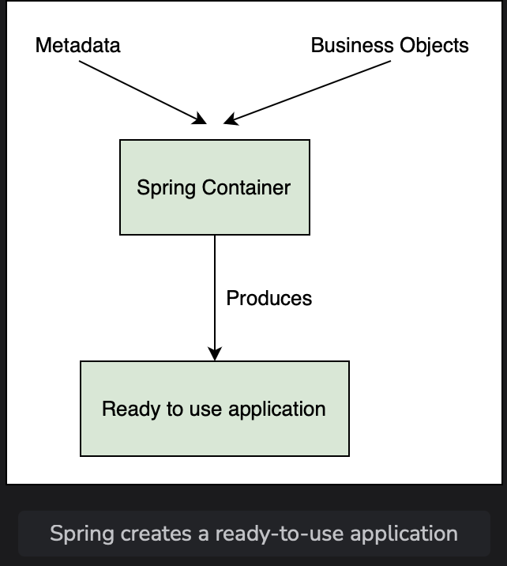
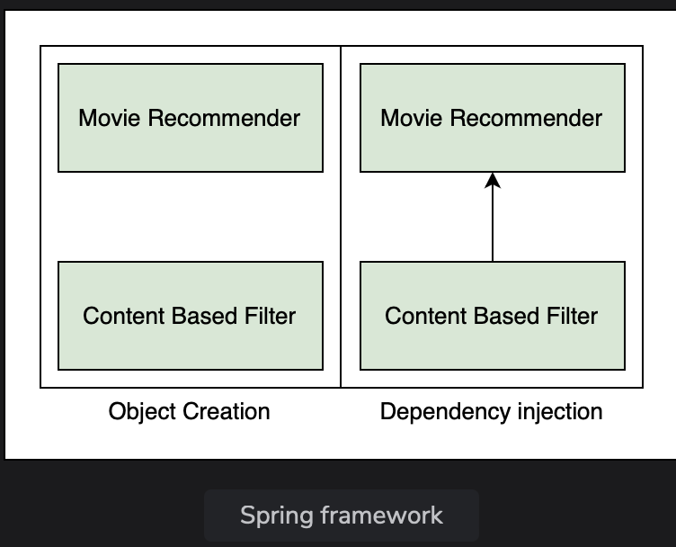

# What is Spring?

Get an overview of Spring as a dependency injection framework.

> We'll cover the following:
>
> - Tight coupling
> - Loose coupling

The Spring framework is an open-source Java application framework, which is based on two key principles: **dependency injection** and **Inversion of Control**.  
 Spring has **ability to autowire the dependency at run time**, which allows the developer to write loosely coupled code.

Spring framework **uses metadata in the form of xml file or java annotations** to create objects and indentifies dependencies, thereby producing a ready-to-use application.  
 

A typical web application is divided into three layers: **web, business, and the data layer**.  
 These layers have objects that collaborate with each other to make the application work.  
 These collaborations are called **dependencies**.  
 A typical application has a lot of classes and dependencies.

## Tightly coupling

Tightly coupled code involves creating an instances of the dependency inside the class.

> As an example, suppose we have an application that recommends movies to watch.  
> The application uses content-based filtering that employs item-to-item similarity as well as user preferences.
>
> The class MovieRecommender is directly instantiating an object of ContentBasedFilter, which make ContentBasedFilter a dependency of MovieRecommender.

        // MovieRecommender class
        public class MovieRecommender {
            ContentBasedFilter filter = new ContentBasedFilter();
        }

> Here's the ContentBasedFilter class:

        // ContentBasedFilter class
        public class ContentBasedFilter {
            // ..
        }

> Problems can arise when we want to use a different option for the dependency.  
>  Suppose we did not get good movie recommendations from the content-based filter and want to switch to a collaborative filter which takes into account the choices of users who have watched similar movies.
>
> This entails changing the code of MovieRecommender, which would be a disadvantage of using tightly coupled code.

## Loose coupling

A better way would be to implement an interface. This will remove the direct instantiation of the ContentBasedFilter, and instead, ask for the type of filter as an argument to the constructor.

        interface Filter {
            // method declarations
        }

Let's look at the way to implement as interface:

        public class ContentBasedFilter implements Filter {
            // implement interface methods
        }

Here's the MovieRecommender class definition:

        public class MovieRecommender {
            Filter filter;
            public MovieRecommender (Filter filter) {
                this.filter = filter;
            }
            // ..
        }

This way MovieRecommender is not dependent on a specific type of filter and can be used with both a content-based filter and a collaborative filter.  
 The above code snippet is an example of loosely coupled code.  
 Loose coupling has a number of advantages.

        public static void main (String[] args) {
            MovieRecommender recommender = new MovieRecommender (new ContentBasedFilter());
            // ..
        }

> Here, we have created an object of ContentBasedFilter class implementing the Filter interface and an object of MovieRecommender class.  
> We have injected the ContentBasedFilter object into the MovieRecommender object.  
> The Spring Framework writes the above code on its own.  
> Spring creates objects and populates dependencies.  
> As a programmer, you only have to tell which objects it has to create and what the dependencies of each object are.

Spring takes **control of populating the dependencies and injecting** the ContentBasedFilter object into the MovieRecommender object.  
 This is in contrast to the approach shown in the first code snippet where MovieRecommender instantiated the ContentBasedFilter object itself.

Spring inverts the control by taking responsibility for populating the dependency. This is referred to as Inversion of Control (IoC).

> To summarize, **Spring is a dependency injection framework that promotes loosely coupled code**.
