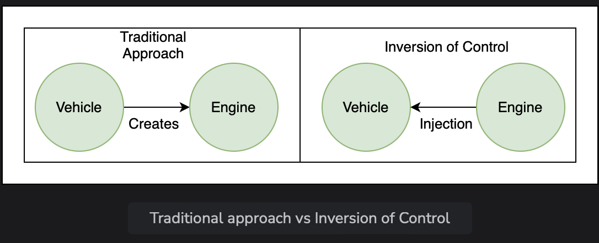
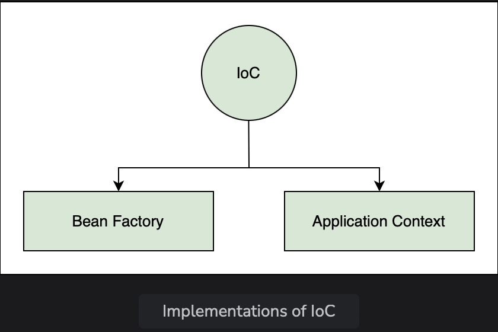

# Teminology

Learn about the different terms used in the world of Spring.

> We'll cover the follwing:
>
> Beans
> Autowiring
> Dependency injection
> Inversion of Control
> IoC container
> Bean factory
> Application context

## Beans

**Beans are objects of classes that are managed by Spring.**  
 Traditionally, objects used to create their own dependencies, but Spring manages all the dependencies of an object and instantiates the object after injecting the required dependencies.

The @Component annotation is the most common method of defining beans.

        @Component
        public class Vehicle {
            // ..
        }

## Autowiring

The process of identifying a dependency, looking for a match, and then populating the dependency is called **autowiring.**

The @Autowired annotation tells Spring to find and inject a collaborating bean into another.

> If more than one bean of the same type is available, Spring throws an error. In the following scenerio, two beans of type Operator are detected by Spring.

    @Component
    class Arithmetic {
        @Autowired
        private Operator operator;
        // ..
    }
    @Component
    class Addition implements Operator {
        // ..
    }
    @Component
    class Substraction implements Operator {
        // ..
    }

> Spring will not know which bean to inject in the Arithmetic bean unless the developer explicitly specifies it.

## Dependency Injection

Dependency injection is the process by which Spring looks up the beans that are needed for a particular bean to function and injects them as dependency.  
 Spring can perform dependency injection by using constructor or by using a setter method.

## Inversion of Control

Traditionally, the class which needed the dependency created an instance of the dependency.  
 The class decided when to create the dependency and how to create it.  
 For example, Engine class is a dependency of Vehicle class, which creates its object.

        class Vehicle {
            private Engine engine = new Engine();
        }

Spring takes this responsibility from the class and creates the object iteself.  
 The developer simply mentions the dependency and the framework takes care of the rest.

Thus, control moves from the component that need the dependency to the framework.  
 The framework takes the responsibility for finding out the dependencies of a component, ensuring their availability and injecting them in the component.  
 This process is called **Inversion of Control.**  
 

## IoC container

An IoC container is a framework that provides the Inversion of Control functionality.

The IoC container manages the beans. For the above mentioned example, it creates an instance of the Engine class, then creates an instance of Vehicle class, and then injects the Engine object as a dependency into the Vehicle object.

IoC container is generic term. It is not framework specific.  
Spring offers two implementations of the IoC container:

1.  Bean factory
2.  Application context

            class Vehicle {
                private Engine engine;
            }

Here's the pictorial representation of the IoC concept:  
 

Both of them are interfaces that have different implementations available.

- Application context is the typical IoC container in the context of Spring.  
  Spring recommends using it unless there is memory concern, like a mobile device.
- If avaiable memory is low, bean factory should be used.

## Bean factory

The basic version of the Spring IoC container is bean factory.

It is the legacy IoC container and provides basic management for beans and wiring of dependencies.  
 In Spring, bean factory still exists to provide backward compatibility.

## Application context

Application context adds more features to the bean factory that are typically needed by an enterprise application.  
 It is most important part of the Spring framework.

All the core logic of Spring happens here.  
It includes basic management of beans and wiring of dependencies as provided by the bean factory.  
Additional features in application context include Spring AOP features, intenationalization, web application context, etc.
