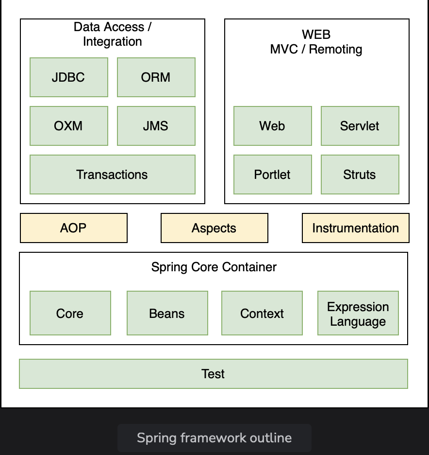

# Spring Architecture

Learn about the modular architecture of Spring and also discuss popular Spring projects.

> We'll cover the following:
>
> - Spring modules
>
>   > - Data access/ integration
>   > - Web (MVC/remoting)
>   > - Test
>   > - AOP
>
>   Spring projects

Spring is not one big framework. It is broken down into modules.  
 This can be seen in the Maven Dependencies folder, where there are lot of JAR files instead of just one big JAR.  
 

Spring is built in a modular way and this enables some modules to be used without using the whole framework.  
 It also makes integration with other frameworks easy.  
 The developer can choose which module to use and discard ones that are not required.

## Spring modules

The modules of Spring architecture, grouped together in layers, are shown below:

The Core Container contains the following modules:  
 **Beans, Core, Context, and Spring Expression Language (SpEL).**

These modules provide fundamental functionality of the Spring framework, like

- Inversion of Control (IoC),
- dependency injection,
- internationilazaion
- as well as support for querying the object at run time.

### Data access/ integration

Spring has very good integration with data and integration layers, and provides support to interact with databases.  
 It contains modules like JDBC, ORM, OXM, JMS, and Trasactions.

- The JDBC (Java Database Connectivity) modules allows the **data layers to interact with databases** to get data or store data, or **to interact with other systems** without the need of cumbersome JDBC coding.
- The ORM (Object Relational Mapping) module **provides support to integrate with ORM frameworks** including Hibernate and JPA.
- The JMS (Java Messaging Service) module **talks to other applications through the queue** to produce and consume messages.
- The transaction management module **provides support for successful rollback** in case a trasaction fails.

### Web (MVC/remoting)

It **contains the Web, Services. Portlets, and Sockets modules to support the creation of a web application.**  
 Spring offers a **web framework of its own called Spring MVC**.

### AOP

The AOP module provides Aspect Oriented Programming functionality like method **interception and pointcuts** as well as **security and logging features**.  
 Spring has its **own module called Spring AOP** that offers basic, aspect-oriented programming functionality.

**Advanced AOP functionality can be implemented through integration with AspectJ**.  
 AOP features cross cutting concerns from business logic.

## Spring projects

Spring also provides solutions to different enterprise application problems through Spring projects.

Some of them are discussed below:

- Spring Boot is **used to develop micro services**.  
   It makes developing applications easy through features like startup projects, auto configuration, and actuator.  
   Spring Boot has gained massive popularity since it was first released in 2014.
- Spring cloud allows the **developement of cloud native applications that can be dynamically configured and deployed**.  
   It provides **functionality for handling common patterns in distributed systems**.
- Spring Data provides **consistent access to SQL and NoSQL** databases.
- Spring Integration implements the patterns outlined by the book _Enterprise Application Integration Patterns_.  
   It **allows enterprise applications to be connected easily through messaging and declarative adapters.**
- Spring Batch provides **functionality to handle large volumes** of data like **_ability to restart, ability to read from and write to different systems, chunk processing, parallel processing, and transaction management_**.
- Spring Security provides **security solutions** for different applications be it a web application or a REST service.  
   It also provides **authentication and authorization feature**.
- Spring Session manages **session information** and makes it **easier to share session data between services in the cloud** regardless of the platform/contianer.  
   It also **supports multiple sessions** in a single browser instance.
- Spring Mobile offers **device detection and progressive rendering options** that make mobile web application development easy.
- Spring Android **facilitates the development of Android applications**.
