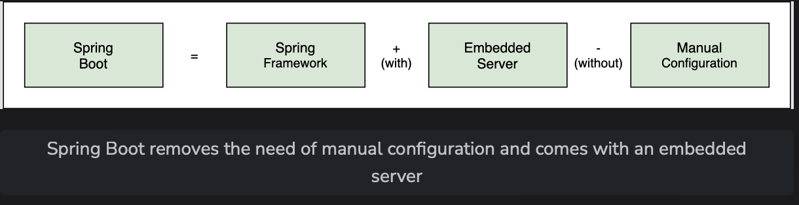
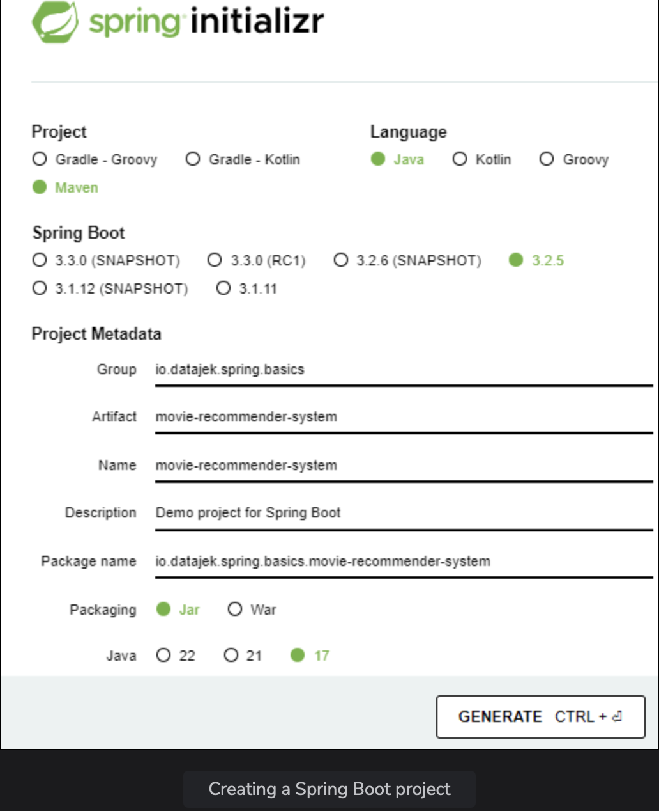
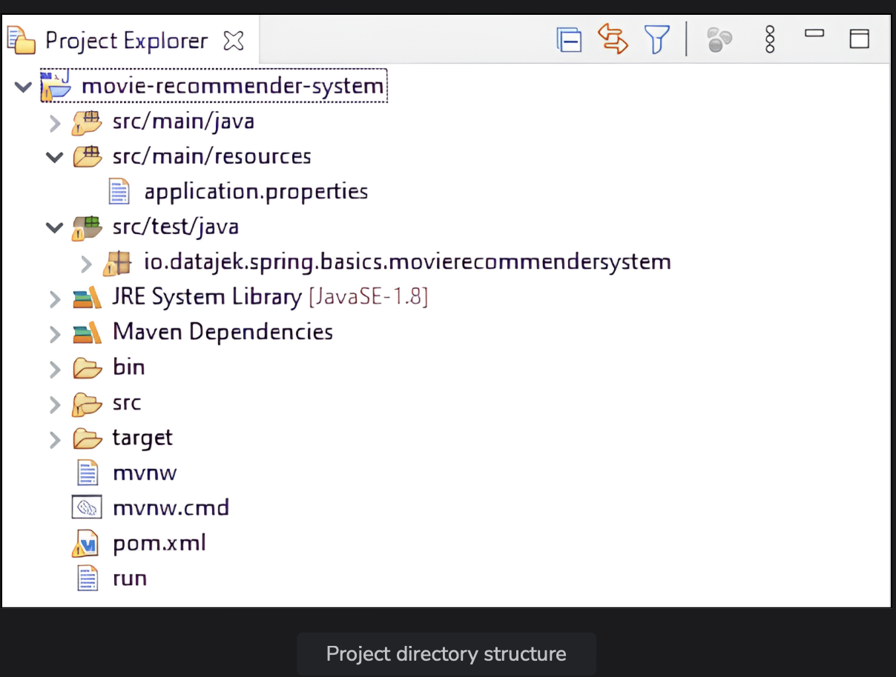
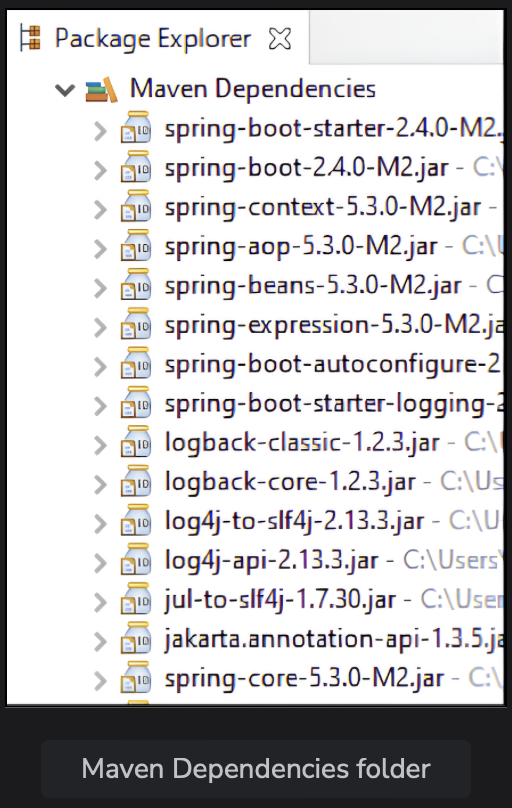
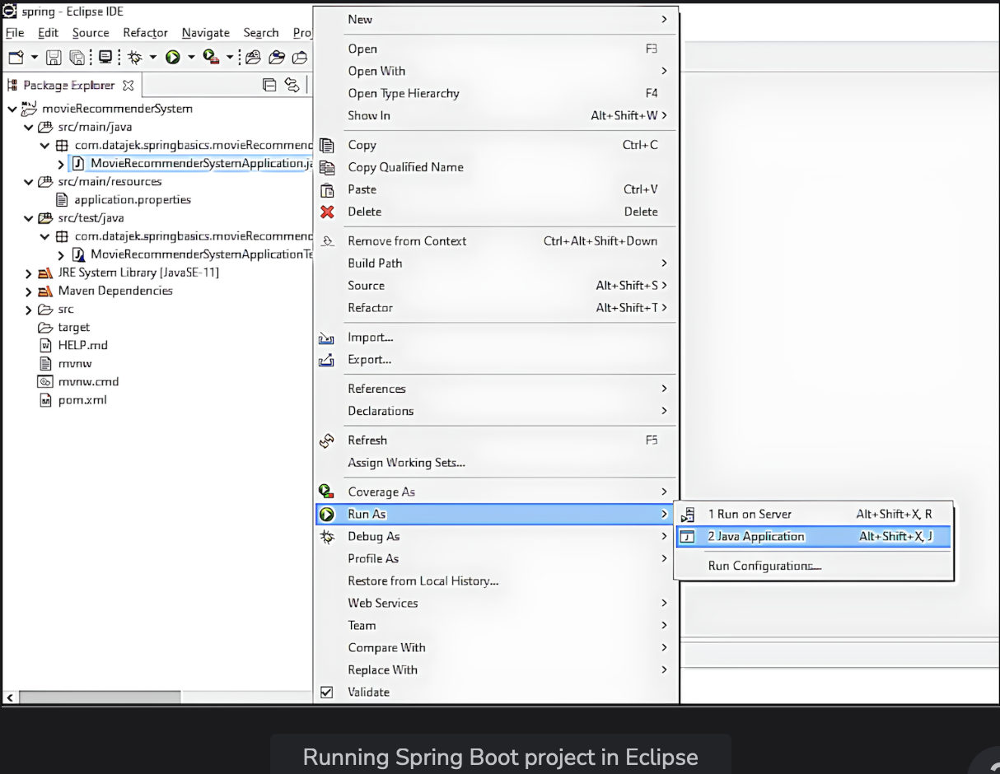

# Creating a Project

Learn about the method to create and run a Spring project using Spring Boot.

> We'll cover the follwing:
>
> - Challenges of building a Spring application
> - Introduction Spring Boot: Simplifying Spring project development
> - Creating a Spring Boot project

## Challenges of building a Spring application

Building a Spring application from scratch can be hard.  
 The developer needs to decide which Maven dependencies to use, set up the configuration for XML or Java, install Tomcat or another server, etc.  
 All these things are needed to build the **infrastructure of the application.**

This involves a lot of configuration in XML or Java, which is difficult and susceptible to errors.

## Introducing Spring Boot: Simplifying Spring project development

Spring Boot offers a quick-fire way to create a Spring project. It makes getting started with the actual application development easy by skipping the manual configuration part.  
 The highlight of Spring Boot is its auto-configuration feature whereby it automatically includes all the dependencies of a project based on property files and JAR classpaths.

Spring Boot is basically the Spring framework along with embedded servers.  
 Spring Boot removes the need for XML configuration.  

**NOTE:** Given the simplicity and ease that Spring Boot provides, we will use it to create our first Spring Project.

## Creation a Spring Boot project

Spring Initializer is one way to create a Spring Boot project, where we can simply select the dependencies and create a basic project structure with a Maven or Gradle build specification.  
This project is available for download in the form of a zip file to be used in variety of IDEs like Eclipse or IntelliJ etc.

1. Go to start.spring.io and provide some basic information about the project. We will choose "Maven" option under "Project", select "Java" as the "Language", and go for the latest stabel version of Spring Boot.  
   It is better to avoid SNAPSHOT versions as they are alpha or beta versions.

   Next, we will provide the "Project Metadata". The group ID and artifact ID are basically the package name and class name.  
   We will use the follwing:
   Group: io.datajek.spring.basics
   Artifact: movie-recommender-system

Spring Initializer, by default, creates Spring as one of the dependencies of the project, so we do not need to explicitly specify any dependency.  
 Later in this course, we will create projects with dependencies like Web, AOP, JDBC, JPA, etc.  

> - When the "Generate" button on the form is clicked, the Initilizer creates a zip file that is downloaded by the browser.  
>    Unzip this file and place it in a folder on the hard drive.
> - To import this project in Eclipse, choose "File" -> "Import" -> "Maven" -> "Existing Maven Projects". Search for Maven in the search bar if the option isn't visible. Browse to the folder on the hard drive where the unzipped Spring Boot project is placed. The pom.xml file can be seen. Select the file and click "Finish" to import the project.

The first time around, the import will take a little while as all the dependencies needed to set up the project are being downloaded.

When the import process finishes, the following hierarchy can be seen:

- **src/main/java** is where the Java code will be written.
- **src/main/resources** is where the application properties are written.
- **src/test/java** is where the tests will be writen.

The pom.xml file contains the project metadata information and lists the dependencies.

The Maven Dependencies folder contains the jar files of all the dependencies.  
Spring has automatically been added as a dependency.

spring-boot-starter, spring-context, spring-beans, and spring-core can also be seen among other dependencies autowired by the Spring Initializer.  

Based on the data we provided to the Spring Initializer, our project contains the io.datajek.spring.basics.movierecommendersystem package inside src/main/java.  
 This package has the MovieRecommenderSystemApplication class containing the main() method.  
 We will run this class to execute the application.

To run the project, right click the **MovieRecommenderSystemApplication.java** file and run it is "Java Application".  

This will launch a simple Spring context. The program successfully runs and prints some text on the console.
