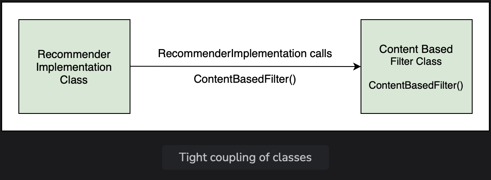

# Dependency

Learn about the concept of dependency by setting up a simple example using a Spring Boot application.

> We'll cover the following:
>
> - Recommender systems
> - Tight coupling

## Recommender systems

In this lesson, we will build a movie recommender system and add some logic to it. A recommender system is a system that filters some entities based on the user's history.  
 Recommender systems also rank these items based on user preferences. The system works by taking an input and then finding items similar to that input.

> In this lesson. we will write the basic code for a movie recommender application.
>
> The application will take a movie and recommend other movies similar to it. There are various ways in which recommendations can be found.  
>  One method is content-based filtering in which item-to-item similarity is used as a basis for finding matches.  
>  So, for a movie like Finding Dory, the system will find movies of the same genre, like Happy Feet, Ice Age, Shark Tale, etc.
>
> 

The package for each lesson contains the MovieRecommenderSystemApplication class containing the main io.datajek.spring.basics.movierecommendersystem package to the newly created package.  
 We will create a class named RecommenderImplementation in the lesson1 sub-package.  
 The RecommenderImplementation class will have a method called recommendMovies(), which will find similar movies using a content-based filter and then return the results.  
 The recommendMovies() method takes a movie as input so the input parameter is of type String and returns a list of similar movies. Hence, the return type is String[]. Inside the method, we will use a filter to find similar movies and return the results.

        public class RecommenderImplementation {
            public String[] recommendMovies (String movie) {
                //use content based filter to find similar movies
                //return the results
                return new String[] {"M1", "M2", "M3"};
            }
        }

We have hard coded the results returned by this method to avoid compile-time errors. The hard-coded results will be removed in the upcoming content below.

Now, we will write the logic of the recommendMovies() method in the RecommendImplementaion class.  
 As mentioned earlier, we will use a technique called **content-based-filtering** to find movie recommendations.  
 We can implement this technique as a seperate class to keep the recommendMovies() method independent of the filter implementation.

Create a new class ContentBasedFilter that has a method getRecommendations() implementing the logic of the contect-based-filter.  
 The method returns a list of movies that are relevant to the input, taking into account the user's watch history as well as movies that are similar to input.  
 We will not make it complex at this step and ignore input arguments like the number of movies to recommend. user's watch history, and the user-movie matrix of ratings.

Our method will have just one input parameter, the movie name, of String type.  
 All the steps in finding the relevant movies are performed in this method:

**Note:** We have hardcoded the results. The getRecommendations() method returns three movies similar to the movie, Finding Dory.

Let's define the getRecommendations() method:

    public class ContectBasedFilter {
        public String[] getRecommendations(String movie) {
            // logic of content based filter
            return new String[] {"Happy Feet", "Ice Age", "Shark Tale"};
        }
    }

Now, we can use an object of the ContentBasedFilter class in the RecommenderImplementation class as follows:

    public class RecommenderImplementation {
        public String[] recommendMovies(String movie) {
            // use content based filter to find similar movies
            ContentBasedFilter filter = new ContentBasedFilter();
            String[] results = filter.getRecommendations(movie);
            // return the results
            return results;
        }
    }

Since the getRecommendations() method is returning a Stringp[], we can remove our hard-coded results and replace them with the actual ones returned by the method.

In the MovieRecommenderSystemApplication class, we will create an object of RecommenderImplementation class and use it to find movie recommendations for the movie, Finding Dory, as follows:

    public class MovieRecommederSystemApplication {
        public static void main(String[] args) {
            RecommenderImplementation recommender = new RecommenderImplementation();
            String[] result = recommender.recommendMovies("Finding Dory");
            System.out.println(Arrays.toString(result));
        }
    }

To make the output readable, we have used the use the toString() method and after importing java.util.Arrays.

## Tight coupling

As can be seen, the ContentBasedFilter class is dependency of the RecommenderImplementation class. The RecommenderImplementation class need an object of ContentBasedFilter class to perform its task.  
 This is an example of tight coupling.  

If we want to use another filter in place of the content-based filter, we will need to change the code in the RecommenderImplementation class.

Consider a scenerio, where we want to use one type of filter in one situation and another type of filter in another situation.  
 Tight coupling makes this difficult to achieve.

In the example above, we created two classes which work together, thus creating a dependency. In a typical enterprise application, there are a large number of objects which work together to provide some end results to the user. This results in a lot of dependencies.

Spring is **dependency injection framework that makes the process of managing these dependencies easy.**
