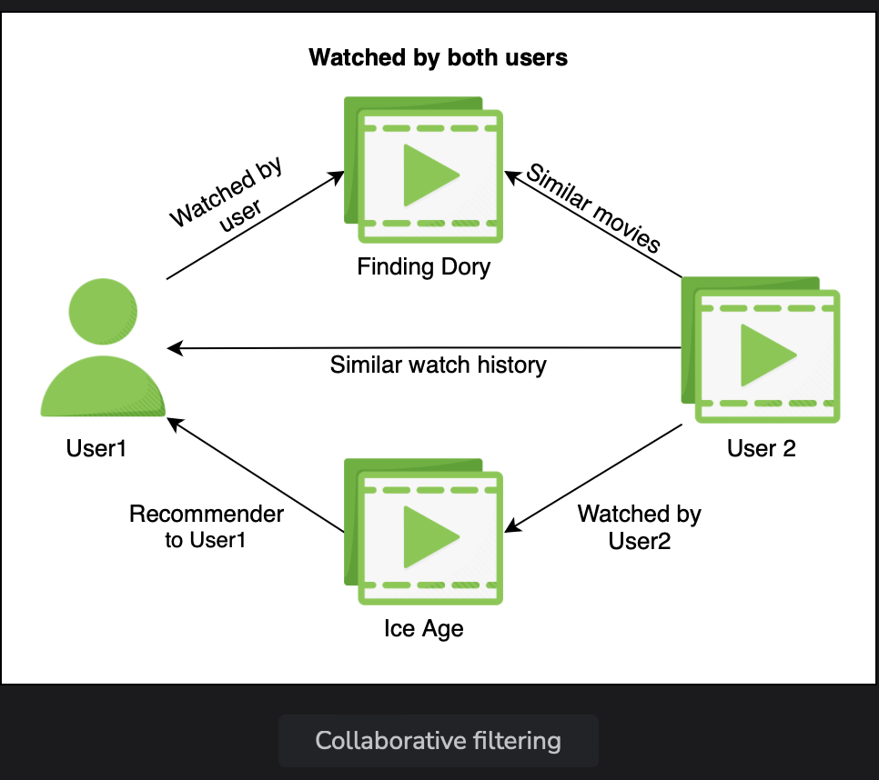
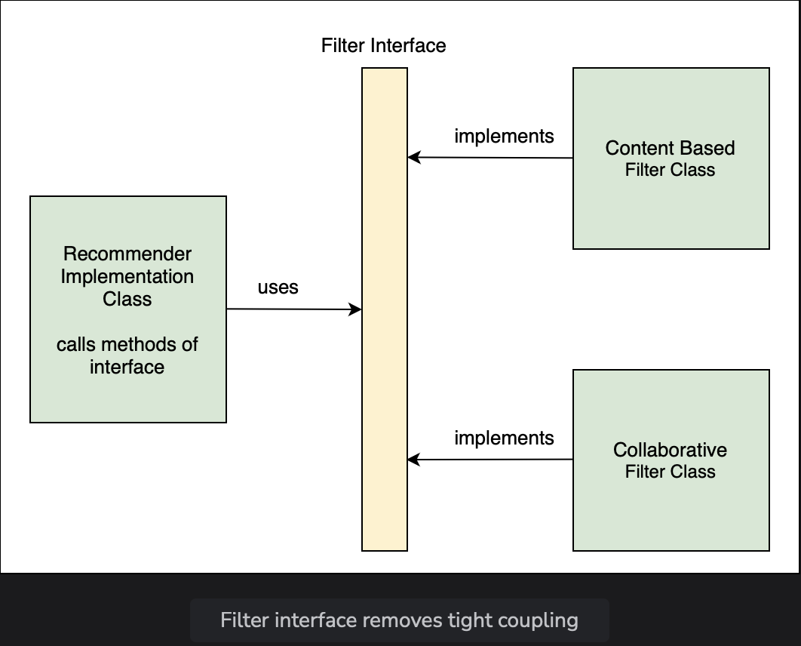

# Decoupling Components

Learn how to change the tightly coupled code to loosely coupled.

> We'll cover the following:
>
> - Filter interface
> - Loose coupling

Right now, the RecommenderImplementation class is hard coded to use the ContentBasedFilter class. If we need to chnge the way our application recommends movies, we will need to change the code of the RecommenderImplementation class.

Say, we want to switch from content based filter to collabortive filter and take into account the preferences of users having a similar watch history.

1.  We have created a sub-package called lesson2 inside the io.datajek.spring.basics.movierecommendersystem package for the code example shown in this lesson.  
    The package contains the MovieRecommenderSystemApplication.java, RecommenderImplementation.java, and ContentBasedFilter.java files from the previous lesson.
2.  Changing the type of filter from content-based to collaborative would call for a change in the code of the RecommenderImplementation class. First, let’s create a class CollaborativeFilter, which, like the ContentBasedFilter class, has one method getRecommendations().  
    This method recommends a list of movies for Finding Dory based on the logic of collaborative filter as shown below:

        public class CollaborativeFilter {
            public String[] getRecommendations(String movie) {
                //logic of collaborative filter
                return new String[] {"Finding Nemo", "Ice Age", "Toy Story"};
            }
        }

3.  If we want to switch to the new filter created in the previous step, we will have to change the code in the RecommenderImplementaion class as follows:

            public String[] recommendMovies(String movie) {
                ColloborativeFilter filter = new ColloborativeFilter();
                String[] results = filter.getRecommendation("Finding Dory")l
                return results;
            }

    Here, we have created an object of the CollaborativeFilter class instead of the ContentBasedFilter class. Every time we want to change the filter implementation, we will have to change the code in the recommendMovies() method.

## Filter interface

One way to make the code loosely coupled is by using an interface called Filter. An interface contains abstract methods whose implementation is left to the classed using it.

We can create an interface by using the wizard just like we created a class in the last lesson.  
 Alternatively, we can simplify extend the class definition and Eclipse IDE will automatically prompt to create an interface:

The Filter interface will have only one method definition:

        public  interface Filter {
            public String[] getRecommendations (String movie);
        }

Both ContentBasedFilter and CollaborativeFilter now implement the Filter interface. Here's how ContentBasedFilter will implement it:

        public class ContentBasedFilter implements Filter {
            // ..
        }

Here's how ColloborativeFilter will implement it:

        public class CollaborativeFilter implements Filter {
            // ..
        }

## Loose coupling

Loose coupling can be achieved by making the RecommenderImplementation class use the interface instead of one of its implementations.  
 We will create a contructor for the RecommenderImplementation class to initialize the Filter.

        public class RecommenderImplementation {
            // use filter interface to select filter
            private Filter filter;
            public RecommenderImplementation (Filter filter) {
                super();
                this.filter = filter;
            }
            // use a filter to find recommendations
            public String[] recommendMovies (String movie) {
                // ..
            }
        }

The method getRecommendations() now belongs to the interface. To check which implementation of the interface is being used to get movie recommendations, we can print the name of the filter as follows:

        public String[] recommendMovies (String movie) {
            // print the name of interface implementation being used
            System.out.println("Name of the filter in use: " + filter + "\n);
            String[] results = filter.getRecommendations("Finding Dory");
            return results;
        }

By using the interface instead of an actual implementation, we can dynamically choose which algorithm to use. Our code has now become loosely coupled.  
 In the MovieRecommenderSystemApplication file, when we create a RecommenderImplementation object, we can pass the name of the filter to use:

        RecommenderImplementation recommender = new RecommenderImplementation(new ContentBasedFilter());

When we run the application, it prints the name of the filter along with the results.

Let's now change the code to use the CollaborativeFilter and see the output change.

        RecommenderImplementation recommender = new RecommenderImplementation(new CollaborativeFilter());

In this lesson, we made RecommenderImplementation class independent of the filter implementation. The RecommenderImplementation now calls methods of the Filter interface.  
 

Now Filter is a dependency of RecommenderImplementation.  
 We still have to create an object of RecommenderImplementation and an object of Filter and pass the objects to the constructor.
