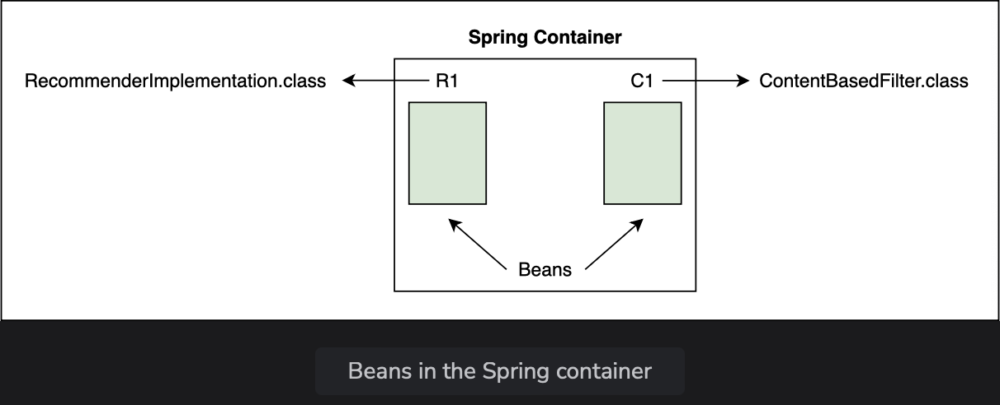
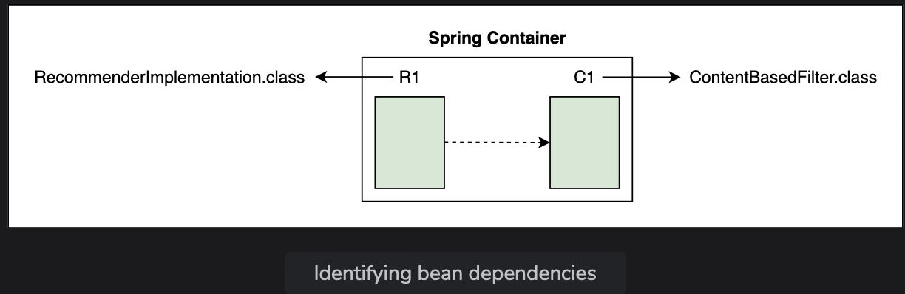

# Managing Beans and Dependencies

Learn how to use annotations to direct Spring to manage beans and autowire dependencies.

> We'll cover the following:
>
> - @Component
> - @Autowired
> - @ComponentScan
> - @SpringBootApplication

So far, we have created objects of RecommenderImplementation class and two classes implementing the Filter interface. We are binding the objects together in the constructor. Our code is now loosely coupled as we are passing the name of the filter to be used as a constructor argument.

Spring automates the above process of creating objects and binding them together. It takes responsibility of creating instances of classes and binding instances based on their dependencies.  
 The instances or objects that Spring manages are called **Beans**.  
 To manage objects and dependencies, Spring requires information about three things: 1. Beans 2. Dependencies 3. Location of beans

For the code example shown in this lesson, we have created a sub-package called lesson3 inside the package io.datajek.spring.basics.movierecommendersystem.

The package contains MovieRecommenderSystemApplication.java, RecommenderImplementation.java, ContentBasedFilter.java, and CollaborativeFilter.java files from the previous lesson.

## @Component

If we want Spring to create and manage objects, we can do so by adding the **@Component annotation at the beginning of the class** and **importing org.springframework.stereotype.Component**.

For now, we want Spring to manage objects of RecommenderImplementation and ContentBasedFilter class only, so we will add the @Component annotation at two places in the code.  
 Let's add it in the RecommenderImplementation class:

        import org.springframework.stereotype.Component;
        @Component
        public class RecommenderImplementation {
            //...
        }

        import org.springframework.stereotype.Component;
        @Component
        public class ContentBasedFilter implements Filter {
            //...
        }

The Spring container will have two beans, one of type RecommenderImplementation and the other of type ContentBasedFilter.  
 

## @Autowired

The second thing Spring needs to know is the dependencies of each object.  
 The **@Autowired annotation** is used for this purpose and we need to **import org.springframework.beans.factory.annotation.Autowired** to be able to use this annotation.

In our application, the ContentBasedFilter class (which implements the Filter interface) is a dependency of the RecommenderImplementation class.

        import org.springframework.stereotype.Component;
        import org.springframework.beans.factory.annotation.Autowired;

        @Component
        public class RecommenderImplementation {
            @Autowired
            private Filter filter;
            // ..
        }

The @Autowored annotation tells Spring that RecommenderImplementation needs an object of type Filter.  
 In other words, Filter is a dependency of RecommenderImplementation.  
 

## @ComponentScan

The third thing that Spring requires from the developer, is the location of the beans so that it can find them and autowire the dependencies.  
 **The @ComponentScan annotation is used for this purpose**  
 This annotation can be used with or without arguments. It tells Spring to scan a specific package and all of its sub-packages.  
 In our case, all the files that contains beans are in the same package, so we want Spring to do a component scan on this package.

> Since we are using Spring Boot, it uses the @SpringBootApplication annotation on the MovieRecommenderSystemApplication class.  
>  This annotation is equivalent to the following three annotations:
>
> - **@Configuration**, which declares a class as the source for bean definitions.
> - **@EnableAutoConfiguration**, which allows the application to add beans using classpath definitions.
> - **@ComponentScan**, which directs Spring to search for components in the path specified.
>
> 

**Because of @SpringBootApplication annotation, we do not need to use @ComponentScan annotation in our code.**

## @SpringBootApplication

**@SpringBootApplication** tells Spring to **scan all the files in the package where the class with this annotation is present.**  
 It also scans any sub-packages of the package where it is placed.

When we use the **@Component, @Autowired, and @SpringBootApplication annotations**, the following line in our code becomes redundant as it is automatically done by Spring:

        RecommenderImplementation recommender = new RecommenderImplementation(new ContentBasedFilter());

The beans that Spring creates are **managed by the ApplicationContext**.  
We can get information about a bean from the Appication Context.

- The run() method returns the ApplicationContext, which can be assigned to a variable appContext.
- Then, the getBean() method of ApplicationContext can be used to get the bean of a particular class.

> We will create a local variable recommender and assign the bean to it as follow:
>
>           public static void main(String[] args) {
>               // ApplicationContext manages the beans and dependencies
>               ApplicationContext appContext = SpringApplication.run(MovieRecommenderSystemApplication.class, args);
>               // use ApplicationContext to find which filter is being used
>               RecommenderImplementation recommender = appContext.getBean(RecommenderImplementation.class);
>               // call method to get recommendations
>               String[] result = recommender.recommendMovies("Finding Dory");
>               // display results
>               System.out.println(Arrays.toString(result));
>           }
>
> Instead of us having to create an instance of the RecommenderImplementation class, Spring Application Context creates the beans. We can simply pick it up from there and use it to execute the RecommendMovies method.
>
> This might look complex to a beginner, but consider for a moment an application that has a hundreds of beans, each having a number of dependencies. The fact that we dp not have to explicitly create beans and manually wire in the dependencies makes the job of a developer very easy.
>
> When we run this application, the output shows that bean being used is ContentBasedFilter.  
>  If the @Component annotation is used on the CollaborativeFilter class instead of the ContentBasedFilter class, the output will change accordingly.

To understand what goes on in the background, we will change the logging level to debug.  
 This can be by adding the following to the application.properties file in the src/main/resources package:

        Logging.level.org.springframework = debug

> When run, the next code widget will show the log of all the actions that are being performed in the background. A summary of the actions is reproduced below:
>
> - Loading source class.... The package is being searched. Spring starts with a component scan to find anything with @Component as well as other annotations.
> - Identified candidate component class... Spring identifies two candidates which have the @Component annotation as we only used it in two places in our code.
> - Creating shared instances of singleton bean movieRecommenderSystemApplication.
> - Creating shared instance of singleton bean contentBasedFilter. Spring starts creating instances of the beans. It creates beans that do not have any dependency first.
> - Creating shared instance of singleton bean recommenderImplementation.
> - Autowiring by type from bean name recommenderImplementation via constructor to bean named contentBasedFilter.
>
> Now Spring can autowire the dependency using the constructor that we have provided and creates the RecommenderImplementation bean.
>
> To better understand these annotations, play around with the code below and see what error messages Spring throws when some of the annotations are missing.  
>  The error message can be found at the end of the log.
>
> If we remove @Component from the ContentBasedFilter class, Spring will throw an error when trying to autowire the dependency saying it required a bean of type Filter that could not be found.
>
> If we remove @Component from the RecommenderImplementation class as well, we will get an error when trying to execute the getBean() method as no beans exists.
>
> If we add @Component to the @CollaborativeFilter class, Spring will not know which bean of Filter type to autowire. It says, expected single matching bean but found 2.
