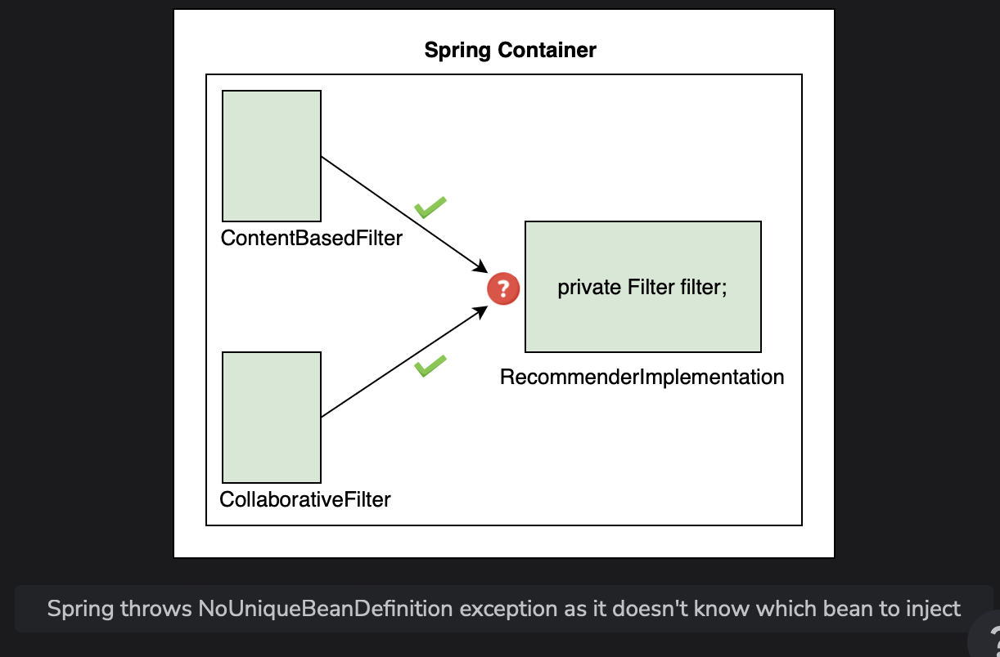
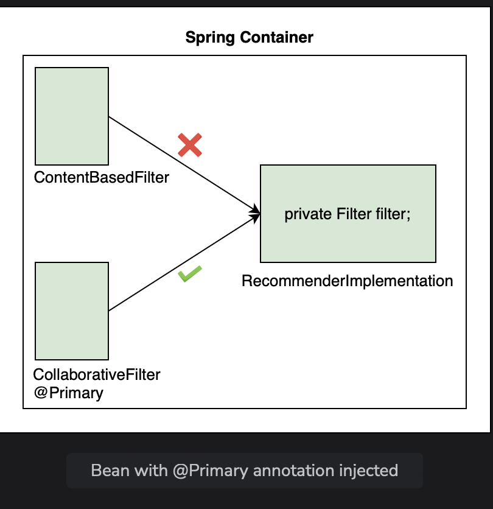

# Autowiring By Type - @Primary

Learn how Spring dynamically autowires a dependency in case it finds more than one component of the same type.

> We'll cover the following:
>
> - Dynamic bean selection
>   > - @Primary annotation

## Dynamic bean selection

In the last lesson, we saw Spring manages two beans of the RecommenderImplementation and ContentBasedFilter classes for us.  
 In this lesson, we will add another bean and see how Spring can dynamically choose a bean if it finds two matches of the same type.

> For the code example shown in this lesson, we have created a sub-package called lesson4 inside the package io.datajek.spring.basics.movierecommendersystem.
>
> The package contains MovieRecommenderSystemApplication.java, RecommenderImplementation.java, ContentBasedFilter.java, and CollaborativeFilter.java files from the previous lesson.

We will add the @Component annotation on the CollaborativeFilter class to declare it a bean. Now both implementations of the Filter interface are beans.  
 Previously, when Spring searched for a dependency to be autowired in the RecommenderImplementation object, it only found one bean of matching type.  
 Now when we run the application, it fails to start.  

**The NoUniqueBeanDefinitionException occurs.** The error message says: _Required a single bean, but two were found._

### @Primary annotation

One way Spring can choose between two beans of the same type is by giving **one bean priority over the other**.  
 The **@Primary annotation is used for making a component the default choice** when multiple beans of the same type are found.

> Let's say we want the collaborative filter to take precedence. We will add the @Primary annotation on the CollaborativeFilter class and import org.springframework.context.annotation.Primary.  
>  When we run the application now, it uses CollaborativeFilter as expected.
> 

        package io.datajek.spring.basics.movierecommendersystem.lesson4;
        import org.springframework.stereotype.Component;
        import org.springframework.context.annotation.Primary;

        @Component
        @Primary
        public class CollaborativeFilter implements Filter{

            public String[] getRecommendations(String movie) {
                //logic of collaborative filter
                return new String[] {"Finding Nemo", "Ice Age", "Toy Story"};
            }
        }

Using @Primary is called **autowiring by type.**

> We are looking for instance of type Filter.  
>  If we make both beans primary by adding the @Primary annotation to both implementations of the Filter interface, we will get an error.
>
> This happend because Spring doesn't know which one to inject in the RecommenderImplementation object. The error message states more than one 'primary' been found among candidates.
