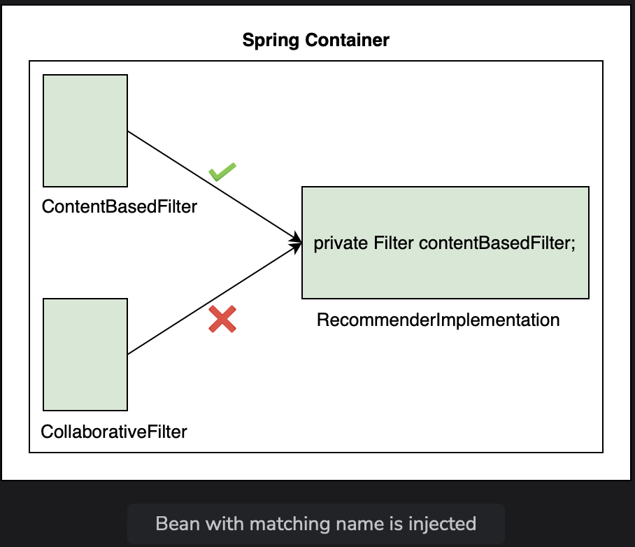

# Autowiring By Name

Learn about the autowiring by name and see which approach has higher priority, by name or by type.

> We'll cover the following:
>
> - Autowiring by name in Spring
> - Implementation
> - Prioritizing autowiring approaches

## Autowiring by name in Spring

In the last lesson, we looked at the autowiring by type approach where priority was given to the colloborative filter using the @Primary annotation.

Another approach is **autowiring by name** where we specify the bean that is to be used by name.  
 In this approach, while creating an object, **the dependency is injected by matching the name of the reference variable to the bean name**.

## Implementation

1.  For the code example shown in this lesson, we have created a sub-package called lesson5 inside the package io.datajek.spring.basics.movierecommendersystem.The package contains MovieRecommenderSystemApplication.java, RecommenderImplementation.java, Filter.java, ContentBasedFilter.java, and CollaborativeFilter.java files from the previous lesson.
2.  We will begin by omitting the @Primary annotation from the CollaborativeFilter class. Now, to let Spring know which bean to use, we will change the variable name in the RecommenderImplementation class to match the bean name as follows:

        public class RecommenderImplementation {
            @Autowired
            private Filter contentBasedFilter;

            public String[] recommendMovies (String movie) {
                System.out.println("\nName of the filter in use: " + contentBasedFilter + ".\n");
                String[] results = contentBasedFilter.getRecommendations("Finding Dory");
                return results;
            }
        }

Now, when the application is run, it chosses ContentBasedFilter bean for autowiring. When Spring finds two beans of the same type (Filter), it determines that the bean to inject is the one whose name matches the bean with the @Component annotation.  
 In other words, the variable name (contentBasedFilter) matched the bean name (ContentBasedFilter).

        public class RecommenderImplementation {
            @Autowired
            private Filter contentBasedFilter;
            // ..
        }

Here's the ContentBasedFilter class:

        @Component
        public class ContentBasedFilter implements Filter {
            // ..
        }

> Lets' have a look at the pictorial representation of autowiring by name approach:
>
> 

3. As an exercise, let's see what happens if the bean name and variable names are different. Let's change the name of the variable to filter.  
   When the application is run, autowiring does not take place and, as expected, we get the **NoUniqueBeanDefinitionException**.
4. We have seen two autowiring approaches so far. To see which autowiring approach takes precedence, we will use the @Primary annotation on ContentBasedFilter class and use autowiring by name by changing the name of the variable of type Filter in RecommenderImplementation class to collaborativeFilter.

## Prioritizing autowiring approaches

The application chooses the ContentBasedFilter bean, showing that **@Primary has a higher priority.**  
 This is because @Autowired annotation tries to resolve dependency by type first. If it fails to resolve a conflict and finds more than one bean of the same type then it tries to resolve it by name.

The autowiring by name approach is advantageous when we want **to use one bean in one situation and another bean in some other situation.**

Using @Primary will always give preference to one bean, which is impractical if we want to use different beans in different scenerios.  
 Autowiring by name ensures that if we have some other component which wants to use another type of bean, it can request Spring by using a different variable name.
