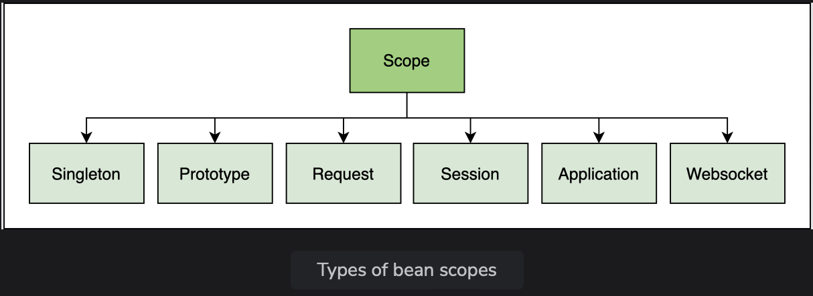
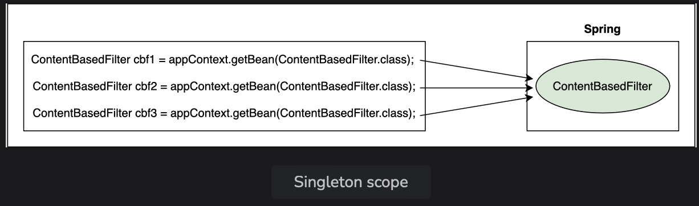
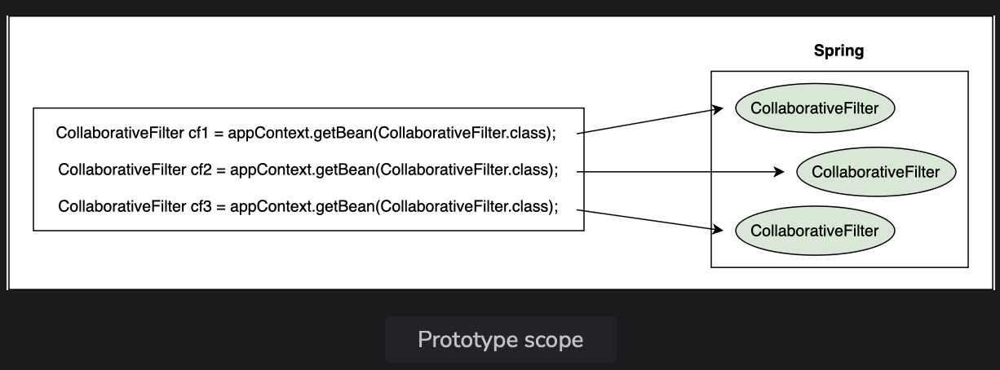

# Bean Scope

Learn about the difference between singleton and prototype bean scopes and how to implement them.

> We'll cover the following:
>
> - Types of bean scopes
>   > - Singleton scope
>   > - Prototype scope
>   > - Spring vs. Gang of Four singleton

The Spring container manages beans. The term bean scope refers to the lifecycle and the visibility of beans. It tells how long the bean lives, how many instances of the beans are created, and how the bean is shared.

## Types of bean scopes

There are six types of scopes: **singleton, prototype, request, session, application, and websocket.**  
 

### Singleton scope

**The default scope of a bean is singleton,** in which **_only one instance of the bean is created and cached in memory_**.  
 Multiple requests for the bean return a shared reference to the same bean.  
In contrast, prototype scope results in the **creation of new beans whenever a request for the bean is made to the application context.**

> In our movie recommendation system example, we have two implementations of the Filter interface, namely ContentBasedFilter and CollaborativeFilter.  
>  We will use them to show the differences between singleton and prototype bean scope.
>
> For the code example shown in this lesson, we have created a sub-package called lesson8 inside the package io.datajek.spring.basics.movierecommendersystem. The package contains MovieRecommenderSystemApplication.java, Filter.java, ContentBasedFilter.java, and CollaborativeFilter.java files.
>
> Application context manages the beans and we can retrieve a bean using the getBean() method.
>
> If we request the application context for the ContextBasedFilter bean three times.

            package io.datajek.spring.basics.movierecommendersystem.lesson8;
            import org.springframework.beans.factory.config.ConfigurableBeanFactory;
            import org.springframework.context.annotation.Scope;
            import org.springframework.stereotype.Component;

            @Component
            public class ContentBasedFilter implements Filter{
                public ContentBasedFilter() {
                    super();
                }
                //getRecommendations takes a movie as input and returns a list of similar movies
                public String[] getRecommendations(String movie) {
                    //implement logic of content based filter
                    //return movie recommendations
                    return new String[] {"Happy Feet", "Ice Age", "Shark Tale"};
                }
            }

> As can be verified from the output, all beans are the same. The application context did not create a new bean when we requested it the second and third time.  
>  Rather, it returned the reference to the bean already created.
>
> Pictorially, it can be shown as follows:  
>  

Singleton bean scope is the default scope.  
 It is used to minimize the number of objects created.

**Beans are created when the context is loaded and cached in memory.**  
 All requests for a bean are returned with the same memory address.  
 This type of scope is **best suited for cases where stateless beans are required.**

On the contrary, prototype bean scope is **used when we need to maintain the state of the beans.**

### Prototype scope

> Now we will change the scope of the CollaborativeFilter bean from singleton to prototype.

For this, we will use @Scope annotation and import org.springframework.context.annotation.Scope and org.springframework.beans.factory.config.ConfigurableBeanFactory.

We can specify the scope in the two ways shown below:

            // Option 1
            @Scope("prototype")

            // Option 2
            @Scope(ConfigurableBeanFactory.SCOPE_PROTOTYPE)

> Just like the previous step, we will ask the application context for the CollaborativeFilter bean three times and output the results as follows:

        public static void main(String[] args) {
             //ApplicationContext manages the beans and dependencies
            ApplicationContext appContext = SpringApplication.run(MovieRecommenderSystemApplication.class, args);
            //...
            //Retrieve prototype bean from application context thrice
            CollaborativeFilter cf1 = appContext.getBean(CollaborativeFilter.class);
            CollaborativeFilter cf2 = appContext.getBean(CollaborativeFilter.class);
            CollaborativeFilter cf3 = appContext.getBean(CollaborativeFilter.class);
            System.out.println(cf1);
            System.out.println(cf2);
            System.out.println(cf3);
        }

This time the application context will return three different objects.
It will create a new object every time we invoke the getBean() method.  
 

        package io.datajek.spring.basics.movierecommendersystem.lesson8;
        import java.util.Set;
        import org.springframework.beans.factory.config.ConfigurableBeanFactory;
        import org.springframework.context.annotation.Scope;
        import org.springframework.stereotype.Component;

        @Component
        @Scope(ConfigurableBeanFactory.SCOPE_PROTOTYPE)
        public class CollaborativeFilter implements Filter{
            public CollaborativeFilter() {
                super();
            }
            //getRecommendations takes a movie as input and returns a list of similar movies
            public String[] getRecommendations(String movie) {
                //implement logic of collaborative filter
                //return movie recommendations
                return new String[] {"Finding Nemo", "Ice Age", "Toy Story"};
            }
        }

Spring creates a singleton bean even before we ask for it **while a prototype bean is not created till we request Spring for the bean**.

> In the code widget below, we will print a message in the ContentBasedFilter and CollaborativeFilter constructors and comment everything in the main method.
>
> When the application is run, **the output shows that Spring has created a ContentBasedFilter bean but the CollaborativeFilter bean has not yet beeen created.**

        @SpringBootApplication
        public class MovieRecommenderSystemApplication {
            public static void main(String[] args) {
    	        //ApplicationContext manages the beans and dependencies
    	        ApplicationContext appContext = SpringApplication.run(MovieRecommenderSystemApplication.class, args);
            }
        }

        package io.datajek.spring.basics.movierecommendersystem.lesson8;
        public interface Filter {
            public String[] getRecommendations(String movie);
        }

        @Component
        @Scope(ConfigurableBeanFactory.SCOPE_PROTOTYPE)
        public class CollaborativeFilter implements Filter{
            public CollaborativeFilter() {
                super();
                // Printing a message here for the ColloborativeFilter
                System.out.println("collaborative filter constructor called");
            }
            //getRecommendations takes a movie as input and returns a list of similar movies
            public String[] getRecommendations(String movie) {
                //implement logic of collaborative filter
                //return movie recommendations
                return new String[] {"Finding Nemo", "Ice Age", "Toy Story"};
            }
        }

        @Component
        public class ContentBasedFilter implements Filter{
            public ContentBasedFilter() {
                super();
                System.out.println("content-based filter constructor called");
            }
            //getRecommendations takes a movie as input and returns a list of similar movies
            public String[] getRecommendations(String movie) {
                //implement logic of content based filter
                //return movie recommendations
                return new String[] {"Happy Feet", "Ice Age", "Shark Tale"};
            }
        }

If the code creating multiple objects of both classes is un-commented, it will be seen that the singleton bean constructor is called only once while the prototype bean constructor is called three times.

### Spring versus Gang of Four singleton

It is important to note that there is a differnce between the Spring singleton and Gang of Four (GoF) singleton design patterns.

- The singleton design pattern as specified by the GoF means **one bean per JVM**.
- However, in Spring **it means one bean per application context**.  
   By GoF definition, even if **there were more than one application contexts running on the same JVM, there would still be only one instance of the singleton class**.
