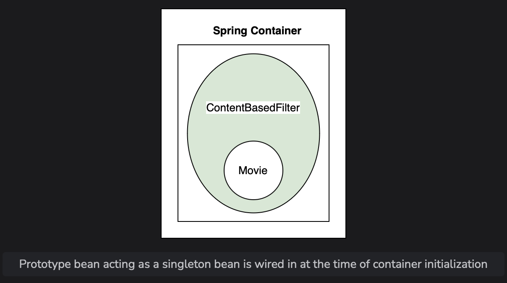
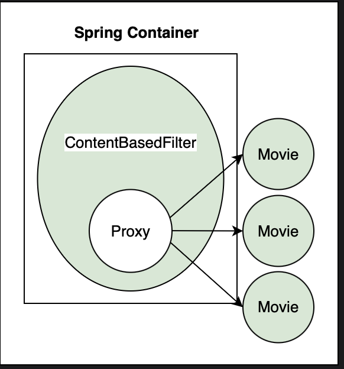

# Mixing Bean Scope

Learn what happens when the dependency of a singleton bean has prototype scope and how to get the correct output.

> We'll cover the following:
>
> - Singleton bean with prototype dependency
> - Proxy
> - @Lookup

## Singleton bean with prototype dependency

In this lesson, we will discuss an interesting problem of mixing bean scopes.  
Sometimes, **a bean has singleton scope but its dependency has a prototype scope**.

> An example is the content-based filter which recommends movies based on item-to-item similarity.  
> Our basic implementation of the content-based filter compares different movies and assigns a similarity score.  
> Hence, Movie is a dependency of the ContentBasedFilter class.
>
> The ContentBasedFilter bean has singleton scope because we need only one instance of the filter.  
>  However, **the Movie bean has prototype scope because we need more than one objects of this class.**
>
> For the code example shown in the lesson, we have created a sub-package called lesson9 inside the package io.datajek.spring.basics.movierecommendersystem.
>
> The package contains MovieRecommenderSystemApplication.java, Filter.java, and ContentBasedFilter.java files from the previous lesson.
>
> We will create a new class called Movie in the lesson9 package. This class has variables for storing movie name, genre, and produver, as well as a static member, instances, to maintain the global count of instances created.
>
> The variable instances is incremented in the constructor.
>
> The scope of the Movie class is prototype because we want multiple objects of this class in the ContentBasedFilter class.

        // Importing classes for the prototype scope
        import org.springframework.beans.factory.config.ConfigurableBeanFactory;
        import org.springframework.context.annotation.Scope;
        import org.springframework.stereotype.Component;

        @Component
        @Scope(ConfigurableBeanFactory.SCOPE_PROTOTYPE)
        public class Movie {
            //for keeping track of instances created
            private static int instances = 0;
            private int id;
            private String name;
            private String genre;
            private String producer;
            public Movie() {
                instances++;
                System.out.println("Movie constructor called");
            }
            public static int getInstances() {
                return Movie.instances;
            }
            //...
        }

> We will modify the ContentBasedFilter class to create a variable instances for keeping track of number of objects created.  
>  This variable is incremented in the constructor.
>
> We will also create a dependency on the Movie class using the @Autowired annotation.
> Lastly, we will add a getter method for the dependency (getMovie()) as shown below:

        @Component
        public class ContentBasedFilter implements Filter {
            //for keeping track of instances created
            private static int instances= 0;
            @Autowired
            private Movie movie;
            public ContentBasedFilter() {
                instances++;
                System.out.println("ContentBasedFilter constructor called");
            }
            public Movie getMovie() {
                return movie;
            }
            public static int getInstances(){
                return ContentBasedFilter.instances;
            }
        }

> In the main() method, we will get the ContentBasedFilter bean from the application context and then use it to retrieve the Movie bean thrice.

        public static void main(String[] args) {
            ApplicationContext appContext = SpringApplication.run(MovieRecommenderSystemApplication.class, args);

            //Retrieve singleton bean from application context
            ContentBasedFilter filter = appContext.getBean(ContentBasedFilter.class);
            System.out.println("\nContentBasedFilter bean with singleton scope");
            System.out.println(filter);

            //Retrieve prototype bean from the singleton bean thrice
            Movie movie1 = filter.getMovie();
            Movie movie2 = filter.getMovie();
            Movie movie3 = filter.getMovie();

            System.out.println("\nMovie bean with prototype scope");
            System.out.println(movie1);
            System.out.println(movie2);
            System.out.println(movie3);

            //Print number of instances of each bean
            System.out.println("\nContentBasedFilter instances created: " + ContentBasedFilter.getInstances());
            System.out.println("Movie instances created: "+ Movie.getInstances());
        }

> We expect one instance of ContentBasedFilter bean and there instances of the prototype Movie bean but the output is different.

        .   ____          _            __ _ _
        /\\ / ___'_ __ _ _(_)_ __  __ _ \ \ \ \
        ( ( )\___ | '_ | '_| | '_ \/ _` | \ \ \ \
        \\/  ___)| |_)| | | | | || (_| |  ) ) ) )
        '  |____| .__|_| |_|_| |_\__, | / / / /
        =========|_|==============|___/=/_/_/_/
        :: Spring Boot ::        (v2.3.4.RELEASE)

        2024-07-19 11:13:49.565  INFO 81 --- [           main] .b.m.l.MovieRecommenderSystemApplication : Starting MovieRecommenderSystemApplication v0.0.1-SNAPSHOT on 9d30ded54159 with PID 81 (/Code/movie-recommender-system/target/movie-recommender-system-0.0.1-SNAPSHOT.jar started by root in /Code/movie-recommender-system/target)
        2024-07-19 11:13:49.569  INFO 81 --- [           main] .b.m.l.MovieRecommenderSystemApplication : No active profile set, falling back to default profiles: default
        ContentBasedFilter constructor called
        Movie constructor called
        2024-07-19 11:13:50.283  INFO 81 --- [           main] .b.m.l.MovieRecommenderSystemApplication : Started MovieRecommenderSystemApplication in 1.201 seconds (JVM running for 1.658)

        ContentBasedFilter bean with singleton scope
        io.datajek.spring.basics.movierecommendersystem.lesson9.ContentBasedFilter@6ff29830

        Movie bean with prototype scope
        io.datajek.spring.basics.movierecommendersystem.lesson9.Movie@6a2b953e
        io.datajek.spring.basics.movierecommendersystem.lesson9.Movie@6a2b953e
        io.datajek.spring.basics.movierecommendersystem.lesson9.Movie@6a2b953e

        ContentBasedFilter instances created: 1
        Movie instances created: 1

The output of the code widget shows that the same Movie bean is returned every time.  
 Moreover, the number of instances of the prototype bean created is one instead of three.

> A singleton bean is created when the context is loaded. The Movie constructor was called by Spring when it was creating the ContentBasedFilter bean.
>
> The prototype bean is injected into the singleton bean at the time of creation of the singleton bean when the container initializes it.
>
> This explains the following output:

        ContentBasedFilter constructor called
        Movie constructor called

When a prototype bean is injected into a singleton bean, it loses its prototype behaviour and acts as a singleton.  
 The same instance of the bean is returned by the application context every time it is requested using the getMovie() method.

## Proxy

Right now, **Spring cannot inject the prototype bean into the singleton bean after it has been created.**  
 The problem can be solved in a number of ways.

- One of them is by using a **proxy.**
  We declare the bean with prototype scope as a proxy using the proxyMode element inside the @Scope annotation.

            @Scope(value=ConfigurableBeanFactory.SCOPE_PROTOTYPE, proxyMode=ScopedProxyMode.TARGET_CLASS)

  This prototype bean doesn't get autowired into the singleton bean at the time of its creation.  
   Instead, **a proxy or placeholder object is autowired.**  
   The proxy adds a level of indirection.

  When the developer requests the prototype bean from Spring, a proxy is created and is returned by the application context.  
   The proxy mode allows Spring container to inject a new object into the singleton bean when a method on the proxy object is called.

  

  After making changes in the code, a proxy Movie object is created and we get a new Movie bean when the ContentBasedFilter bean calls the getMovie() method on the proxy object.  
   The proxy resolves the Movie instance and calls getMovie() on the resolved instance.

As can be seen from the output, the singleton bean constructor is called when the ContentBasedFilter object is initialized, but the Movie constructor isn't called at that time.

## @Lookup

Another method is by using the @Lookup annotation on the getMovie() method.  
 This annotation tells Spring **to return an instance of Movie type**.  
 It is **essentially the same as beanFactory.getBean(Movie.class).**

One thing to consider is that singleton scope minimizes the number of objects created so the scope should only be changed where necessary.  
 **If there are more objects, there will be an impact on the memory used as well as on garbage collection.**
