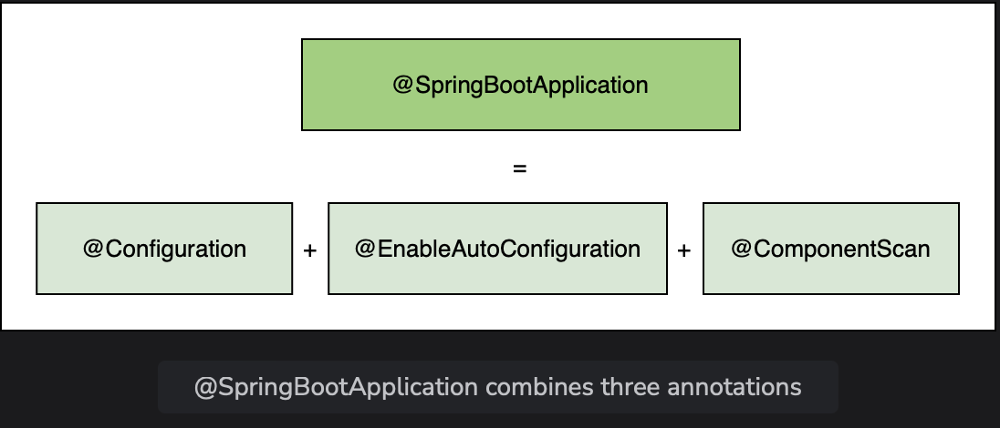
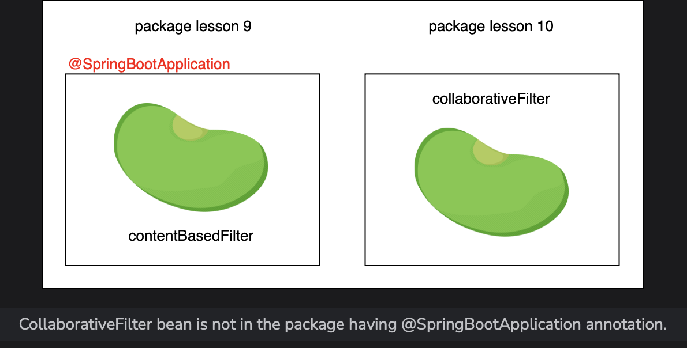
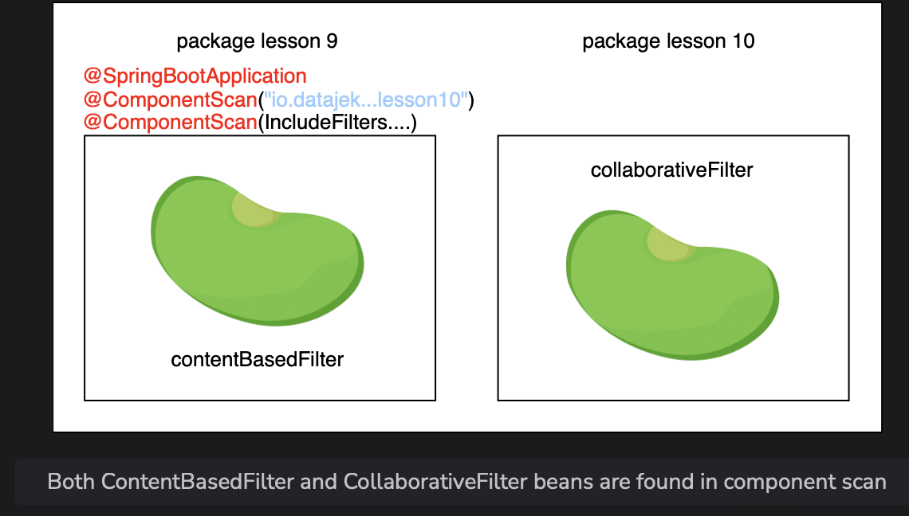

# @ComponentScan

Learn how does the Spring search for beans found in different packages.

> We'll cover the following:
>
> - @SpringBootApplication
>   > - @ComponentScan for specific package
> - Include and exclude filters
>   > - Filter types

Spring does a component scan to search for the beans that it manages.  
 In a Spring application, **the @ComponentScan annotation without any argument tells Spring to scan the current package as well as any sub-packages** that might exist.

Spring detects all classes marked with the **@Component, @Repository, @Service, and @Controller annotations during component scan.**

## @SpringBootApplication

In a Spring application, **@ComponentScan is used along with the @Configurable annotation.**  
 In a Spring Boot application, component scan happens implicitly.

The @SpringBootApplication annotation is a combination of three annotations:

- @Configurable
- @EnableAutoConfiguration
- @ComponentScan

@SpringBootApplication by default, searches the package where it is present, as well as all the sub-packages.  
 If a bean is present in a package other than the base package or its sub-package, it will not be found.

If we want Spring to find beans defined in other packages, we need to use the @ComponentScan annotation and provide the path of the package where we want Spring to look for the beans.

> For the code example shown in this lesson, we have created a sub-package called lesson10 inside the package io.datajek.spring.basics.movierecommendersystem.
>
> The package contains the CollaborativeFilter.java file copied from lesson8 package.
>
> We will also use the files from lesson9 sub-package from the previous lesson namely MovieRecommenderSystemApplication.java, Filter.java, ContentBasedFilter.java, and Movie.java.
>
> To demonstrate that Spring cannot find beans in other packages, we will use the MovieRecommenderSystemApplication class in the lesson9 sub-package to access the ContentBasedFilter and CollaborativeFilter beans.
>
> The ContentBasedFilter bean is in the same package as the application file, but the CollaborativeFilter bean is present in a different package, namely: io.datajek.spring.basics.movierecommendersystem.lesson10.
>
> 

**NOTE:** The MovieRecommenderSystemApplication class has the @SpringBootApplication annotation which means that io.datajek.spring.basics.movierecommendersystem.lesson9 and its sub-packages will be scanned for beans.  
 The **containBean() method, which returns a Boolean value, is used to check if the bean is found during component scanning.**

        package io.datajek.spring.basics.movierecommendersystem.lesson9;

        @SpringBootApplication
        public class MovieRecommenderSystemApplication {
            public static void main(String[] args) {
                ApplicationContext appContext = SpringApplication.run(MovieRecommenderSystemApplication.class, args);
                System.out.println("ContentBasedFilter bean found = " + appContext.containsBean("contentBasedFilter"));
                System.out.println("CollaborativeFilter bean found = " + appContext.containsBean("collaborativeFilter"));
            }
        }

When the application is run, the ContentBasedFilter bean (from lesson9 package) is found but the CollaborativeFilter bean (from lesson10 package) is not found.  
 This is because Spring scans the io.datajek.spring.basics.movierecommendersystem.lesson9 package where the @SpringBootApplication annotation is used.

### @ComponentScan for specific package

> We need to guide Spring to search the io.datajek.spring.basics.movierecommendersystem.lesson10 package, where the CollaborativeFilter bean is present.
>
> The basePackage argument lists all the package names that are scanned during component scanning.
>
> We will use the @ComponentScan annotation with basePackage argument as follows:

        @ComponentScan(basePackages = "io.datajek.spring.basics.movierecommendersystem.lesson10")

This time Spring detects the CollaborativeFilter bean but since we explicitly specified the package to be searched, it only looked for beans in that package only, and thus the ContentBasedFilter bean was not found.  
 

If lesson9 package is included in the basePackage list, as shown below, both beans will be found.

        @ComponentScan(basePackages={"io.datajek.spring.basics.movierecommendersystem.lesson9", "io.datajek.spring.basics.movierecommendersystem.lesson10"})

## Include and exclude filters

@ComponentScan can be used to include or exclude certain packages from being scanned.  
 **Include filters** are used to _include certain classes in component scan_.  
 **Exclude filters** are used to _stop Spring from auto-detecting classes in component scan_.

### Filter types

There are different types of filters that make use of **stereotype annotations, interfaces, regular expressions, and AspectJ expressions**.

Spring **also allows the creation of custom filters**, e.g., find only those beans whose names are a certain length.

FilterType can have the following values:

- FilterType.ANNOTATION
- FilterType.ASPECTJ
- FilterType.ASSIGNABLE_TYPE
- FilterType.REGEX
- FilterType.CUSTOM

One way to direct Spring to detect both ContentBasedFilter and CollaborativeFilter beans, is to use the **include filter of type REGEX and provide the path of the package where the ContentBasedFilter bean is present**.

        @ComponentScan(basePackages = "io.datajek.spring.basics.movierecommendersystem.lesson10")
        @ComponentScan(includeFilters = @ComponentScan.Filter(
                    type= FilterType.REGEX,
                    pattern="io.datajek.spring.basics.movierecommendersystem.lesson9.*"))

Our REGEX pattern evaluates to all beans declared with @Component annotation in the lesson9 package.  
 Now when the application is run, beans from two different packages are successfully detected.

