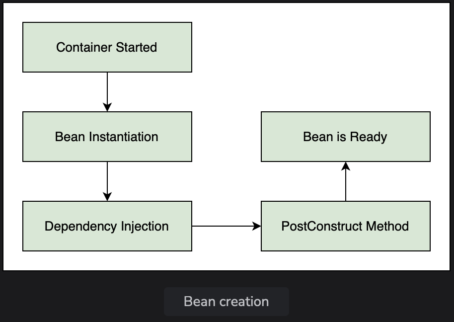
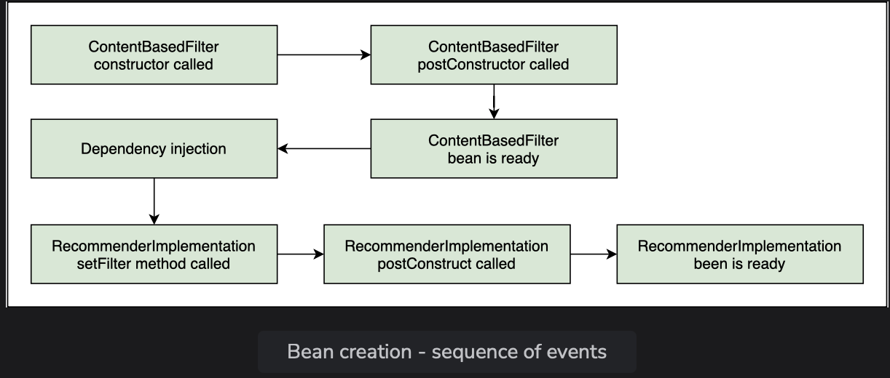
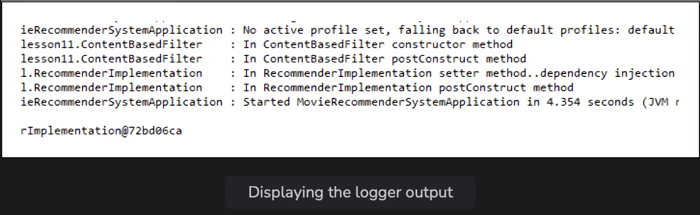
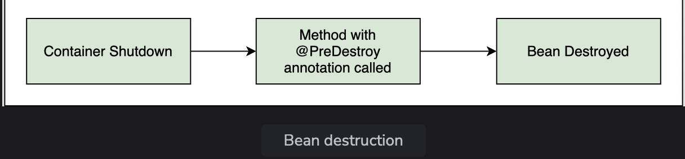

# Bean Lifecycle: @PostConstruct and @PreDestroy

Learn about the bean lifecycle methods annotated with @PostConstruct and @PreDestroy

> We'll cover the following:
>
> - @PostConstruct
> - @PreDestroy

**Spring manages the entire lifecycle of beans** from the time they are created till the time they are destroted.  
 It **provides post-initialization and pre-destruction callback methods on the beans.**

> The developer can tap these callbacks and write custom initialization and cleanup code.
>
> For the code example shown in this lesson, we have created a sub-package called lesson11 inside the package io.datajek.spring.basics.movierecommendersystem. The package contains MovieRecommenderSystemApplication.java, Filter.java, ContentBasedFilter.java, and RecommenderImplementation.java files.

In this lesson, we will introduce the **slf4j** logger to log the sequence of events in our application and use it instead of **System.out.println.**

**Loggers offer flexibility, as well as better output,** that includes timestamp, name of the thread executing the code, and the name of the class.  
 This information comes in handy when debugging applications.

We will declare a logger and import the relevant files as follows:  
 (defining the RecommenderImplementation class)

        import org.slf4j.Logger;
        import org.slf4j.LoggerFactory;

        @Component
        public class RecommenderImplementation {
            private Logger logger = LoggerFactory.getLogger(this.getClass());
            //...
        }

Similarly, we will declare a logger in the ContentBasedFilter class as well.

Next, we will create a setter method in RecommenderImplementation to inject the Filter dependency and display a logging message as follows:

        @Component
        public class RecommenderImplementation {
            //...
            private Filter filter;

            @Autowired
            public void setFilter(Filter filter) {
                logger.info("In RecommenderImplementation setter method..dependency injection");
                this.filter = filter;
            }
            //...
        }

## @PostConstruct

When Spring creates a bean, it autowires the dependencies.  
 If the developer wants to **perform a task after the dependencies have been populated**, it can be **done by calling a method annotated with the @PostConstruct annotation**.

A method with this annotation workd like the init() method.  
 The @PostConstruct annotation tells Spring to call the method for us once the object has been created.  
 The method can have any name and its return type is always void.

> After the bean is created, we can **initialize the contents of the bean, load data, establish a database connection, or connect to a web server.**
>
> The post construct method is only called after all the dependencies have been populated.
>
> 

We will create a method called postConstruct() in the RecommenderImplementation class and use the @PostConstruct annotation on it.  
 This method can have any name.

        import javax.annotation.PostConstruct;

        @Component
        public class RecommenderImplementation {
            //...
            @PostConstruct
            public void postConstruct() {
                //initialization code goes here
                logger.info("In RecommenderImplementation postConstruct method");
            }
            //...
        }

Similarly, for the ContentBasedFilter class, the constructor and post construct method are shown below:

        @Component
        public class ContentBasedFilter implements Filter{
            //...
            public ContentBasedFilter() {
                super();
                logger.info("In ContentBasedFilter constructor method");
            }
            @PostConstruct
            private void postConstruct() {
                //load movies into cache
                logger.info("In ContentBasedFilter postConstruct method");
            }
            //...
        }

In the main() method, we will create a RecommenderImplementation bean and observe the order in which the constructor and post construct methods of the bean and its dependency are called.

        public static void main(String[] args) {
            ApplicationContext appContext = SpringApplication.run(MovieRecommenderSystemApplication.class, args);
            //use ApplicationContext to get recommender object
            RecommenderImplementation recommender = appContext.getBean(RecommenderImplementation.class);
            System.out.println(recommender);
        }

> The logger message give an insight into the sequence of events after the container is initialized.
>
> In order to create the RecommenderImplementation bean, the ContentBasedFilter bean is needed.  
>  The constructor of the ContentBasedFilter class is called.
>
> When the bean has been created, it is injected into the RecommenderImplementation bean as can be seen from the logger output of the setter method.
>
> After the dependency has been injected into the RecommenderImplementation bean, its PostConstruct() method is called.
>
> Now the bean is ready for use and is returned by the getBean() method after which the bean name is printed.
>
> 
>
> The logger output is shown below:
>
> 

## @PreDestroy

The **callback method that is executed just before the bean is destroyed is annotated using @PreDestroy.**  
 The method having this annotation is **called when the bean is in the process of being removed from the container.**

**All cleanup stuff can be performed in this method.**  
 A method with the **@PreDestroy annotation can be used to release resources or close a database connection.**

> We will write our custom destroy method in both the RecommenderImplementation and ContentBasedFilter classes.  
>  Here's the code for RecommenderImplementation class:

        import javax.annotation.PreDestroy;

        @Component
        public class RecommenderImplementation {
            //...
            @PreDestroy
            public void preDestroy() {
                //cleanup code
                logger.info("In RecommenderImplementation preDestroy method");
            }
        }

> Here's code for ContentBasedFilter class:

        @Component
        public class ContentBasedFilter implements Filter{
            //...
            @PreDestroy
            private void preDestroy() {
                //clear movies from cache
                logger.info("In ContentBasedFilter preDestroy method");
            }
        }

The log shows that when the RecommenderImplementation bean is in the process of being destroyed, its PreDestroy() method is called followed by the ContentBasedFilter bean's PreDestroy() method.

**MovieRecommenderSystem.java**

        package io.datajek.spring.basics.movierecommendersystem.lesson11;
        import java.util.Arrays;
        import org.springframework.boot.SpringApplication;
        import org.springframework.boot.autoconfigure.SpringBootApplication;
        import org.springframework.context.ApplicationContext;

        @SpringBootApplication
        public class MovieRecommenderSystemApplication {
            public static void main(String[] args) {
                //ApplicationContext manages the beans and dependencies
                ApplicationContext appContext = SpringApplication.run(MovieRecommenderSystemApplication.class, args);

                //use ApplicationContext to get recommender object
                RecommenderImplementation recommender = appContext.getBean(RecommenderImplementation.class);

                System.out.println();
                System.out.println();
                System.out.println(recommender);

                //call method to get recommendations
                String[] result = recommender.recommendMovies("Finding Dory");

                //display results
                System.out.println();
                System.out.println();
                System.out.println(Arrays.toString(result));
            }
        }

**RecommenderImplementation.java**

        package io.datajek.spring.basics.movierecommendersystem.lesson11;
        import javax.annotation.PostConstruct;
        import javax.annotation.PreDestroy;
        import org.slf4j.Logger;
        import org.slf4j.LoggerFactory;
        import org.springframework.beans.factory.annotation.Autowired;
        import org.springframework.stereotype.Component;

        @Component
        public class RecommenderImplementation {
            private Logger logger = LoggerFactory.getLogger(this.getClass());
            private Filter filter;

            @Autowired
            public void setFilter(Filter filter) {
                logger.info("In RecommenderImplementation setter method..dependency injection");
                this.filter = filter;
            }
            //use a filter to find recommendations
            public String [] recommendMovies (String movie) {
                String[] results = filter.getRecommendations("Finding Dory");
                return results;
            }
            @PostConstruct
            public void postConstruct() {
                //initialization code
                logger.info("In RecommenderImplementation postConstruct method");
            }
            @PreDestroy
            public void preDestroy() {
                //cleanup code
                logger.info("In RecommenderImplementation preDestroy method");
            }
        }

**Filter.java**

        package io.datajek.spring.basics.movierecommendersystem.lesson11;

        public interface Filter {
            public String[] getRecommendations(String movie);
        }

**ContentBasedFilter.java**

        package io.datajek.spring.basics.movierecommendersystem.lesson11;
        import javax.annotation.PostConstruct;
        import javax.annotation.PreDestroy;
        import org.slf4j.Logger;
        import org.slf4j.LoggerFactory;
        import org.springframework.stereotype.Component;

        @Component
        public class ContentBasedFilter implements Filter{
            private Logger logger = LoggerFactory.getLogger(this.getClass());
            public ContentBasedFilter() {
                super();
                logger.info("In ContentBasedFilter constructor method");
            }
            @PostConstruct
            private void postConstruct() {
                //load movies into cache
                logger.info("In ContentBasedFilter postConstruct method");
            }
            @PreDestroy
            private void preDestroy() {
                //clear movies from cache
                logger.info("In ContentBasedFilter preDestroy method");
            }
            //getRecommendations takes a movie as input and returns a list of similar movies
            public String[] getRecommendations(String movie) {
                //calculate similarity between movies
                //return movie recommendations
                return new String[] {"Happy Feet", "Ice Age", "Shark Tale"};
            }
        }
