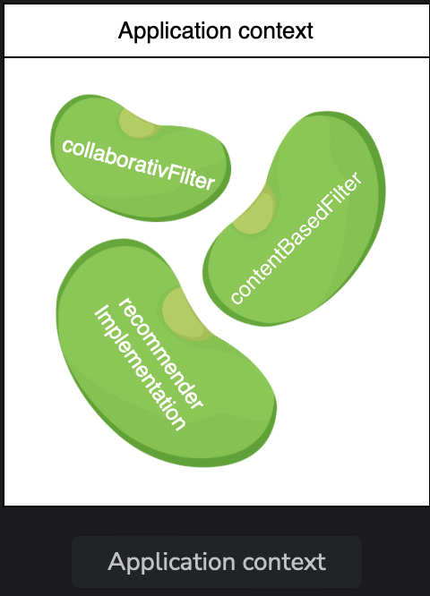

# XML Application Configuration

Learn how to replace Spring annotations with XML configuration.

> We'll cover the following:
>
> - XML configuration file
>   > - <bean> tag
> - ClassPathXmlApplicationContext
> - Dependency injection
>   > - Using <property> tag
>   > - Using constructor injection
> - Closing the context

Have a look at how to configure a Spring application using XML.  
 We will remove annotations from our application altogether and use XML to define beans and dependencies.

> For the code example shown in this lesson, we have created a sub-package called lesson14 inside the package io.datajek.spring.basics.movierecommendersystem.
>
> The package contains MovieRecommenderSystemApplication.java, Filter.java, ContentBasedFilter.java, CollaborativeFilter.java, and RecommenderImplementation.java files copied from the previous lesson.

We will remove all annotations from the code.  
 This **includes the @Configuration and @ComponentScan annotations** from the MovieRecommenderSystemApplication class and **@Component, @Qualifier, and @Autowired annotations** from RecommenderImplementation, ContentBasedFilter, and CollaborativeFilter classes.

## XML configuration file

The first step is creating an XML file that contains the bean definitions.  
 Spring will read this file and know which beans to create and manage.

We will create an XML file in src/main/resources and call it **appContext.xml.**

First, we need to provide some metadata for validating the tags which will be used in this file.

**The metadata defines the schema location of the tags**, as shown:

            <beans xmlns="http://www.springframework.org/schema/beans" xmlns:xsi="http://www.w3.org/2001/XMLSchema-instance" xsi:schemaLocation="http://www.springframework.org/schema/beans    http://www.springframework.org/schema/beans/spring-beans.xsd">

            <!-- bean definitions -->
            </beans>

## <bean> tag

Next, we will define the beans inside this metadata using the <bean> </bean> tag.  
 For every bean, we need to **specify the fully-qualified class name as well as a reference id.**  
 The fully-qualified class name is the **class name along with its package name**.

We used @Component at three places in our application.  
Now we will declare three beans as follows:

            <bean id="contentBasedFilter"
                class="io.datajek.spring.basics.movierecommendersystem.lesson14.ContentBasedFilter">
            </bean>

            <bean id="collaborativeFilter"
                class="io.datajek.spring.basics.movierecommendersystem.lesson14.CollaborativeFilter">
            </bean>

            <bean id="recommenderImplementation"
                class="io.datajek.spring.basics.movierecommendersystem.lesson14.RecommenderImplementation">
            </bean>

The **IOC container will read the appContext.xml file and create objects of the classes mentioned in it.**  
 It will **call the constructor of the class to create the object by giving it the name that we specified as the id.**

Hence, the following line:

            <bean id="contentBasedFilter">
            </bean>

translates to:

            ContentBasedFilter contentBasedFilter = new ContentBasedFilter();

Let's have a look at its pictorial representation:  
 

After reading appContext.xml file, the IOC container creates the following beans:  

## ClassPathXmlApplicationContext

Inside the main() method, the **application context will be created using ClassPathXmlApplicationContext by providing the name of the XML config file as an argument.**

            ClassPathXmlApplicationContext appContext = new ClassPathXmlApplicationContext("appContext.xml");

Once the context is loaded, we can check **which beans are present using the getBeanDefinitionNames() method**:

            //check the beans which have been loaded
            System.out.println("\nBeans loaded:");
            System.out.println(Arrays.toString(appContext.getBeanDefinitionNames()));

We can also **retrieve a bean using the getBeans() method by providing the bean id** (defined in the appContext.xml file) **along with the class name** as follows:

            //retrieve bean from the application context
            RecommenderImplementation recommender = appContext.getBean("recommenderImplementation", RecommenderImplementation.class);

## Dependency injection

> In our application, Filter is a dependency of RecommenderImplementation.

**In XML, a dependency can be defined in multiple ways:**

- ### Using property tag

  We can create getter and setter methods for the Filter dependency as follows:

            public class RecommenderImplementation {
                private Filter filter;
                public Filter getFilter() {
                    return filter;
                }
                public void setFilter(Filter filter) {
                    this.filter = filter;
                }
                //...
            }

  To define this dependency, we will modify the bean tag created above and use property tag for the dependency as follows:

            <bean id="recommenderImplementation"
                class="io.datajek.spring.basics.movierecommendersystem.lesson14.RecommenderImplementation">
                <property name="filter" ref="collaborativeFilter"/>
            </bean>

  > The setter method setFilter() will be used to set the filter dependency in the recommenderImplementation object by passing the reference of the collaborativeFilter object.  
  >  We can change the ref property to use the contentBasedFilter bean as well.

  **A no-arg constructor is needed** for the above mentioned dependency injection to work, if the RecommenderImplementation class has a constructor for setting filter dependency.

- ### Using constructor injection

  Instead of using the setter method, we can define a constructor in the RecommenderImplementation class as follows:

            public class RecommenderImplementation {
                private Filter filter;
                public RecommenderImplementation(Filter filter) {
                    this.filter = filter;
                }
                //...
            }

  To use the constructor method defined above, we will use the constructor-arg tag in the bean tag created above as follows:

            <bean id="recommenderImplementation"
                class="io.datajek.spring.basics.movierecommendersystem.lesson14.RecommenderImplementation">
                <constructor-arg ref="collaborativeFilter"/>
            </bean>

  > This tells Spring to **pass a bean called collaborativeFilter as a constructor argument when creating the recommenderImplementation object.**  
  >  We can change the name of the argument to autowire contentBasedFilter as well.

  After dependency injection, we can run the application to find movie recommendations in the main() method:

            //retrieve bean from the application context
            RecommenderImplementation recommender = appContext.getBean("recommenderImplementation", RecommenderImplementation.class);
            //call method to get recommendations
            String[] result = recommender.recommendMovies("Finding Dory");

            //display results
            System.out.println(Arrays.toString(result));

  From the output, it can be seen that the dependency has been autowired.

## Closing the context

The last step is to close the context.

        appContext.close();

We are now ready to run the application using XML configuration.

**MovieRecommenderSystemApplication.java**

            package io.datajek.spring.basics.movierecommendersystem.lesson14;
            import java.util.Arrays;
            import org.springframework.context.support.ClassPathXmlApplicationContext;

            public class MovieRecommenderSystemApplication {
                public static void main(String[] args) {
                    //load the configuration file
                    ClassPathXmlApplicationContext appContext = new ClassPathXmlApplicationContext("appContext.xml");

                    //check the beans which have been loaded
                    System.out.println("\nBeans loaded:");
                    System.out.println(Arrays.toString(appContext.getBeanDefinitionNames()));

                    //retrieve bean from the application context
                    RecommenderImplementation recommender = appContext.getBean("recommenderImplementation", RecommenderImplementation.class);

                    //call method to get recommendations
                    String[] result = recommender.recommendMovies("Finding Dory");

                    //display results
                    System.out.println();
                    System.out.println(Arrays.toString(result));

                    appContext.close();
                }
            }

**RecommenderImplementaion.java**

            package io.datajek.spring.basics.movierecommendersystem.lesson14;

            public class RecommenderImplementation {
                private Filter filter;
                public void setFilter(Filter filter) {
                    this.filter = filter;
                }
                public Filter getFilter() {
                    return filter;
                }
                public RecommenderImplementation() {
                }
                public RecommenderImplementation(Filter filter) {
                    this.filter = filter;
                }
                //use a filter to find recommendations
                public String [] recommendMovies (String movie) {
                    //print the name of interface implementation being used
                    System.out.println("\nName of the filter in use: " + filter + "\n");
                    String[] results = filter.getRecommendations("Finding Dory");
                    return results;
                }
            }

**appContext.xml**

                <?xml version="1.0" encoding="UTF-8"?>
                <beans xmlns="http://www.springframework.org/schema/beans"
                    xmlns:xsi="http://www.w3.org/2001/XMLSchema-instance"
                    xsi:schemaLocation="http://www.springframework.org/schema/beans
                            http://www.springframework.org/schema/beans/spring-beans.xsd">

                <!-- bean definitions -->
                    <bean id="contentBasedFilter"
                            class="io.datajek.spring.basics.movierecommendersystem.lesson14.ContentBasedFilter">
                    </bean>

                    <bean id="collaborativeFilter"
                            class="io.datajek.spring.basics.movierecommendersystem.lesson14.CollaborativeFilter">
                    </bean>

                    <bean id="recommenderImplementation"
                            class="io.datajek.spring.basics.movierecommendersystem.lesson14.RecommenderImplementation">
                            <!--<property name="filter" ref="collaborativeFilter"/> -->
                            <constructor-arg ref="collaborativeFilter"/>
                    </bean>

                </beans>
