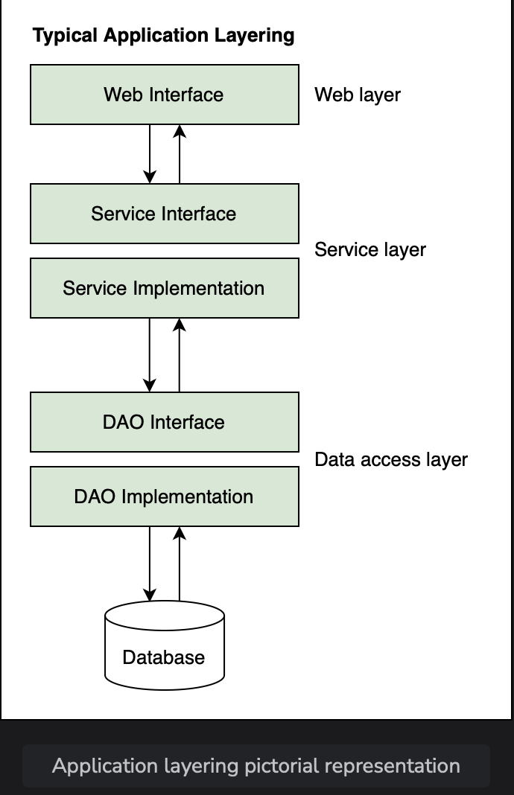
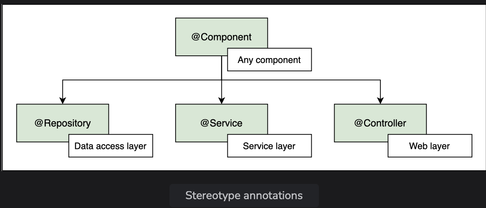
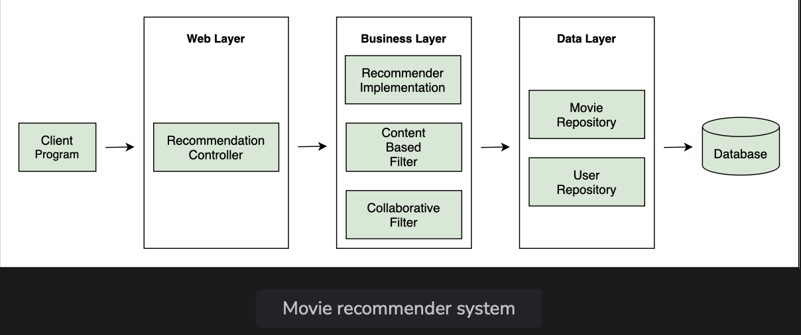

# Strereotype Annotations

Learn about different annotations that can be used in place of the generic @Component annotation and their usage.

> We'll cover the following:
>
> - @Controller
> - @Service
> - @Reposistory

Beans can be declared using the @Component annotation and the bean tag.  
 But there are other ways to define beans. We will look at some of them in this lesson.

Beans can be detected using the @Bean annotation in a configuration class or by using the @Controller, @Service, and @Repository annotations.  
 These annotations are used at different layers of an enterprise application.

A typical annotation has the following layers:  
 

The web or UI layer interacts with the client program, the service layer provides an abstraction between the web and data access layer as well as taking care of business logic, and the data layer interacts with databases or an external interface.  
 @Component is generic annotation. It can be used in any layer, if the developer is unsure about where the bean belongs.  
 The other three annotations, @Controller, @Service, and @Repository, are specific to layers.

## @Controller

@Controller is used to define a controller in the web layer. Spring scans a class with @Controller to find methods that are mapped to different HTTP requests.  
 It makes sure that the right view is rendered to the user.

**@RestController is a specialized form of @Controller.**

## @Service

@Service is used in the business layer for objects that define the business logic.  
 It marks a class as a service provider.

## @Repository

@Repository is used in the data layer to encapsulate storage, retrieval, and search in a typical database.  
 This annotation can also be used for other external sources of data.

> Create a new sub-package lesson-16 and copy all files from the lesson-11 sub-package.  
> Here, the RecommenderImplementation class contains the business logic.  
> The filter algorithm contained in the ContentBasedFilter class also falls in the category of business logic.  
> The Movie class is responsible for loading movie data from a movie repository as well as comparing movies to find similarity so it represents the data access layer.
>
> Note that, we haven’t written the logic of retrieving movie data yet. All the above mentioned classes contain the @Component annotation.

We can replace the @Component annotation with the stereotype annotation.  
 Instead of @Component, we can use the @Service annotation for classes with business logic i.e., RecommenderImplementation and ContentBasedFilter.  
Similarly, if we had the CollaborativeFilter class in the packge, we could annotate it with @Service too.

For the Movie class, we can replace the @Component annotation with @Repository annotation as it belongs to the data access layer.

> It can be seen that there is no change in terms of output when the stereotype annotation replace the @Component annotation.

---

Right now, there is no web layer in our application, but we can have a RecommendationController class marked with @Controller that calls the classes in the business layer.  
 Likewise, we should also have a User class marked with @Repository to hold the user watch history and movie preferences data for our recommender system.

**The advantage of having annotations specific to every layer instead of the generic @Component is in Aspect Oriented Programming (AOP).**  
 We can identify the annotations and add functionility to specific annotations.  
 Similarly, we can classify components in different categories and apply a specific logic to each category.

> For example, if we want to log everything that is coming from the business layer, we can identify objects with the @Service annotation using AOP and log all the content.

Spring provides a **default exception translation facility for JDBC exceptions if the @Repository annotation is used**.  
 This feature cannot be used on beans annotated with @Component.  
 When using a persistence framework like Hibernate, exceptions thrown in a **class with the @Repository annotation are caught and automatically translated into Spring's DataAccessException class**.

Likewise, the **request mapping feature is enabled only when using the @Controller annotation.**  
 The DispatcherServlet automatically looks for @RequestMapping for classes marked with the @Controller annotation only.

The @Controller, @Service, and @Repository annotations are similar to @Component annotation with respect to bean creation and dependency injection, except that **they provide specialized functionality**.
