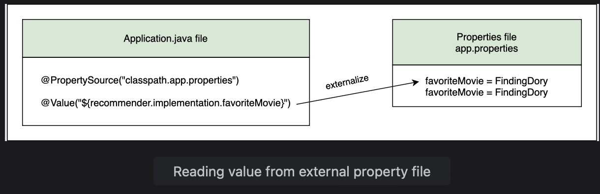

# Using an External Property File

Learn how to use an external property file in the Java application.

> We'll cover the following:
>
> - application-properties file
> - @Value
> - @PropertySource

Applications have a lot of configuration and keeping it seperate from the code leads to clarity. If the property file is inside the jar when the application is built, it can't be changed later without having to un-compress the jar.  
 Spring provides a way to change configuration while the application jar remains intact.

The application configuration is different in different environements. Local machines are used in development, then the application moves to test environment, and afterwards a production server is used.  
 To use different configuration in different environments, a property file is used to externalize the values for each environment.  
 For example, the database connection in the data layer might be different in different environments.  
 The developer can create an application with default properties and deploy it.  
Then, if the values need to be changed, an external property file will do the trick. The values from the external property file outside the jar overwrite the values inside the jar.

## application-properties file

The application-properties file is a text file that defines the key-value pair for a property.  
 The name of the property **follows a convention where the class name is used with the property name to disambiguate properties with the same name in different classes.**

> For the code example shown in this lesson, we have created a sub-package called lesson15 inside the package io.datajek.spring.basics.movierecommendersystem.  
>  The package contains MovieRecommenderSystemApplication.java, Filter.java, ContentBasedFilter.java, CollaborativeFilter.java, and RecommenderImplementation.java files copied from lesson6 sub-package.

Our movie recommender system has been using a hard coded input string, Finding Dory, for the movie.  
 We can create a variable favoriteMovie in RecommenderImplementation class for the input string as follows:

            String favoriteMovie = "Finding Dory";
            public String getFavoriteMovie() {
                return favoriteMovie;
            }
            //...

> We will dynamically fetch the value of favoriteMovie from a property file. To make sure that the value has been read from the File, we have created a getter method getFavoriteMovie() that returns the value read.

We will create a file called **app.properties** in src/main/resources and define a value for favoriteMovie in it.  
 Every line in this file defines a value for a property key using the equality (=) sign.  
 As per convention, the fully-qualified name of the variable should be used.

            recommender.implementation.favoriteMovie = Finding Dory

## @Value

We can dynamically fetch the favoriteMovie value from the file using the @Value annotation.  
 This annotation can be used with the constructor or setter method. It can be used directly on the variable using the following syntax:

            @Value("${recommender.implementation.favoriteMovie}")
            String favoriteMovie;

If the propery value is not found in app.properties file, Spring throws the **IllegalArgumentException**.  
 One way to avoid this exception is to provide a **default value for the property**.

            @Value("${recommender.implementation.favoriteMovie: Finding Dory}")
            String favoriteMovie;

Now, if the favoriteMovie property is commented out in the app.properties file using the # symbol, its default value will be read.

## PropertySource

In the MovieRecommenderSystemApplication method, we will mention the name of the film from where to fetch the value using the @PropertySource annotation.  
 By default, Spring loads the property file from the classpath.  
 Since our file is in src/main/resources, we will use classpath:app.properties. The getFavoriteMovie() method will print the value read from the property file.

            @SpringBootApplication

            @PropertySource("classpath:app.properties")
            public class MovieRecommenderSystemApplication {
                public static void main(String[] args) {
                    ApplicationContext appContext = SpringApplication.run(MovieRecommenderSystemApplication.class, args);

                    RecommenderImplementation recommender = appContext.getBean(RecommenderImplementation.class);

                    String favoriteMovie = recommender.getFavoriteMovie();
                    System.out.println(favoriteMovie);
                }
            }

If the code given below is executed, our application will run as usual after reading the value from the property file. This gives us the freedom to change the value of favoriteMovie in the app.properties file without having to make changes to the source code.

