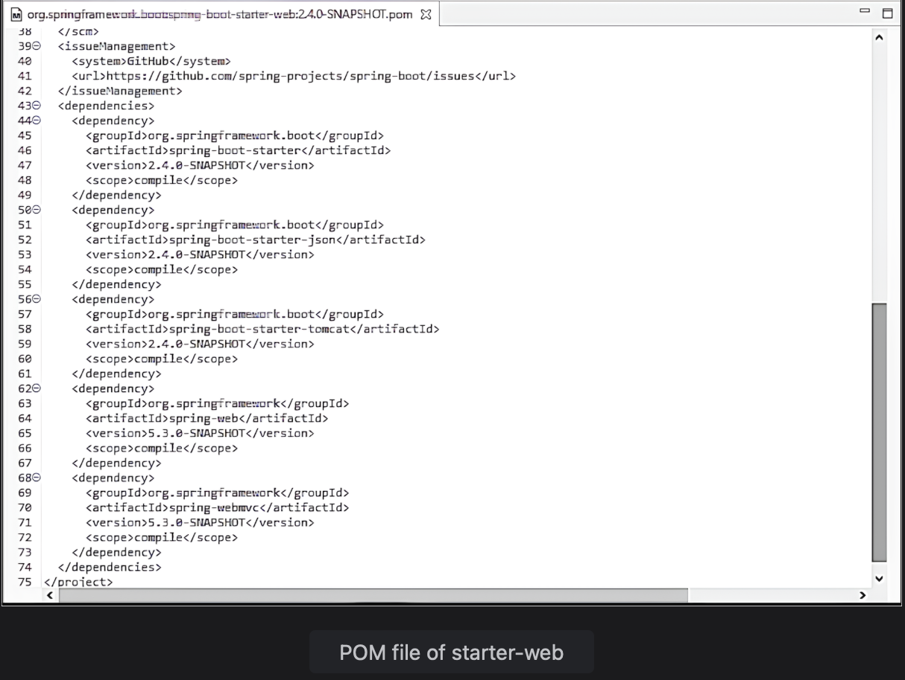

# What is Spring Boot?

Learn about the needs and features of Spring Boot with a focus on started projects.

> We'll cover the following:
>
> - Features of Spring Boot
> - Spring Boot autoconfiguration
> - Starter projects
>   - Starter web
>   - Started test
>   - Started JPA

## Features of Spring Boot

Spring boot enables robust creation of applications. It provides features like servers, metrics, health checks, etc. Spring Boot allows for integration with many different servers, but by itself, it is neither an application server nor a web server.  
 **Auto configuration is a great feature of Spring Boot whereby it provides all the required dependencies to start a particular project.**

> For example, starter web automatically configures everything needed for a web application. Similarly, starter JPA automatically configures basic JPA along with Hibernate.

The main features of Spring Boot are shown below:  

## Spring Boot autoconfiguraion

**Without Spring Boot, creating a simple web application can be a daunting and time-consuming task.**  
 When creating a project, the frameworks required need to be decided along with the versions of the frameworks that are compatible with each other.

Spring Boot does that work for us. **It has already created a set of dependencies with compatible versions.**  
 The developer only needs to choose the uber dependency (like starter web) and Spring Boot configures appropriate versions of Spring core, dispatcher servlet, view resolver, logging, security and validation frameworks along with exception handling and support for internationalization.

Spring Boot takes care of the **configuration part for us so we can focus on developing the business logic.** Spring Boot saves the time spent on creating a Spring application from scratch. An analogy of Spring and Spring Boot is shown below:  

## Starter projects

Spring boot offers starter project which have a set of predefined dependencies.  
 These dependencies are **automatically provided to the project to simplify the build configuration**.

## Starter web

Starter web is the preferred starter for building web applications, including RESTful applications, using Spring MVC.  
 It uses Tomcat as the default embedded container.

> The pom.xml file of spring-boot-starter-web shows a number of dependencies including spring-web, spring-webmvc, starter-tomcat, and starte-json for conversion to JSON when a web service is invoked.  
>  

## Starter test

Starter test is the starter dependency for testing Spring Boot applications with libraries including JUnit Jupiter, Hamcrest, and Mockito.  
 sprint-boot-starter-test enables the developer to write unit and integration tests.

> The pom.xml file shows dependencies on JUnit, AssertJ, and Mockito.  
>  It also has Hamcrest that, in combination with AssertJ, is used for writing matchers.  
>  

## Starter JPA

Starter JPA is another frequently used starter project. JPA is the interface for the Hibernate framework.  
 starter-data-jpa is used for Spring Data JPA with Hibernate.

> The pom.xml shows that it has a dependency on spring-boot-starter-aop, spring-boot-starter-jdbc, hibernate-core, and transaction-api.  
>  
