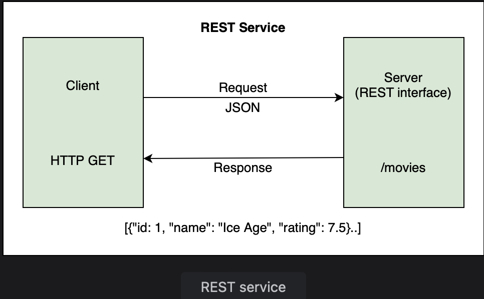
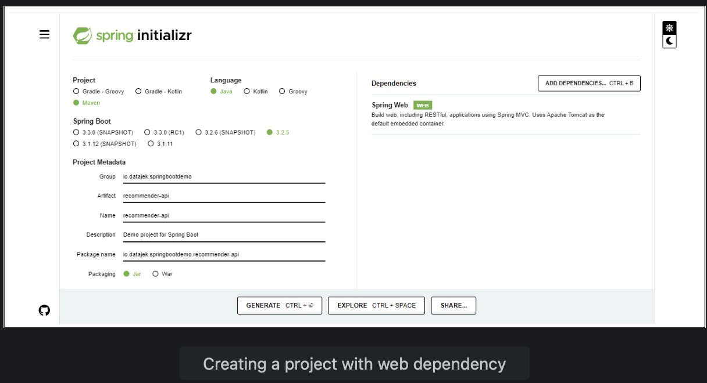

# Creating a REST service

Learn about the ease and simplicitu of development using Spring Boot by creating a REST controller.

> We'll cover the following:
>
> 1. Using Spring Initializer
> 2. @RestController annotation
> 3. Mapping requests

> Let's have a look at how to create a REST service using Spring Boot. We will define a controller for movie recommendations to return a few hard coded values when URI http://localhost:8080/movies is accessed.  
>  The HTTP GET request for the above URI will be mapped to a controller method which returns a JSON response.
>
> 

Let's see how Spring Boot makes application development easy. The application is created using the following steps:

1. Using Spring Initializr

- There are numerous ways of creating a Spring Boot application. The easiest way is using the web UI called Spring Initializr.  
   Other approaches include using Spring Boot command line interface (CLI) and the Spring Tools Suite (STS) IDE.
  The Spring Initializr offers a way to bootstrap a Spring Boot application by offering a set of options to choose from.  
   **These are called starter projects.**

  Starter projects make it very easy to develop applications. Since we want to develop a simple REST service, we need the web starter.  
   We will fill the form on start.spring.io with the following information:

  - Group: io.datajek.springbootdemo
  - Artifact: recommender-api

- Click "Add Dependencies" and choose the "Spring Web" dependency from the web sections. Click on the "Generate" button, and once the project is downloaded, unzip and import the project into your IDE.

  

- The "Spring Web" dependency that we added results in a lot of jars being downloaded.  
   These can be seen int the "Maven Dependencies" folder and include **jackson-databind, tomcat, spring-webmvc, and json, etc.**

  If we were to create a REST application without Spring Boot we would need to add the spring-webmvc, jackson-databind, servlet-api for configurin the dispatcher servlet, as well as other dependencies that Spring Boot automatically downloaded for us.  
   Spring Boot provides us with an embedded server.

- If we open the application and run it, the log says: "Tomcat started on port 8080". This means that we have a web applicaiton up and running.  
   Tomcat runs on port 8080 by default. To verify that the server is running, we can go to the web browser and type http://localhost:8080 or http://127.0.0.1:8080.

  We will get an error from the Tomcat servlet container saying there is no mapping for /error defined.  
   This is because we have not provided any mapping for localhost. So, when the server tries to go to /error and finds no mapping, it throws an error.  
   We will define a mapping for localhost in step 3.  
   

2. **@RestController** annotation

- To create a controller, we will create a class called RecommendationController and **use an annotation @RestController to inform Spring that this is a controller class.**

  **A controller is a Java class that maps a URI to a method.**  
   When the method is executed, it returns a response.

  **A @RestController is a specialized form of @Controller annotation which handles REST requests and responses.**  
   It automatically **handles conversion to JSON**.

        import org.springframework.web.bind.annotation.RestController;

        @RestController
        public class RecommendationsController {
            // method to return all movies
        }

- Next, we will create a class Movie that has id, name, and rating attributes.  
   We will add constructors, getter methods, and a toString() method as follows:

         public class Movie {
             int id;
             String name;
             double rating;

             public Movie() {}
             public Movie(int id, String name, double rating) {
                 super();
                 this.id = id;
                 this.name = name;
                 this.rating = rating;
             }
             public int getId() {
                 return id;
             }
             public String getName() {
                 return name;
             }
             public double getRating() {
                 return rating;
             }
             @Override
             public String toString() {
                 return "Movie [id=" + id + ", name=" + name + ", rating=" + rating + "]";
             }
         }

  Note, that we have added a no-arg constructor along with a constructor taking movie name and rating as arguments.

  - Now that we have a Movie class, we can create a method in the controller that returns a list of movies. This method is called getAllMovies() and its return type is a List of Movie objects.  
    We will create a list inline using the Arrays.asList() method as follows:

            public List<Movie> getAllMovies() {
                return Arrays.asList(new Movie(1, "Ice Age", 7.5),
                                    new Movie(2, "Happy Feet", 6.4),
                                    new Movie(3, "Shark Tales", 6.0) );
            }

3. Mapping requests

We have created a controller and a method. Now we need to inform Spring to execute the method when the HTTP request is received.  
 There are different types of HTTP requests like GET, POST, PUT, etc.

The **@RequestMapping annotation maps the HTTP request and URI to a method in the controller.**  
 Since we currently handling a GET request, we can also use the **shortcut annotation @GetMapping** on the getAllMovies() method.

            @RequestMapping(method=RequestMethod.GET, value="/movies")
            // OR
            @GetMapping("/movies")
            public List<Movie> getAllMovies() {
                // ..
            }

The **@GetMapping annotation will map the /movies URI to the getAllMovies() method and convert the list of movies returned by the method to a JSON response.**

By following these simple steps, our REST controller is ready. If the application in the widget below is executed, a JSON response is returned by the server.

If you are running this application in your IDE, head over to the browser and type localhost:8080/movies or http://127.0.0.1.:8080/movies in your browser.  
 The server will respond back with a JSON response of the recommended movies.

---

To be able to run the application again in an IDE, we need to kill the application to free up port 8080.

In this lesson, we focused on the logic of creating a controller while the infrastructure was taken care of by Spring Boot.  
 All the things needed for the REST service to function were configured automatically.

Here is a list of things that happened in the background:

- **@SpringBootApplication** annotation defines a configuration and enables a component scan. The dispatcher servlet gets initialized without us having to configure it.
- During component scan, all classes marked with different @Component annotations are picked up by Spring.  
   The class marked with @RestController annotation is picked up and RecommendationsController is listed as a component.
- Tomcat server is autoconfigured in our application. There is no need to download and install the server.  
   There are some servlet container configurations that may be needed on Tomcat to run our application.  
   **Spring Boot makes those servlet container configurations a part of our application which makes it a standalone application.**
- In the RecommendationsController class, we are returning an array back which is automatically converted into a JSON response.  
   The **starter-json dependency causes the JSON binding.**
- **spring-boot-autoconfigure is listed as a dependency in the ”Maven Dependencies” folder** which has a lot of classes.  
   At startup, Spring Boot triggers this JAR which looks through classes on the classpath.  
   If we **turn the debug mode on in the application.properties file** to see a detailed autoconfiguration report.

            logging.level.org.springframework = DEBUG

  This report mentions all the beans that have been configured due to conditional matching (positive matches).  
  It also shows all the things that were not autoconfigured (negative matches) and why certain beans were not created.
