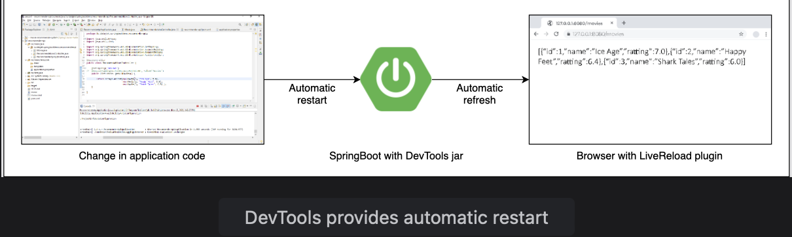

# Developer Tools

Learn how the Spring Boot devtools module improves development time.

> We'll cover the following:
>
> - Devtools dependency
> - Automatic restart
> - LiveReload server

> We created a simple RecommendationsController in the last lesson that received a request from localhost/movies and returned a list of movies.  
>  If we make a change in the movies to be returned by the controller and execute the service again, the change will not be picked up unless the server is stopped and started again.
>
> Restarting the application takes a long time and doing that over and over again causes unwanted delays at the developer’s end.

## Devtools dependency

To counter this problem, **Spring Boot offers a Developer Tool that supports live reloads.**  
 This jar is provided by the Spring Boot framework and is useful for development-specific debugging.

To use developer tools, add the following dependency to pom.xml file:

        <dependency>
            <groupId>org.springframework.boot</groupId>
            <artifactId>spring-boot-devtools</artifactId>
        </dependency>

If the **scope of this dependency is limited to runtime using the tag scope, it will not be packaged in the jar.**

When the dependency is downloaded, we can execute the project again.  
 From this point on, any changes in the code will be picked up by the server without the need to stop and restart the server.

We can make changes to the list of movies being returned and run the application again.

## Automatic restart

One of the things that you will notice when running the application after making a change in the code is that the application automatically starts again.  
This is an efficient restart that takes way less time as compared to a typical restart.  
 **Spring knows that the Maven dependencies do not change,** so only the application beans are loaded again, which is why it takes less time.

**Automatic restart of the application is an important feature of devtools.**  
 Whenever any change is made to the code, devtools causes an automatic restart when a file on its classpath changes.

Spring Boot provides two classloaders:

- one for the classes that do not change like third-party jars and
- the other for application code using the RestartClassLoader.
  **When the code is changed, only the RestartClassLoader is loaded, which causes the restart to be much faster.**

Here's given the pom.xml file containing devtools dependency:

            <?xml version="1.0" encoding="UTF-8"?>
            <project xmlns="http://maven.apache.org/POM/4.0.0" xmlns:xsi="http://www.w3.org/2001/XMLSchema-instance"
                xsi:schemaLocation="http://maven.apache.org/POM/4.0.0 https://maven.apache.org/xsd/maven-4.0.0.xsd">
                <modelVersion>4.0.0</modelVersion>
                <parent>
                    <groupId>org.springframework.boot</groupId>
                    <artifactId>spring-boot-starter-parent</artifactId>
                    <version>2.4.0</version>
                    <relativePath/> <!-- lookup parent from repository -->
                </parent>
                <groupId>io.datajek.springbootdemo</groupId>
                <artifactId>recommender-api</artifactId>
                <version>0.0.1-SNAPSHOT</version>
                <name>recommender-api</name>
                <description>Demo project for Spring Boot</description>

                <properties>
                    <java.version>1.8</java.version>
                </properties>

                <dependencies>
                    <dependency>
                        <groupId>org.springframework.boot</groupId>
                        <artifactId>spring-boot-starter-web</artifactId>
                    </dependency>

                    <!-- Dev Tools   -->
                    <dependency>
                        <groupId>org.springframework.boot</groupId>
                        <artifactId>spring-boot-devtools</artifactId>
                    </dependency>

                    <dependency>
                        <groupId>org.springframework.boot</groupId>
                        <artifactId>spring-boot-starter-test</artifactId>
                        <scope>test</scope>
                    </dependency>
                </dependencies>

                <build>
                    <plugins>
                        <plugin>
                            <groupId>org.springframework.boot</groupId>
                            <artifactId>spring-boot-maven-plugin</artifactId>
                        </plugin>
                    </plugins>
                </build>

            </project>

## LiveReload server

To save the time wasted in refreshing the browser after every code change, **Spring Boot comes with a LiveReload embedded server which triggers an automatic browser refresh.**

The LiveReload extensions are available for different browsers.  
 Once installed and enabled, any change in the code is detected by the LiveReload server and the browser is automatically refreshed to reflect the changes.
