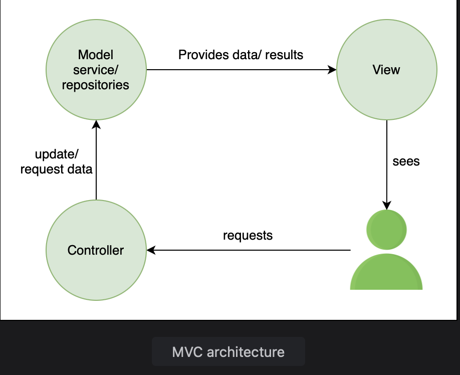

# Comparing Spring Boot and Spring MVC

Learn the difference between Spring Boot and Spring MVC and see which is better for developing a web application.

> We'll cover the following:
>
> - Spring framework
> - Spring MVC
> - Spring Boot

> **Spring offers the Spring MVC framework for developing web applications.**  
>  A very common question in the minds of new learners is the difference between Spring Boot and Spring MVC and which one to use for developing web applications.

Both Spring Boot and Spring MVC **play a seperate role** and both are **designed to solve different problems** as we will see in this lesson.

## Spring framework

Spring Boot and Spring MVC are both components of the Spring framework.

Spring offers dependency injection and inversion of control, which provides good integration with other frameworks.  
 It defines beans using different annotations and autowires them.  
 Spring helps build loosely coupled applications that are easy to unit test.  
 It also eliminates plumbing code like exception handling, establishing and closing connections, etc.

## Spring MVC

Spring MVC is an **HTTP oriented Spring framework, which is concerned with developing web applications.**  
 It makes **use of the Model View Controller (MVC) design pattern to achieve separation of concerns.**

The **DispatcherServlet is the front controller** that handles all requests while the **View Resolver is concerned with resolving view names to physical views.**

This **decoupling makes development of web applications and RESTful services very simple** _because the model, view, and controller operate without dependency._

When we built a web service with Spring Boot, it internally made use of Spring MVC.  
Spring MVC helps create web applications that are scalable as well as testable.

## Spring Boot

**Spring Boot is designed to solve configuration issues.**  
 It **autoconfigures a lot of dependencies** based on the kind of application that is being built.

Spring Boot **offers pre-configured projects to bootstrap an application** in a few simple steps.  
 When building a web application using Spring Boot, the **DispatcherServlet, ViewResolver, Data Source, Transaction Manager, etc. get configured automatically.**

Spring Boot configures compatible versions of the dependencies needed for the frameworks.  
 It provides monitoring features.

Spring Boot helps kickstart the project by bringing in all the required dependencies.  
 It is a useful tool for someone who is just starting out with Spring and gets overwhelmed with the configuration part.  
 It also saves a lot of time. However, Spring Boot offers a biased view and has strong preferences about the dependencies that are used.
