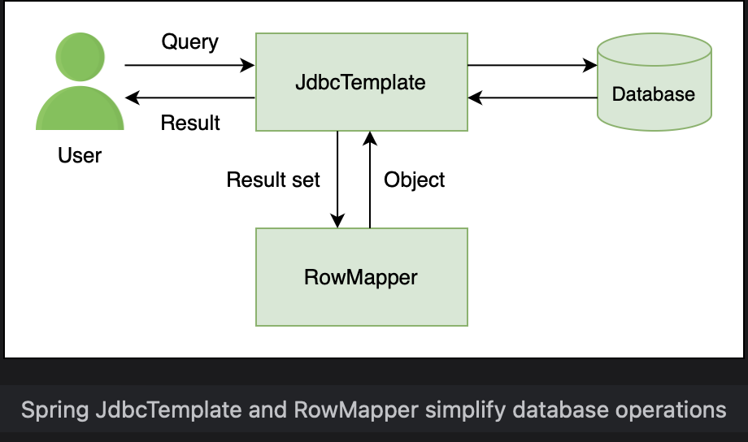

# SELECT Query

Learn how to write queries to return all rows and the others to return rows based on some criterion.

> We'll cover the following:
>
> - Defining Player bean
> - Creating DAO class
> - SELECT \* query
> - Executing the query

JDBC involves a lot of boilerplate code that is required just to get the application working.  
 It is a tedious task to write a simple query using JDBC. There are a number of steps that are required to interact with the database.

- The first step is **establising a connection**.
- The second step is **creating a prepared statement or query**.
- The third step is to **execute the query**.
- The forth step is **looping through the result set** to get the objects.
- The fifth and final step is to **close the connection**.

Spring JDBC support makes interacting with databases easy. Since we are using Spring Boot, the connection part is automatically taken care of and the data source is automatically configured.  
 Likewise, the connection is easy to write and execute a query. It also provides the **BeanPropertyRowMapper** which maps rows of a table to a bean.

In this lesson, first we will write a query to return all rows from the Player table. We will **learn how to map the data coming from the database to a bean in our application.**  
 Next, we will modify our query to return the row that matched an input argument.

## Defining Player bean

We have created a Player table but we need to define a class Player with the same fields. The row in the Player tabl will map to this class:

            public class Player {
                private int id;
                private String name;
                private String nationality;
                private Date birthDate;
                private int titles;
                // ..
            }

Next, we will create two constructors (with arguments and no-arguments), getters and setters, as well as a ToString() method for the fields.  
 **The no-arg constructor is a requirement of the BeanPropertyRowMapper.**

The Player class is a bean and the data coming from the Player table in H2 will be mapped to this class.

## Creating DAO class

We will create a new class PlayerDao to interact with the database.  
 Since this class belongs to the data layer, we will **use the @Repository annotation instead of the generic @Component annotation**.

            @Repository
            public class PlayerDao {

            }

The PlayerDao class will have methods that execute various queries to manipulate rows of the Player table.

## SELECT \* query

The first method in the PlayerDao class returns all rows from the Player table. We will call this method getAllPlayers().  
 The return type will be List of Player. This method will execute the SELECT \* query.  
 We will autowire the JDBCTemplate in the PlayerDao class.  
 JdbcTemplate offers a number of methods.

            @Autowired
            JdbcTemplate jdbcTemplate;

We will make use of the query method of JdbcTemplate to execute a SELECT \* query.

**A row mapper is used to match the data coming from the database to the attributes of the bean.**  
 The **BeanPropertyRowMapper is the default row mapper** defined by Spring.

            public List<Player> getAllPlayers() {
                String sql = "Select * from player";
                return jdbcTemplate.query(sql, new BeanPropertyRowMapper<Player> (Player.class));
            }

## Executing the query

To run this query, we will use the CommandLineRunner.  
 A **CommandLineRunner is an interface in Spring Boot which has only one method called run().**  
This method is launched as soon as the context is loaded.

> Our TennisPlayerApplication will implement the CommandLineRunner.  
>  We will autowire the PlayerDao class to use an object of this class to call the getAllPlayers() method inside the run() method of the CommandLineRunner.
>
> A logger will display the list of players returned.

            @SpringBootApplication
            public class TennisPlayerApplication implements CommandLineRunner {
                private Logger logger = LoggerFactory.getLogger(this.getClass());

                @Autowired
                PlayerDao dao;

                public static void main(String[] args) {
                    SpringApplication.run(TennisPlayerApplication.class, args);
                }
                @Override
                public void run(String... args) throws Exception {
                    logger.info("All Players Data: {}", dao.getAllPlyers());
                }
            }

> Run the code given below and look for "All Players Data:" towards the end of the terminal output.  
>  It can be seen that three rows have been retrieved from the database and are displayed in the log.
>
> The database can be viewed in the web browser by typing localhost:8080/h2-console or http://127.0.0.1:8080/h2-console.  
>  In the login page that shows up, make sure that the JDBC URL is the same as the one that we provided in the application.properties file (jdbc:h2:mem:testdb).  
> If not, change it to jdbc:h2:mem:testdb and click connect to go to the database console.  
>  This will open up the interface of the database.

            public Player getPlayerById(int id) {
                String sql = "SELECT * FROM PLAYER WHERE ID = ?";
                return jdbcTemplate.queryForObject(sql, new BeanProperyRowMapper<Player>(Player.class), new Object[] {id});
            }

To execute this query, we will call getPlayerById() in the run() method and pass id 3 to it:

            @Override
            public void run(String... args) throws Exception {
                // logger.info("All Players Data: {}", dao.getAllPlayers());
                logger.info("Player with Id 3: {}", dao.getPlayerById(3));
            }
