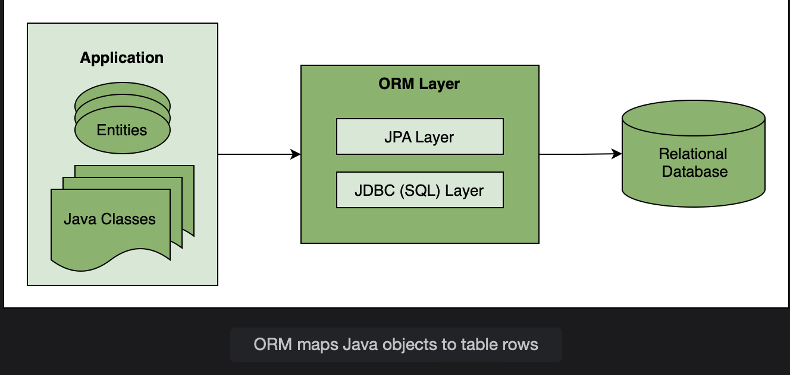
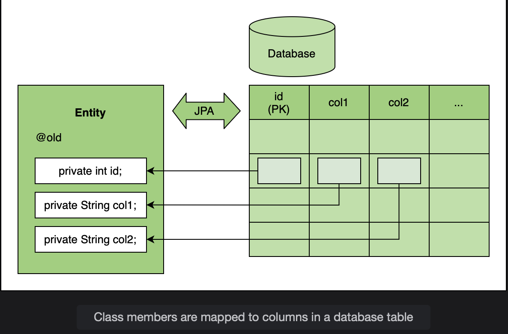

# What is JPA?

Learn how Spring JPA makes database operations easy in Java programming.

> We'll cover the following:
>
> - How JPA works
> - JPA implementations

JDBC requires the developer to **write the queries, map values to the query, pass a set of parameters to execute the query, and map rows of the result set to a bean.**  
 For simple queries, this task is manageable, but in large applications with hundreds of tables, the queries become complex.  
 Writing and maintaining those queries requires expertise beyond the skillset of a Java developer.

Java Persistence API (JPA) is designed to ease that task.

## How JPA works

JPA challenges the notion of writing queries and mapping the data back.  
 It creates entities that are Java objects which map to a row in a database table.  
 JPA creates a schema based on the entities and defines relationships between entities.

The Object-Relational Mapping (ORM) layer maps the objects to a database table.  

Using JPA, we can map a Java class or bean to a table.  
 The members of the class map columns in the table. When this mapping is defined, JPA can write queries on its own.  
 It takes the responsibility of creating and executing queries for CRUD operations.  
 This is due to the fact that the operations performed on a database are identical and can be generalized. The types of objects change based on the database schema but the operations remain the same.

## JPA implementations

Hibernate, the most popular ORM framework in the last decade, prompted the creation of the JPA standard.  
**JPA is a standard of Object Relational Mapping.**

It is an interface that defines a set of annotations for creating the object relational mapping.  
 There are numerous implementations of the JPA interface like Hibernate, EclipseLink, Apache OpenJPA, etc.  
 Hibernate is by far the most popular implementation of JPA.  
 It is a lightweight framework and can easily be integrated with Spring.

The benefit of using JPA instead of Hibernate is that **JPA is a standard and one can switch to any other implementation later**.
