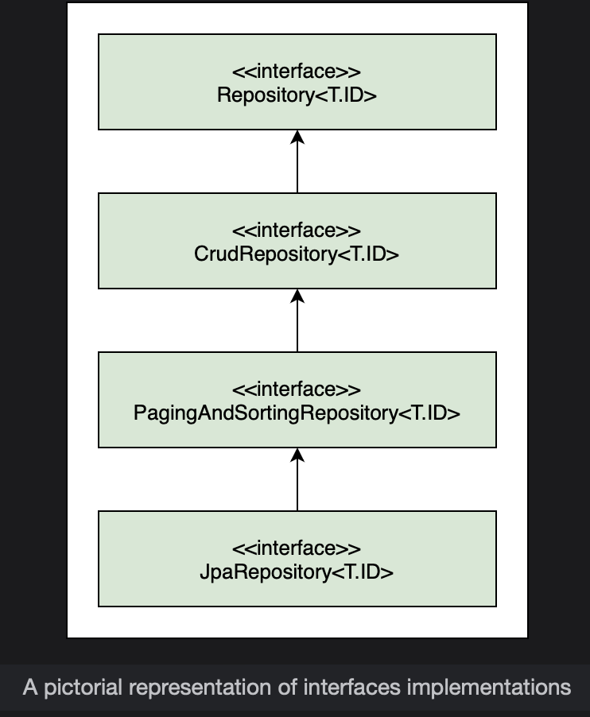

# Spring Data JPA

Learn about the methods provided by JpaRepository to further simplify the CRUD operations.

> We'll cover the following:
>
> - JpaRepository interface
>   - save() method
>   - findById() method
>   - findAll() method
>   - deleteById() method

> We have written methods to perform CRUD operations on the Player entity. If we add more entities to the project like Coach and Tournament, we will have to write the same code for CRUD operations and plug a different entity type.
>
> The methods that we implemented as part of the CRUD operations are all generic methods. The logic of the methods remains the same, and only the entity changes.

Spring Data identified this duplication of code when writing repositories and created some predefined repositories. The developer provides the entity type and its primary key and Spring Data comes up with the CRUD methods for the entity.

**Spring Data JPA adds a layer of abstraction over the JPA provider (Hibernate in our case).**

The JpaRepository interface extends the Repository interface. It contains the API provided by CrudRespository as well as the PagingAndSortingRepository for CRUD operations along with pagination and sorting of records.

## JpaRepository interface

We will create an interface that extends the JpaRepository. We will call this interface PlayerSpringDataRepository.  
 We need to specify the entity that will be managed by this repository, as well as the primary key of the entity as follows:

        import org.springframework.data.jpa.repository.JpaRepository;

        public interface PlayerSpringDataRepository extends JpaRepository<Player, Integer>{

            //no implementation required!
        }

Simply by extending the JpaRepository, we get all basic CRUD operations without having to write any implementation.

To use the repository created in the last step, we will create a copy of the TennisPlayerApplication and call it TennisPlayerSpringDataApplication. We also autowire the PlayerSpringDataRepository in place of the PlayerRepository.

        @Autowired
        PlayerSpringDataRepository repo;

#### save() method

To insert and update an object, Spring Data has a save() method that works in the same manner as the merge() method of the EntityManager.

        //Inserting rows
        logger.info("Inserting Player: {}", repo.save(new Player("Djokovic", "Serbia", Date.valueOf("1987-05-22"), 81)));

        logger.info("Inserting Player: {}", repo.save(new Player("Monfils", "France", Date.valueOf("1986-09-01"), 10)));

        logger.info("Inserting Player: {}", repo.save(new Player("Thiem", "Austria", new Date(System.currentTimeMillis()), 17)));

Now, let's write a code to update the object:

        //Updating row
        logger.info("Updating Player with Id 3: {}", repo.save(new Player(3, "Thiem", "Austria", Date.valueOf("1993-09-03"), 17)));
        }

#### findById() method

Spring Data has a method called findById(), which takes in the primary key and returns an object.

        logger.info("Player with Id 2: {}", repo.findById(2));

#### findAll() method

It also has a findAll() method which returns all entity objects.

        logger.info("All Players Data: {}", repo.findAll());

#### deleteById() method

For deletion, Spring Data has a deleteById() method that takes the primary key of the record to be deleted.

        repo.deleteById(2);

If we use the above-mentioned methods, we can run the application without any change in the output.

> Using Spring Data, we can run the same application again without writing an implementation for any of the CRUD operations.  
> The JpaRepository provides us with methods needed to perform those operations.  
> This results in a significant reduction in boilerplate code.
>
> If we compare the code in the PlayerRepository.java with the code in PlayerSpringDataRepository.java, the former had more than 20 lines of code while the latter has just 3 lines of code for the same functionality.
>
> The CRUD methods in Spring Data are annotated with @Transactional.
>
> Spring Data can parse a method name and create a query from it.
>
> In the code widget below, we have a method findByNationality in the PlayerSpringDataRepository for which we have not provided any implementation. This method name is converted to the following JPQL query using the JPA Criteria API:
>
>       select p from Player p where p.nationality = ?1

We can use keywords such as And, Or, GreaterThan, LessThan, Like, IsNull, Not etc., in the method name and OrderBy clause can be used to sort the results.

**TennisPlayerSpringDataApplication.java**

        package io.datajek.springdatajpa;

        import java.sql.Date;

        import org.slf4j.Logger;
        import org.slf4j.LoggerFactory;
        import org.springframework.beans.factory.annotation.Autowired;
        import org.springframework.boot.CommandLineRunner;
        import org.springframework.boot.SpringApplication;
        import org.springframework.boot.autoconfigure.SpringBootApplication;

        @SpringBootApplication
        public class TennisPlayerSpringDataApplication implements CommandLineRunner {

            private Logger logger = LoggerFactory.getLogger(this.getClass());

            @Autowired
            PlayerSpringDataRepository repo;

            public static void main(String[] args) {
                SpringApplication.run(TennisPlayerSpringDataApplication.class, args);
            }

            @Override
            public void run(String... args) throws Exception {

                logger.info("\n\n>>Inserting Player: {}\n", repo.save(new Player("Djokovic", "Serbia", Date.valueOf("1987-05-22"), 81)));
                logger.info("\n\n>>Inserting Player: {}\n", repo.save(new Player("Monfils", "France", Date.valueOf("1986-09-01"), 10)));
                logger.info("\n\n>>Inserting Player: {}\n", repo.save(new Player("Thiem", "Austria", new Date(System.currentTimeMillis()), 17)));
                logger.info("\n\n>>Updating Player with Id 3: {}\n", repo.save(new Player(3, "Thiem", "Austria", Date.valueOf("1993-09-03"), 17)));
                logger.info("\n\n>>Player with Id 2: {}\n", repo.findById(2));
                repo.deleteById(2);
                logger.info("\n\n>>All Players Data: {}\n", repo.findAll());
            }
        }

**PlayerSpringDataRepository.java**

        package io.datajek.springdatajpa;

        import java.util.List;

        import org.springframework.data.jpa.repository.JpaRepository;

        public interface PlayerSpringDataRepository extends JpaRepository<Player, Integer>{

            public List<Player> findByNationality(String nationality);

        }

**Player.java**

        package io.datajek.springdatajpa;

        import java.sql.Date;
        import java.sql.Time;

        import javax.persistence.Entity;
        import javax.persistence.GeneratedValue;
        import javax.persistence.Id;
        import javax.persistence.NamedQuery;

        @Entity
        @NamedQuery(name="get_all_players", query="SELECT p FROM Player p")
        public class Player {
            @Id
            @GeneratedValue
            private int id;
            private String name;
            private String nationality;

            private Date birthDate;
            private int titles;

            public Player( ) {

            }

            public Player(String name, String nationality, Date birthDate, int titles) {
                super();
                this.name = name;
                this.nationality = nationality;
                this.birthDate = birthDate;
                this.titles = titles;
            }

            public Player(int id, String name, String nationality, Date birthDate, int titles) {
                super();
                this.id = id;
                this.name = name;
                this.nationality = nationality;
                this.birthDate = birthDate;
                this.titles = titles;
            }

            public int getId() {
                return id;
            }

            public void setId(int id) {
                this.id = id;
            }

            public String getName() {
                return name;
            }

            public void setName(String name) {
                this.name = name;
            }

            public String getNationality() {
                return nationality;
            }

            public void setNationality(String nationality) {
                this.nationality = nationality;
            }

            public Date getBirthDate() {
                return birthDate;
            }

            public void setBirthDate(Date birthDate) {
                this.birthDate = birthDate;
            }

            public int getTitles() {
                return titles;
            }

            public void setTitles(int titles) {
                this.titles = titles;
            }

            @Override
            public String toString() {
                return "\nPlayer [id= " + id + ", name= " + name + ", nationality= " + nationality + ", birthDate= " + birthDate
                        + ", titles= " + titles + "]";
            }

            public void setBirthDate(Time time) {
                // TODO Auto-generated method stub

            }
        }

**application.properties**

        spring.datasource.url=jdbc:h2:mem:testdb
        spring.h2.console.enabled=true
        spring.h2.console.settings.web-allow-others=true
        spring.jpa.show-sql=true

> The database can be viewed in the web browser by typing localhost:8080/h2-console or http://127.0.0.1:8080/h2-console. In the login page that shows up, make sure that the JDBC URL is the same as the one that we provided in the applications.properties file (jdbc:h2:mem:testdb). If not, change it to jdbc:h2:mem:testdb and click "Connect" to go to the database console. This will open up the interface of the database.
