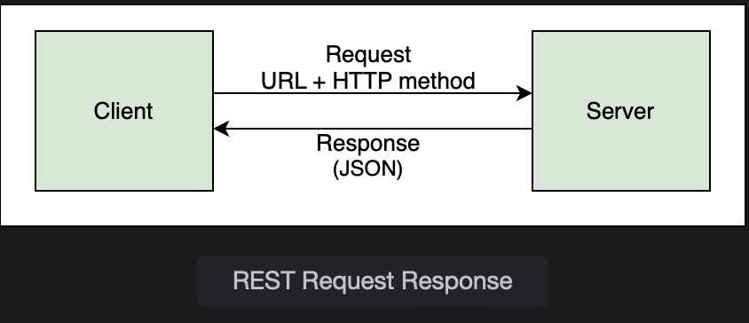
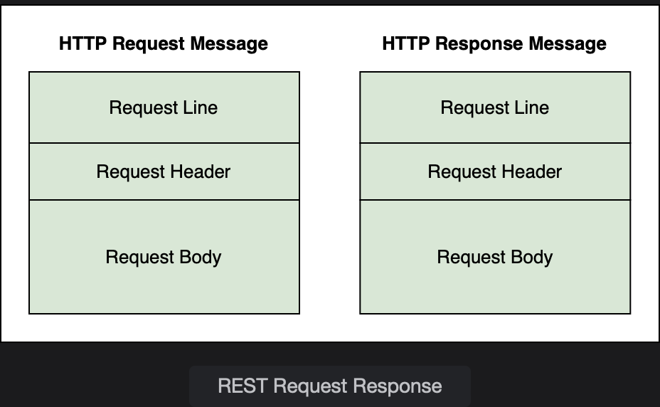
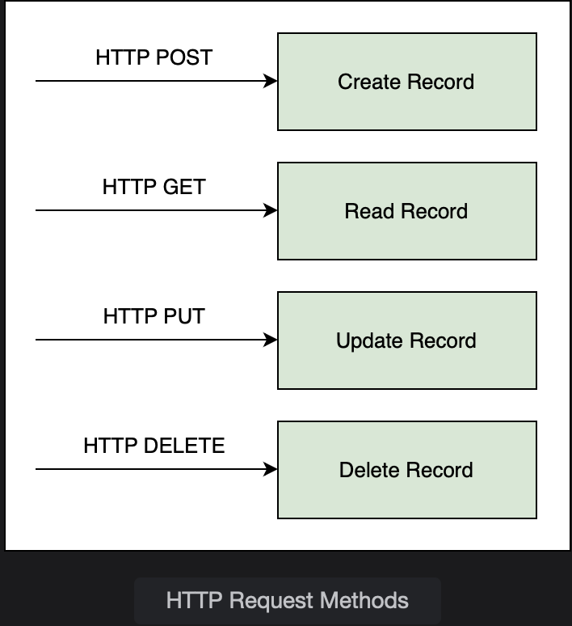

# Developing REST services in Spring

Learn about the basic concepts of REST and Spring's support of RESTful web services.

> We'll cover the following:
>
> - REST support in Spring
> - What is REST?

## REST support in Spring

Spring framework is a very good choice for creating REST applications.  
 Spring **provides specialized annotations** that make RESTful application development easy.  
 Some examples include @RestController, @ResponseBody and @ResponseStatus etc.

Spring also **automatically handles Jackson integration** which makes conversion of data from JSON to POJO and vice versa a breeze.  
 Any JSON data received by the controller is automatically converted to a POJO and any POJO returned by the controller is converted to JSON.

## What is REST?

REST stands for th **RE**presentational **S**tate **T**ransfer. It provides a **mechanism for communication between applications**.  
 In the REST architecture, the _client and server are implemented independently_ and they do not depend on one another.  
 REST is _language independent_, so the client and server applications can use different programming languages.  
 This gives REST applications a lot of flexibility.  
 

The **REST architecture is stateless** meaning that the **client only manages the session state and the server only manages the resource state**.  
 The communication between the client and server is such that _every request contains all the information necessary to interpret it without any previous context_.

Both the **client and server know the communication format** and are able to understand the message sent by the other side.  
 REST calls can be made over HTTP.  
 The client can send an HTTP request message to the server where it is processed, and an HTTP response is sent back.  
 

> The request message has three parts:
>
> 1. The request line contains the HTTP method like (GET or POST etc.)
> 2. The request header contains data with additional information about the request.
> 3. The request body contains the contents of the message, e.g., if it is a POST request, the request body will contain the contents of the entity to be created.
>
> The response message also has three parts:
>
> 1. The response line contains the status code for success or redirection etc.
> 2. The response header contains additional information about the response like the content type and the size of the response.  
>    The client can render the data based on the content type so if it is text/html, it is displayed according to the HTML tags and if it is application/json or application/xml, it is processed accordingly.
> 3. The response body contains the actual message sent in response to the request.

The HTTP methods for CRUD operations are:

- **POST** for creating a resource
- **GET** for reading a resource
- **PUT** for updating a resource
- **DELET** for deleting a resource

