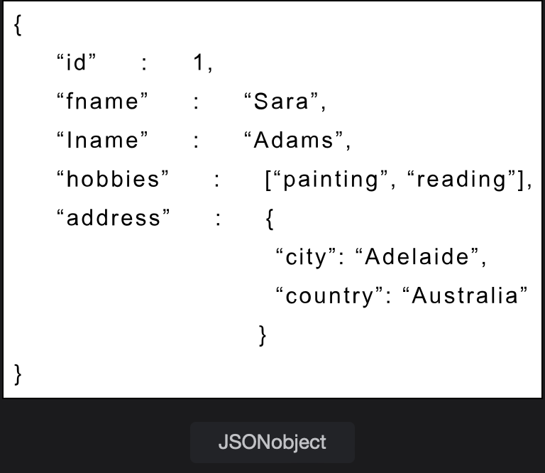
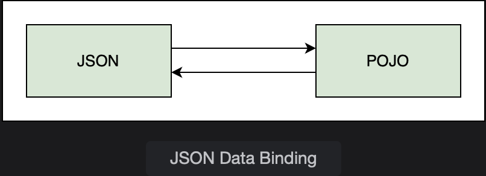

# JSON Data Binding

Learn about JSON, a popular data format being used in REST applications.

> We'll cover the following:
>
> - Syntax
> - Java - JSON data binding
> - Jackson Project

The most commonly used data formats in a REST application are JSON and XML.  
 JSON stands for JavaScript Object Notation.  
 It is a plain text data format used for exchanging data between applications.

JSON is a collection of name-value pairs, which application processes as a string.  
 So, instead of using HTML or JSP to send data, it is passed as a string, and the application can process and render the data accordingly.  
 JSON is language-independent and can be used with any programming language.

## Syntax

A sample JSON object is shown below, along with rules regarding the syntax.  

> - A JSON object is defined between curly braces ({ }).
> - The object consists of members in the form of comma-separated name-value pairs.
> - The names and values are separated by a colon (:).
> - Names are provided in double quotes and are on the left side of the colon.
> - The values are on the right side of the colon.
> - If the value is a string, it is written in double quotes.
> - JSON also supports arrays written within square brackets ([ ]) that contain a comme-separated list of values.
> - An object can contain nested objects.
> - JSON objects can have a null value.
> - Boolean values true and false are also allowed.

## Java - JSON data binding

A Java object (POJO) can be converted into a JSON object and vice versa through a process called **data binding.**  
 We can read JSON and use it to populate a Java object.  
 In the same manner, we can use a Java object to create JSON.  
 

## Jackson Project

Jackson Project handles data binding between Java and Json. It also provides support for data binding with XML.  
**Spring framework uses the Jackson project for data binding.**

The Jackson data binding API is present in the _com.fasterxml.jackson.databind_ package.

The following maven dependency adds Jackson support to the project:

        <dependency>
            <groupId>com.fasterxml.jackson.core</groupId>
            <artifactId>jackson-databind</artifactId>
            <version>2.12.3</version>
        </dependency>

(The latest version at the time of writing this lesson is 2.12.3).

Jackson handles the **conversion between JSON and POJOs by making use of the getter and setter methods of a class.**  
 To convert a JSON object to POJO, the setter methods are called.  
 Vice versa, to create a JSON object from a POJO, the getters methods are used.  
 Jackson has access to the getters and setters only, not the private fields of the class.

> The figure illustrates how Jackson converts JSON data to Java object. It calls the corresponding setter methods to populate the class members.  
>  If a setter method matching a JSON property is not found, an exception is thrown.
>
> 

The Jackson annotation **@JsonIgnoreProperties can be used to bypass the exception by setting the IgnoreUnknown attribute to true**.  
 This feature is useful when the JSON file contains more properties but we are only interested in a few of them.
