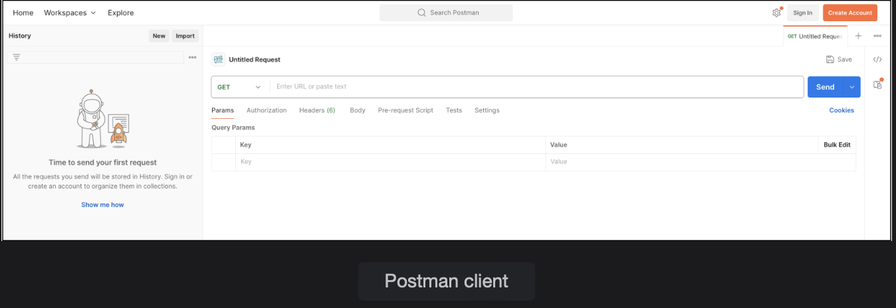

# REST Client - Postman

Learn how to install and use the REST client, Postman.

> We'll cover the following:
>
> - Install Postman
> - Web Browser or Postman

We will be creating a REST Service.  
 To test our service, we need a client tool to send HTTP requests to our REST API and view the response sent back by our service.

> There are many **REST client tools for testing REST APIs like Curl, which is a command line tool, and Postman, which is a GUI tool.**
>
> We will be using Postman which is widely used because of its simplicity and advance features.

## Install Postman

Not required to create an account after downloading Postman, as it is a free software.

The top part of the screen is for the HTTP request and the bottom part shows the HTTP response.  
 Different request methods like GET, POST, PUT, etc., are available from the dropdown list.  
 You can also view the headers, authorization items, and status code.  
 

To send a request using Postman, select the HTTP method from the dropdown list, then type the request URL.  
 If the request sends some data to the server (e.g., POST or PUT), it can be added by selecting the "Body" option.  
 We can also set the format in which data is sent.  
 The request is sent by hitting the "Send" button.  
 The response from the REST Service is displayed in the bottom part of the screeen.

It shows the status code and may contain some data in the body as well.

## Web Browser or Postman

For a simple GET request, a web browser can also be used in place of Postman.  
 However, for other types of requests, Postman offers better support, like posting JSON data, setting the content type, passing over request headers, and authentication, etc.
