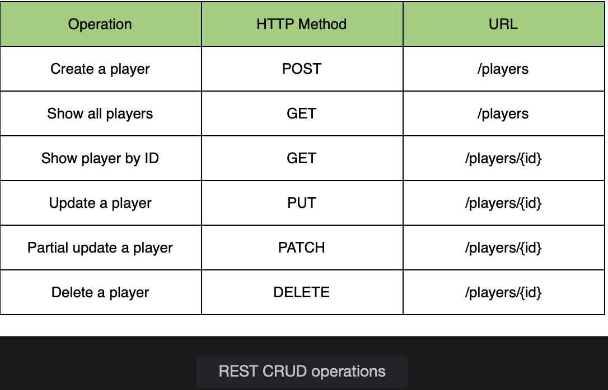
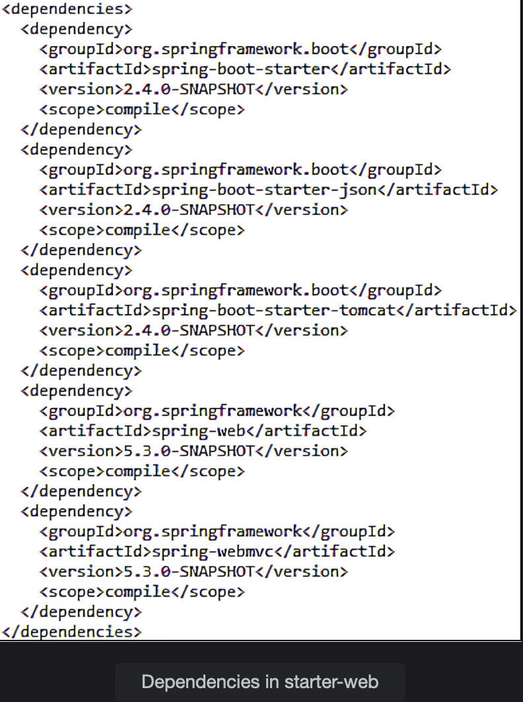

# REST API Design

Learn about the basic design principles for a REST API and start creating one using Spring Initializr.

> We'll cover the following:
>
> - REST API design
> - Required dependencies
> - Data source configuration
>   - Entity Player class
> - Database Initialization
> - Creating a repository
> - Service layer

In this lesson, we will **start building a REST API that performs CRUD operations**.  
 We will make use of the tennis player project to create a REST API to perform CRUD operations on the data stored in the in-memory H2 database.

## REST API design

> Our REST API will expose endpoints which allow a REST client to perform the following functions:
>
> - Get a list of players
> - Get a player by ID
> - Add a new player
> - Update an existing player
> - Update the titles of a player
> - Delete a player
>
> We will make use of the HTTP GET, POST, PUT, PATCH, and DELETE methods to perform these operations.
>
> To create service endpoints for our REST API, we need to identify the entity (main resources) which is the most notable noun from the requirements listed above.
>
> A glance at our requirements shows that it is player.
>
> A REST API design convention is to use the plural of the entity as the endpoint, so we will use /players.
>
> The following image shows the HTTP methods and their REST endpoints for the corresponding CRUD operations:
>
> 
>
> As it can be seen from the image, we have not used any action words (e.g., show or create) in the endpoints.  
>  Rather, the HTTP method, like GET and POST, defines the action to be performed.

To create a project, we will use spring initializer and provide the following details:

    Group ID: io.datajek
    Artifact ID: tennis-player-rest

Next, we will choose dependencies for the project.

## Required dependencies

- To create a REST API in spring, we need the spring-webmvc dependency.  
  This dependency **supports web as well as RESTful applications**.  
   It **loads all the supporting dependencies** like spring-core, spring-context, spring-web etc., and comes with the embedded Tomcat server.
- Secondly, we need the **jackson-databind dependency** for JSON data binding.  
   By having Jackson dependency on the classpath, Spring will **automatically handle the conversion of JSON data to POJO and vice versa**.

Spring Boot makes the task of adding required dependencies easy. Using the spring initializer, add the starter dependency for _Web_.  
 The **spring-boot-starter-web** takes care of both the above mentioned dependencies.

The transitive dependencies of the starter web are shown below:  
 

As it can be seen, spring-webmvc and spring-boot-starter-json are included along with other dependencies like spring-boot-starter-tomcat.

- Other than spring-boot-starter-web, we will add the **spring-boot-starter-data-jpa** dependency for Hibernate ORM support, **h2 dependency for the in-memory database**, and **spring-boot-devtools dependency which provides the auto restart feature**.

Spring Boot also has built in support for testing and adds the **spring-boot-starter-test dependency** to the pom.xml file.

## Data source configuration

_Spring Boot automatically configures the data source_ using entries in the pom.xml file where we have added the **spring-boot-starter-data-jpa** and **h2 dependencies**.  
 In the **application.properties** file, we can set up the data source URL by using the following property:

        spring.datasource.url = jdbc:h2:mem:testdb

#### Entity Player class

Now, we will create a Player class for our REST API.  
We will **use the @Entity annotation to map the class to a database table**.

The name of the table is the same as the class, unless otherwise specified. We will store the player's id, name, nationality, date of birth and number of titles.

        @Entity
        public class Player {
        @Id
        @GeneratedValue (strategy=GenerationType.IDENTITY)
        private int id;

        private String name;
        private String nationality;

        @JsonFormat(pattern = "dd-MM-yyyy")
        private Date birthDate;

        private int titles;

        //constructors
        //getter and setter methods
        }

The **@ID** and **@GeneratedValue** annotations are used to **mark the primary key and define the manner in which values are generated.**  
 By default, dates are saved as Timestamp by Hibernate.  
 When we annotate the birthDate field with @JsonFormat, Jackson will use the provided format for serializing and deserializing the field.

> We will create two constructors; a no-argument constructor and a constructor with fields other than the primary key (as it will be auto-generated).  
> We will also generate getters and setters for the fields which are needed by Jackson to handle conversion between Player POJO and JSON.

## Database Initialization

Hibernate can generate the DDL based on the **spring.jpa.hibernate.ddl-auto** property.  
We will use **create-drop** as its value in the application.properties file.

        spring.jpa.hibernate.ddl-auto=create-drop
        spring.jpa.show-sql=true

The **spring.jpa.show-sql** property, when set to true, _shows the queries used by Hibernate when creating the database_.  
 The database is populated using the **import.sql** file placed at the root of the classpath.  
 The file, shown below, is executed on startup.

        INSERT INTO player (ID, Name, Nationality, Birth_date, Titles) VALUES(1,'Djokovic', 'Serbia', '1987-05-22', 81);
        INSERT INTO player (ID, Name, Nationality, Birth_date, Titles) VALUES(2,'Monfils', 'France', '1986-09-01', 10);
        INSERT INTO player (ID, Name, Nationality, Birth_date, Titles) VALUES(3,'Isner', 'USA', '1985-04-26', 15);

## Creating a repository

We will create an interface PlayerRepository.java which extends the **JpaRespository interface** and provides the entity and the data type of the primary key:

        import org.springframework.data.jpa.repository.JpaRepository;

        public interface PlayerRepository extends JpaRepository <Player, Integer> {}

Simply by extending the **JpaRepository**, _we get all the basic CRUD operations_ like findAll(), findById(), save(), and deleteById() etc., without having to write any implementation.

## Service layer

As a best practice, we will introduce a service layer on top of the repository.  
We will create a class PlayerService.java and use the @Service annotation to indicate that this class belongs to the service layer.

To use the PlayerRepository in the service layer, we will autowire it and then delegate calls to the methods provided by the JpaRepository.

        @Service
        public class PlayerService {

        @Autowired
        private PlayerRepository repo;

        //method to return all players

        //method to find player by id

        //method to add player

        //...
        }

[See the code here](../../projects/Module%201/tennis-player-rest)
