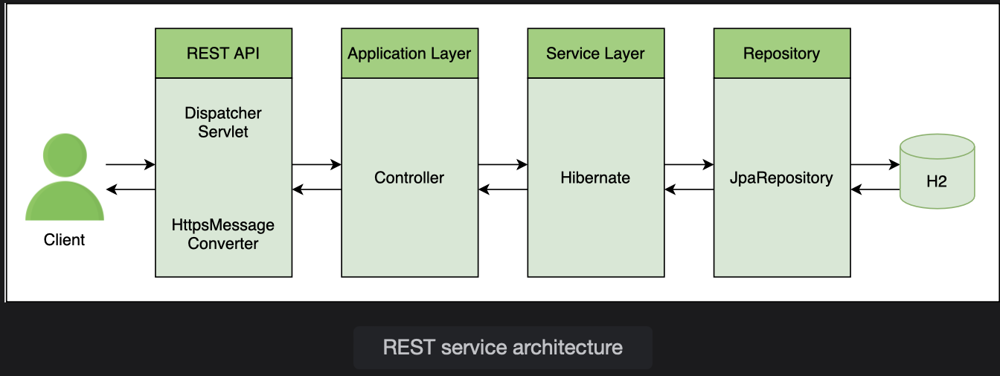
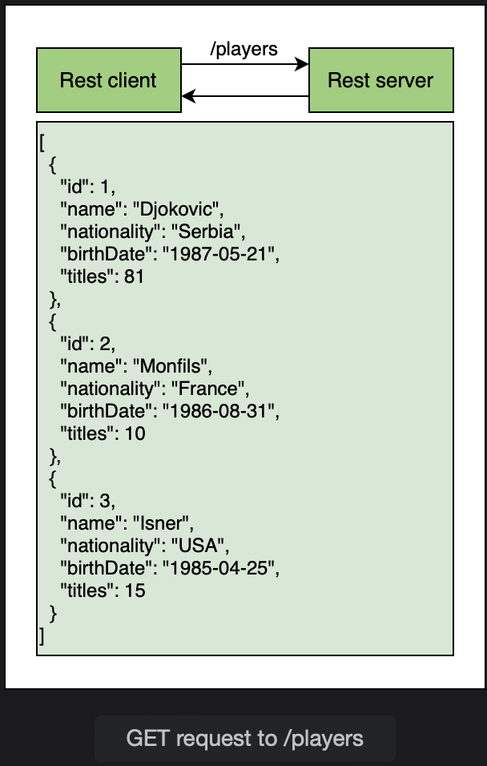
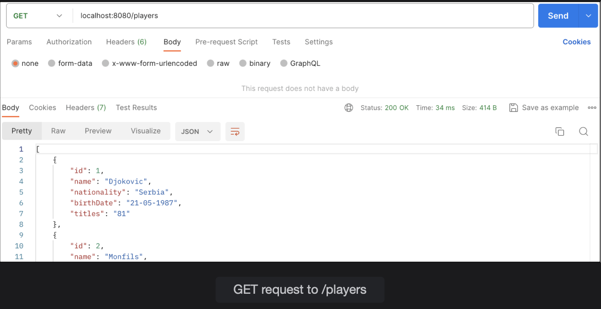

# @GetMapping

Learn how to create a GET mapping in the REST service that returns a list of POJOs as JSON.

> We'll cover the following:
>
> 1. Defining the PlayerService class
> 2. Defining the getAllPlayers() method

Starting from this lesson, we will build a REST service that provides basic CRUD functionality. The client sends an HTTP request to the REST service. The dispatcher servlet handles the requests and if the request has JSON data, the **HttpMessageConverter** converts it to Java objects.  
 The request is mapped to a controller which calls service layer methods. The service layer delegates the call to repository and returns the data as POJO. The MessageConverter converts the data to JSON and it is sent back to the client.

The flow of request is shown below:  

In this lesson, we will create an endpoint for retrieving the list of players from the database.  
 The REST client will send a request to /players.  
 The REST service will respond witht a JSON array of all players.  
 

We will write the code for the REST service to return List of Player objects when it receives a request for /players.  
The REST API will automatically convert that list of POJOs to JSON when it finds Jackson on the classpath, and a JSON response is returned to the client.

## 1. Defining the PlayerService class

In order to retrieve the list of players from the database, we will write a method getAllPlayers() in the PlayerService class.  
This method will call a repository method and return a list of objects.

        public List<Player> getAllPlayers() {
            // call repository method
        }

To be able to use methods from teh PlayerRepository, we have autowired it in the PlayerService class.

        @Service
        public class PlayerService {

            @Autowired
            PlayerRepository repo;

            // ...
        }

## 2. Defining the getAllPlayers() method

Remember that we have used the JpaRepository interface for our PlayerRepository which provides all the basic methods for CRUD operations. This means that there is no need to write any implementation for the methods.  
We can simply call methods provided by the JpaRepositoty from the service layer.  
The JpaRepository provides the findAll() method that returns a List of objects.

        public List<Player> getAllPlayers() {
            return repo.findAll();
        }

Now that service layer is set up, we will move to the controller and create a method on which the /player request will be mapped.  
We will call this method getAllPlayers. Since /players is a GET request, we will use the @GetMapping annotation on the method as follows:

        @GetMapping("/players")
        public List<Player> getAllPlayer() {
            // call service layer method
        }

The @GetMapping annotation maps HTTP GET requests to controller methods. It is a shortcut for:

        @RequestMapping(method = RequestMethod.GET)

The controller method calls the service layer method getAllPlayers(). To be able to use the PlayerService methods, we will autowire PlayerService in the PlayerController class.

        @RestController
        public class PlayerController {

            @Autowired
            PlayerService services;
        }

The getAllPlayers method returns a List of Player objects. The REST API will convert that list of POJOs to JSON and return it to the client.

        @GetMapping("/players")
        public List<Player> getAllPlayers() {
            return service.getAllPlayers();
        }

To test the REST endpoint, we will use both the browser and Postman as REST clients. In the browser, we will use the URL given below the code widget or type localhost:8080/players if working locally.  
 The REST service will respond with a JSON array of al players from the H2 database.

In Postman, we can create a GET request using the URL given under the code widget.

The result are displayed at the bottom part of the screen. It can be seen from the header section that the contect type is application/JSON.

