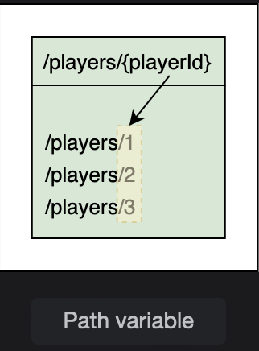
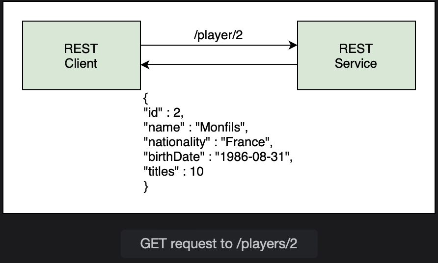

# @PathVariable

Learn how to use path variables for parameterizing the REST endpoints.

> We'll cover the follwing:
>
> - Using the findById method
> - @PathVariable annotation
> - Error handling

In this lesson we will create a new endpoint for our REST API to retrieve a single player based on the id field.  
We will fetch the required player from the Player table.

Path variables are a way of parameterizing the path or endpoint to accept data.  
Path variables are written in curly braces. When the client sends a request, it passes a value in place of the path variable.

> For example, we could say /players/1 to give us the player with id 1, or /players/3 for the player with Id 3.
>
> 

The REST client will send a request to /players/{playerId}, where playerId is a path variable. So the actual call may be /player/2.  
 The REST service will return the player with id 2 from the Player table, which is Monfils.

JpaRepository interface provides us with methods for all basic CRUD operations. We need a service method to call the repository.  
 We will call this method getPlayer.  
 It takes an integer id as input and returns a Player object.

        @Service
        public class PlayerService {
            @Autowired
            PlayerRespository repo;

            public Player getPlayer (int id) {
                // find and return the player
            }
            // ..
        }

## Using the findById method

To retrieve an entity based on the id, JpaRepository provides the findById() method.  
 This method has a return type of **Optional.**  
 Optional is a design pattern introduced in Java 8, where instead of writing code to check for null values, we can see if a value is present in the Optional.

        public Player getPlayer (int id) {
            return repo.findById(id);
        }

Since findById() does not return a Player object, we will get a type mismatch error when we try to return the result.  
 The way to go about it, is to create a temporary variable to store the result of the method call.

We will create an Optional named tempPlayer.

        public Player getPlayer(int id) {
            Optional<Player> tempPlayer = repo.findById(id);
            return null;
        }

We also need a Player object named p which is assigned null value.

        public Player getPlayer(int id) {
            Optional<Player> tempPlayer = repo.findById(id);
            Player p = null;
            return p;
        }

Next, we will check the tempPlayer using the isPresent() method to check if a value is present.  
 The get() method can be used to retrieve the value and assign it to p.  
 Player p is returned at the end of the method.

        public Player getPlayer(int id) {
            Optional<Player> tempPlayer = repo.findById(id):
            Player p = null;

            // if the Optional has a value, assign it to p
            if (tempPlayer.isPresent())
                p = tempPlayer.get();

            return p;
        }

In case the if condition evaluates to false, meaning that the Player was not found, we can throw an exception to let the user know that player with the given ID does not exist.

        public Player getPlayer(int id) {
            Optional<Player> tempPlayer = repo.findById(id);
            Player p = null;

            // if the Optional has a value, assign it to p
            if (tempPlayer.isPresent()) p = tempPlayer.get();

            // if value is not found, throw a runtime exception
            else    throw new RuntimeException("Player with id " + " not found.");
            return p;
        }

So, in this approach of coding, we used Optional and avoided explicitly checking for null values.

Alternatively, the **JpaRepository provides the getOne() method which returns an object.**  
 This method **throws an EntityNotFoundException if the object doen not exist**. When using this method, we explicitly need to check for null values.

In the controller class, we will create a method getPlayer() for retrieving a player by id. The endpoint /players/{id} maps to this method.  
We will set up a @GetMapping for /players/{id}, where id in curly braces means that it is a path variable.

        @GetMapping("/players/{id}")
        public Player getPlayer() {
            // call service layer method
        }

Behind the scenes, Jackson will convert the player object to JSON.

## @PathVariable annotation

Since there is a path variable in the endpoint, we need to bind it with a method parameter. The @PathVariable annotation binds the path variable {id} from the URL to the method parameter id.  
 By default, both the names must be the same for the binding to work.

        public Player getPlayer(@PathVariable int id) {
            return service.getPlayer(id);
        }

If the names of the path variable and the method parameter are different, then we need to specify the path variable as argument of the @PathVariable annotation.  
 In the code snippet below, the path variable id will bind with the variable playerId.

        public Player getPlayer(@PathVariable("id") int PlayerId) {

        }

To test the newly created endpoint, we will use the url given below the code widget (or http://localhost:8080/players/2 if working locally), where 2 is the player id which will be used to fetch a player record from the database. Id 2, corresponds to Monfils.

We can test the new endpoint in both the browser and through Postman.

## Error handling

If a GET request is sent for a player record which is not present in the list or the user enters a character in place of an int for the path variable, the application will throw an error.
