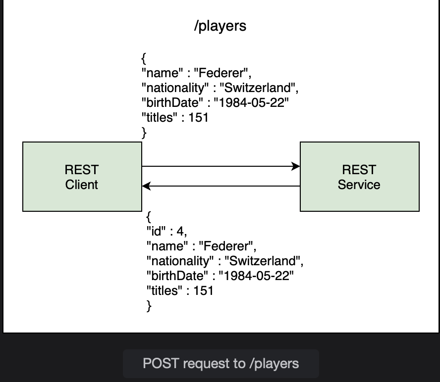
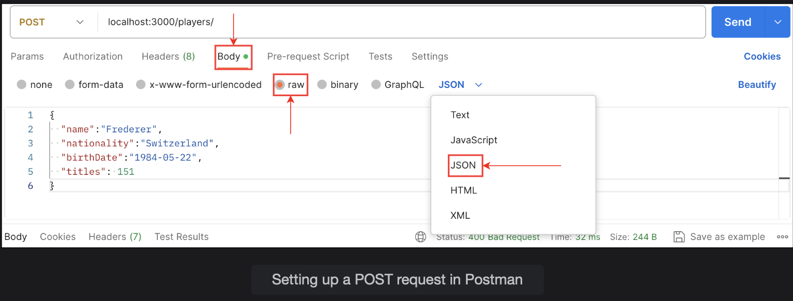

## @PostMapping

Learn how to add a record to the database using a POST request.

> We'll cover the following:
>
> - save() method
> - @PostMapping
> - @RequestBody
> - Creating a POST request

In this lesson, we will create an endpoint for the REST API which creates a new player and adds it to the database.

The REST client will send a POST request to /players. The body of the request contains the JSON data for a player. Since this is a new player, the client will not pass the ID (primary key).  
 The backend system will generate the key for the new record.

The REST service will convert JSON data to POJO and add it to the database. The primary key of the added player is automatically generated by Hibernate, which is the default ORM used by Spring Data JPA.  
 The response to the client is an echo of the player details along with the newly generated ID value.

We will begin by writing the service layer method to add a player.  
 This method, addPlayer takes a Player object as parameter and returns the entity that has been added.

        public Player addPlayer(Player p) {
            // call repository method to add a player object to the player table
        }

## save() method

The JpaRepositoty interface inherits a method from the CrudRepository called save().  
 This method handles both inserts and updates. To distinguish between an Insert and Update operation, the save() method checks the primary key of the object that is being passed to it.  
 If the primary key is empty or null, an INSERT operation is performed, otherwise an UPDATE to an existing record is performed.

        public Player addPlayer(Player p) {
            return repo.save();
        }

The calling method will ensure that the primary key, Id, in the Player object is empty so that the record gets inserted.

After writing the service layer method for adding a player, we are ready to move on to the controller layer. We will create a method addPlayer() in the PlayerController class.  
 This method will have a mapping for a POST request to /players.  
 The method will return the inserted record back to the client.

        @PostMapping("/players")
        public Player addPlayer(Player player) {

        }

## @PostMapping

The @PostMapping annotation maps HTTP POST requests to controller methods.  
It is a shortcut annotation for:

        @RequestMapping(method = RequestMethod.POST)

## @RequestBody

The client will send the player data in the request body as JSON.  
 Jackson will convert the incoming JSON data to POJO.  
 The @RequestBody annotation handles this conversion and binds the data in the request body to a method parameter.

        @PostMapping("/players")
        public Player addPlayer(@RequestBosy Player player){

        }

Inside the addPlayer() method, we will set the primary key to zero. This is done to ensure that if the client accidently passes the id of a player to be added, we remove it from the request before delegating the call to the service layer.  
 The save() method offered by the JpaRepository works for both INSERT and UPDATE requests by checking the primary key and performs an INSERT or UPDATE operation depending upon its value.

        @PostMapping("/players")
        public Player addPlayer(@RequestBody Player player) {
            player.setId(0);
        }

We are explicitly setting the Id to zero to ensure the insertion of a new player instead of an update to an existing player.  
 By overwriting the Id with zero, we are effectively setting it to null or empty.

Then, we just delegate this request to the service layer.

        @PostMapping
        public Player addPlayer(@RequestBody Player player) {
            player.setId(0);
            return service.addPlayer(player);
        }

The response from the REST controller will contain the player's name, nationality, birth date, and titles.  
 It will also contain the Id that was automatically generated by Hibernate.

## Creating a Post request

We can not test the newly created endpoint with Postman. To send data to REST service, we need to create a POST request and use the URL given below the code widget.

When sending JSON data to a REST controller, we need to set an HTTP request header. The information in the header tells the controller how to process the data.

- To set up the request, we will choose "Body" and then choose a radio item for "raw" because we will send raw data in the request.
- A dropdown on the right contains different content types.  
   We will choose the content type of "JSON", because our controller method expects JSON data.

These settings ensure that Postman will automatically set the correct HTTP request header and then send the data across accordingly.

The actual body of the request consists of JSON for the player containing the name, nationality, birth date, and titles information.  
 We will not pass the id because the system will auto generate that value for us. The controller method also check the Id and sets it to zero, even if it is passed in the request.

        {
            "name": "Federer",
            "nationality": "Switzerland:,
            "birthDate": "22-11-1984",
            "titles": 151
        }

When we send the request, the response from teh REST service appears in the bottom part of the screen.  
 The player has been added to the database and Hibernate has generated a new ID for the player as 4.

        spring.h2.console.settings.web-allow-others=true

To confirm this, we can log into H2 console by using /h2-console/ instead of /players in the URL given below.  
 After logging into the H2 web console, run the following query:

        SELECT * FROM players;

The new player can be seen in the Players table.

> We can also vertify the INSERT by sending a GET request to the REST API at /players. The response now contains 4 players, which verifies that a player has been added to the database.
