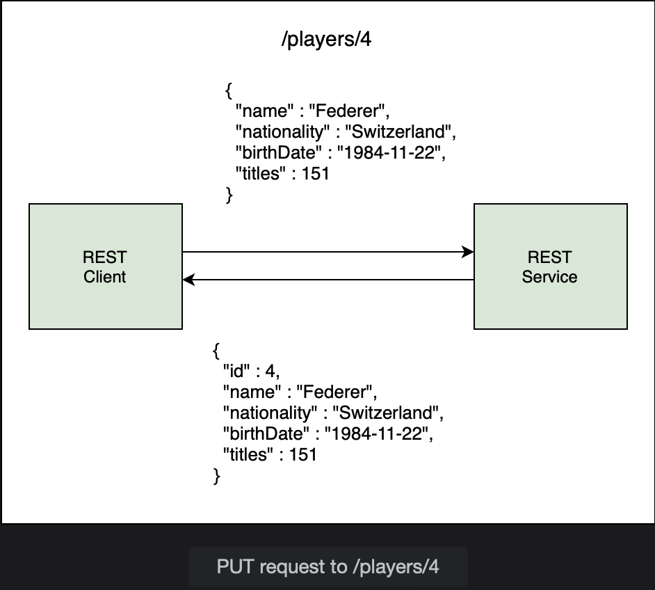

# @PutMapping

Learn how to update a record in the database using a PUT request.

> We'll cover the following:
>
> - Adding @PutMapping annotation

In this lesson, we will create an endpoint to edit a player record and update his information in the database.

The HTTP PUT request is used for updates. The REST client will send a PUT request to /players/{playerId} with JSON data containing the information to be updated.  
 The player's ID is a path variable.

The REST service will convert the JSON data to a Player object, and using the id of the player; it will overwrite the player's record in the database with the sent in the PUT request.  
 On success, the REST service will respond with the updated player record (which is an echo of the request).

To handle the update based on the player's id, we will create a method called updatePlayer() in the PlayerService class.  
 This method takes in two arguments: a player's id and a Player object.  
 It returns the updated Player object.

        public Player updatePlayer(int id, Player p) {
            // call repository method to update the player
        }

The primary key passed in the method will be used to fetch the existing record from the database.  
 We will use the getOne() method as follows:

        public Player updatePlayer(int id, Player p) {

            // get player object by Id
            Player player = repo.getOne(id);

            // update player information in database
        }

Once we get the old player record from the database in player, we need to modify it based on the information in the Player object p, received as argument.

For each field, we will call the getter methods on p to fetch the new information. Then, we will overwrite the old information by calling setter methods on player.

        // update player details
        player.setName(p.getName());
        player.setNationality(p.getNationality());
        player.setBirthDate(p.getBirthDate());
        player.setTitles(p.getTitles());

The last step is to call repository methods to save the updated information. JpaRespository inherits the save() method offered by the CrudRepository.  
 This method handles both insert and update operations on the repository. It works by checking the primary key of the object and performing an update if the key is present.  
 If the primary key is zero or null, a new record is inserted into the database.

In our case, the player object contains a non-null id value. So, if we call the save() method, it will perform an update of the existong record.

        public Player updatePlayer(int id, Player p) {
            // get player object by ID
            Player player = repo.getOne(id);

            // update player details
            player.setName(p.getName());
            player.setNationality(p.getNationality());
            player.setBirthDate(p.getBirthDate());
            player.setTitles(p.getTitles());

            // save updates
            return repo.save(player);
        }

The save() method returns the object.

After setting up the service layer method to handle updates, we can write the controller method to receive a PUT request.  
 We will send the Id of the player to be updated as a path variable.  
 The request body contains the JSON with the updated information of the player. The method will return a Player object which will be converted to JSON and sent back to the client.

The following code snippet shows the updatePlayer() method with a @PutMapping of /players/{id}:

        @PutMapping("/players/{id}")
        public Player updatePlayer(@PathVariable int id, @RequestBody Player player) {

        }

## Adding @PutMapping annotation

The @PutMapping is a shortcut annotation for mapping a PUT request to a controller method. It is same as:

        @RequestMapping(method=RequestMethod.PUT)

The updatePlayer() method accepts JSON data in the request body. The @RequestBody annotation binds the JSON data to the Player object player.  
 It handles the conversion from JSON to POJO.

We have also used the @PathVariable annotation which will extract the path variable id from the incoming request /players/{id} and bind it with the id method parameter.

The controller method delegates the call to the service layer by calling its update method and passing the id and the Player object containing the information to be updated:

        @PutMapping("/players/{id}")
        public Player updatePlayer(@RequestBody Player player, @PathVariable int id) {
            return service.updatePlayer(id, player);
        }

To test the new endpoint, we will create a PUT request in Postman. Suppose we want to update the information of the player with id 2 so the URL is /player/2.  
We will provide the data for a new player, Nadal. To send the JSON in the request, choose "Body", then choose "raw" and from the dropdown choose "JSON".

The body of the request is as follows:

        {
            "name" : "Nadal",
            "nationality" : "Spain",
            "birthDate" : "03-06-1986",
            "titles" : 88
        }

When the request is sent, we can see a response at the bottom part of the screen.  
 The response is an echo of the request and indicates that the request has beem successful. The player with id 2 is now Nadal.

The change can be verified from the web console of H2 database.
