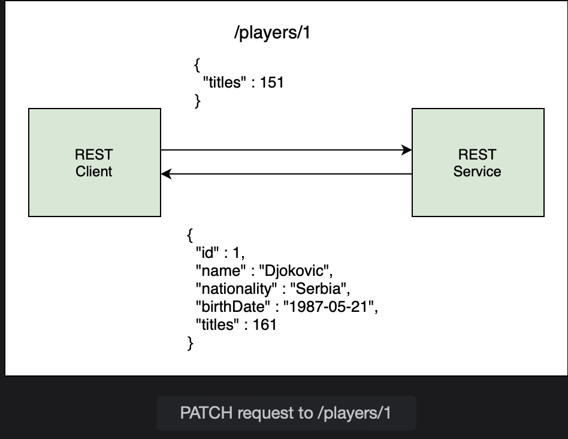

# @PatchMapping

Learn how to perform partial updates to a record in the database.

> We'll cover the following:
>
> - Partial update
>
> 1. Defining the patch() method
> 2. Using reflection
> 3. @PatchMapping
> 4. Queries for partial update

## Partial update

The PUT method updates the whole record. There may be a scenerio when only or two fields needs to be updated. In that case, sending the whole record does not make sense.  
 The HTTP PATCH method is used for partial updates.

Sometime we may need to update a single field.  
 For example, once we enter a player in our database, the field that will most likely change is his titles count.  
 The player entity only has a few fields and PUT can be used for update.  
 But if the entity is large and contains nested objects, it will have a performance impact to send the whole entity only to update a single field.

So, in our example, partial request means that we only send the titles in the request body instead of the whole Player object.  
 If we use PUT to send a partial request, all other fields are set to null. The code widget below illustrates the point of a PUT request with the following request body is sent to /players/1.

        {
            "title" : 161
        }

We get the follwing response:

        {
            "id" : 1,
            "name" : null,
            "nationality" : null,
            "birthDate" : null,
            "titles" : 161
        }

The titles have been modified but the rest of the values are now null which is not desired outcome.  
The PUT method requires the entire object to be sent, even when we want to modify a single field. If partial data is sent, then all other fields are set to null.  
PATCH comes in handy in such situations. It allows a list of changes to be applied to the entity, as we will see in this lesson.

## 1. Defining the patch() method

In the PlayerService class, we will implement a method to handle partial updates to the Player object.  
 This method patch() will have two arguments.  
 The first is the id of the player on which the patch is to be applied.  
 The second argument is the Map containing the key-value pairs of the fields that will be updated.  
 The key (field name) is a String while the value is an Object as it can have different datatypes.

        public Player patch(int id, Map<String, Object> playerPatch) {

        }

Inside the metthod, we will use the id to fetch the existing Player object from the database using the findById() method of the JpaRepository.  
 This method loads the entity from the database unlike the getOne() method, which returns a proxy object without hitting the database.  
 The findById() returns an Optional and we need to check if a Player object is returned using the isPresent() method.

        public Player patch(int id, Map<String, Object> player Patch) {
            Optional<Player> player = repo.findById(id);
            if (player.isPresent()) {
                // update fields using Map
            }
            return repo.save(player);
        }

## 2. Using reflection

Next, we will loop through the Map, find the field that will be updated, and then change the value of that field in the existing Player object that we retrieved from the database in the previous step.  
 The Reflection API is used to examine and modify fields, methods, and classes at runtime.  
 It allows access to private fields of a class and can be used to access the fields irrespective of their access modifiers.
