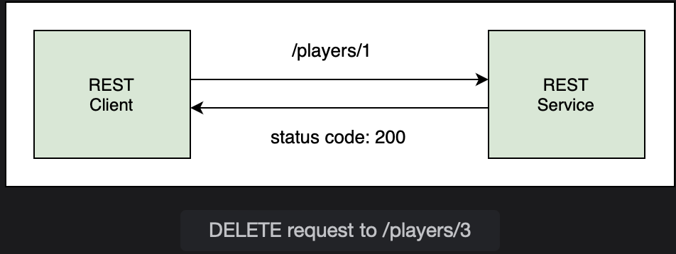

# @DeleteMapping

Learn how to delete a record from the database using DELETE request.

> We'll cover the following:
>
> - Using @DeleteMapping annotation

The HTTP DELETE request deletes a record. The primary key of the record to be deleted can be sent as part of the request URI or the record itself can be sent as part of the request body.  
 The client will send a DELETE request to our REST service with the id of the player to be deleted. The REST Service deletes the record and reponds with the 200 (OK) status code to the client.

JpaRespository inherits two methods of the CrudRepository for deleting a record. One is the delete() method which takes an entity to be deleted, and the other is deleteById() which takes the primary key of the entity to be deleted.  
 They both have the same function, and internally the deleteById() methods calls the delete() method:

        void deleteById(ID id) {
            delete(findById(id));
        }

The difference lies in the way both methods respond when entity to be deleted is not found.  
 The deleteById() method throws the EmptyResultDataAccessException while delete() throws a NoSuchElementException.

Following the same apporoach adopted in the previous lessons, we will first define the service layer method to handle delete functionality.  
 In the PlayerService class, create a method called deletePlayer(). This method takes an int argument which is the primary key of the player to be deleted. It returns a String message to indicate success or failure of the delete operations.

        public String deletePlayer(int id) {
            // call repo method for delete
        }

Inside the method, we will call the repository method deleteById() and pass the player's id. As mentioned above, the deleteById() method internally calls the findById() method, and then deletes the record.

        public String deletePlayer(int id) {
            repo.deleteById(id);
            return "Deleted player with id: "+id;
        }

To handle the exception thrown when the player record is not found, we can enclose the method call in a try catch block:

        try {
            repo.deleteById(id);
        } catch {
            return "Player with id " + id + "not found";
        }
        return "Deleted player with id: " + id;

Moving on to the controller layer, we will create a method deletePlayer to handle the DELETE request. It will map to the endpoint /players/{id}, with id being the path variable.  
 The REST controller will respond with a message informing the client of the success or failure.  
 The method is annotated with @DeleteMapping.  
 The @PathVariable annotation binds the id path variable to the method parameter id.

        @DeleteMapping("/players/{id}")
        public String deletePlayer(@PathVariable int id) {
            // call service layer method
        }

## Using @DeleteMapping annotation

The @DeleteMapping annotation is a shortcut annotation. It is same as:

        @RequestMapping(method = RequestMethod.DELETE)

The deletePlayer() method will delegate the call to the service layer and pass the id received in the DELETE request.  
 On success, the method will return the deleted player's id by plugging the id received in the request. If the player is not found in the database, the method will return with a message informing the client that the player was not found.

        @DeleteMapping("/players/{id}")
        public String deletePlayer(@PathVariable int id) {
            return service.deletePlayer(id);
        }

To test the new endpoint, launch the application given below, and create a DELETE request in postman.  
 We will provide the id of the player as part of the URI, so the request body will be empty. Send two DELETE requests, first to /players/3 and then to /players/4.  
 In the first case, the REST controller responds with a success message while in the second case the player with id 4 is not found.  
 The results can be verified by using a GET request to /players. It can be seen that only 2 players remain in the database. We can also use the web console of H2 to check the Players table and verify that it has two rows now.

**PlayerController.java**

        package io.datajek.springrest;

        import java.util.List;
        import java.util.Map;

        import org.springframework.beans.factory.annotation.Autowired;
        import org.springframework.web.bind.annotation.DeleteMapping;
        import org.springframework.web.bind.annotation.GetMapping;
        import org.springframework.web.bind.annotation.PatchMapping;
        import org.springframework.web.bind.annotation.PathVariable;
        import org.springframework.web.bind.annotation.PostMapping;
        import org.springframework.web.bind.annotation.PutMapping;
        import org.springframework.web.bind.annotation.RequestBody;
        import org.springframework.web.bind.annotation.RestController;

        @RestController
        public class PlayerController {

            @Autowired
            PlayerService service;

            @GetMapping("/welcome")
            public String welcome() {
                return "Tennis Player REST API";
            }

            @GetMapping("/players")
            public List<Player> allPlayers() {
                return service.getAllPlayers();
            }

            @GetMapping("/players/{id}")
            public Player getPlayer(@PathVariable int id){
                return service.getPlayer(id);
            }

            @PostMapping("/players")
            public Player addPlayer(@RequestBody Player player) {
                player.setId(0);
                return service.addPlayer(player);
            }

            @PutMapping("/players/{id}")
            public Player updatePlayer(@PathVariable int id, @RequestBody Player player) {
                return service.updatePlayer(id, player);
            }

            @PatchMapping("/players/{id}")
            public Player partialUpdate(@PathVariable int id, @RequestBody Map<String, Object> playerPatch) {
                return service.patch(id, playerPatch);
            }

            @PatchMapping("/players/{id}/titles")
            public void updateTitles(@PathVariable int id, @RequestBody int titles) {
                service.updateTitles(id, titles);
            }

            @DeleteMapping("/players/{id}")
            public void deletePlayer(@PathVariable int id) {
                service.deletePlayer(id);
            }

            }

**PlayerService.java**

        package io.datajek.springrest;

        import java.lang.reflect.Field;
        import java.util.List;
        import java.util.Map;
        import java.util.Optional;

        import org.springframework.beans.factory.annotation.Autowired;
        import org.springframework.stereotype.Service;
        import org.springframework.transaction.annotation.Transactional;
        import org.springframework.util.ReflectionUtils;

        @Service
        public class PlayerService {

            @Autowired
            PlayerRepository repo;

            //Get all players
            public List<Player> getAllPlayers() {
                return repo.findAll();
            }

            //Get player by ID
            public Player getPlayer(int id) {
                Optional<Player> tempPlayer = repo.findById(id);

                if(tempPlayer.isEmpty())
                    throw new PlayerNotFoundException("Player with id {"+ id +"} not found");

                return tempPlayer.get();
            }

            //Add a player
            public Player addPlayer(Player p) {
                return repo.save(p);
            }

            //Update a player
            public Player updatePlayer(int id, Player p) {
                Optional<Player> tempPlayer = repo.findById(id);

                if(tempPlayer.isEmpty())
                    throw new PlayerNotFoundException("Player with id {"+ id +"} not found");

                p.setId(id);
                return repo.save(p);
            }

            //Partial update
            public Player patch( int id, Map<String, Object> partialPlayer) {

                Optional<Player> player = repo.findById(id);

                if(player.isPresent()) {
                    partialPlayer.forEach( (key, value) -> {
                        System.out.println("Key: " + key + " Value: " + value);
                        Field field = ReflectionUtils.findField(Player.class, key);
                        ReflectionUtils.makeAccessible(field);
                        ReflectionUtils.setField(field, player.get(), value);
                    });
                }
                else
                    throw new PlayerNotFoundException("Player with id {"+ id +"} not found");

                return repo.save(player.get());
            }

            //delete a player
            public void deletePlayer(int id) {
                Optional<Player> tempPlayer = repo.findById(id);

                if(tempPlayer.isEmpty())
                    throw new PlayerNotFoundException("Player with id {"+ id +"} not found");

                repo.delete(tempPlayer.get());
            }

            //update a single field
            @Transactional
            public void updateTitles(int id, int titles) {
                Optional<Player> tempPlayer = repo.findById(id);

                if(tempPlayer.isEmpty())
                    throw new PlayerNotFoundException("Player with id {"+ id +"} not found");

                repo.updateTitles(id, titles);
            }
        }

**PlayerRepository.java**

        package io.datajek.springrest;

        import java.util.List;

        import org.springframework.data.jpa.repository.JpaRepository;
        import org.springframework.data.jpa.repository.Modifying;
        import org.springframework.data.jpa.repository.Query;
        import org.springframework.data.repository.query.Param;

        public interface PlayerRepository extends JpaRepository<Player, Integer>{

            @Modifying
            @Query("update Player p set p.titles = :titles where p.id = :id")
            void updateTitles(@Param("id") int id, @Param("titles") int titles);

        }

**Player.java**

        package io.datajek.springrest;

        import java.util.Date;

        import javax.persistence.Entity;
        import javax.persistence.GeneratedValue;
        import javax.persistence.GenerationType;
        import javax.persistence.Id;

        import com.fasterxml.jackson.annotation.JsonFormat;

        @Entity
        public class Player {
            @Id
            @GeneratedValue(strategy=GenerationType.IDENTITY)
            private int id;
            private String name;
            private String nationality;
            @JsonFormat(pattern = "dd-MM-yyyy")
            private Date birthDate;
            private int titles;

            public Player() {

            }

            public Player(String name, String nationality, Date birthDate, int titles) {
                super();
                this.name = name;
                this.nationality = nationality;
                this.birthDate = birthDate;
                this.titles = titles;
            }

            public int getId() {
                return id;
            }

            public void setId(int id) {
                this.id = id;
            }

            public String getName() {
                return name;
            }

            public void setName(String name) {
                this.name = name;
            }

            public String getNationality() {
                return nationality;
            }

            public void setNationality(String nationality) {
                this.nationality = nationality;
            }

            public Date getBirthDate() {
                return birthDate;
            }

            public void setBirthDate(Date birthDate) {
                this.birthDate = birthDate;
            }

            public int getTitles() {
                return titles;
            }

            public void setTitles(int titles) {
                this.titles = titles;
            }

            @Override
            public String toString() {
                return "\nPlayer [id= " + id + ", name= " + name + ", nationality= " + nationality + ", birthDate= " + birthDate
                        + ", titles= " + titles + "]";
            }
        }

**TennisPlayerSpringRestApplication.java**

        package io.datajek.springrest;

        import org.springframework.boot.SpringApplication;
        import org.springframework.boot.autoconfigure.SpringBootApplication;

        @SpringBootApplication
        public class TennisPlayerSpringRestApplication{

            public static void main(String[] args) {
                SpringApplication.run(TennisPlayerSpringRestApplication.class, args);
            }
        }
