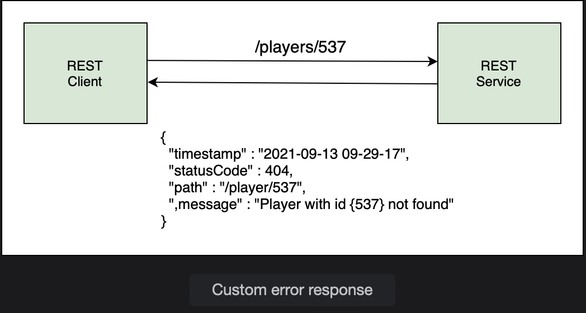

# Exception Handling I

Learn how to throw an exception of a custom type.

> We'll cover the following:
>
> 1. Custom error response class
> 2. Custom exception class
> 3. throw exception

When the client sends a request to fetch, update or delete a player record not found in the database, an internal server error occurs.  
 The information contained in the response is verbose and of interest to developers only.

We will learn how to send a client-friendly JSON response when a player record is not found. The message can contain the error code, time when the error occurred, and information about why the error occurred.  
 So when the client sends a request for an Id that does not exist, say 537, the REST service sends it a custom JSON response instead of the 500 Internal Server Error.

## 1. Custom error response class

In order to send a custom response to the client, we will create a class with fields like status code, error message, path/URI, and timestamp.  
 An object of this class will be created when an exception occurs and sent back to the client as the response.

Jackson will automatically handle data binding and send this object as a JSON response.

Creating a class PlayerErrorResponse in io.datajek.springrest. The class contains the following fields:

        public class PlayerErrorResponse {
            @JsonFormat(pattern = "yyyy-MM-dd HH:mm:ss")
            private ZonedDateTime timestamp;
            private int statusCode;
            private String path;
            private String message;

            // constructor
            // getters and setters
        }

The class has a constructor to create an object using fields as well as getter and setter methods for all fields.

## 2. Custom exception class

When the REST service receives a bad request, we want it to throw an exception of our custom type. Since the exception is thrown when the player is not found, we will call the class PlayerNotFoundException.  
 This class extends the RunTimeException class.

        public class PlayerNotFoundException extends RuntimeException {
            // superclass constructors
        }

The RunTimeException class contains muyltiple constructors and we will use one of them to throw exception when the player is not found.

## 3. throw exception

Now that we have defined a custom class, we are in a position to throw exceptions of this class. PlayerNotFoundException will be thrown at multiple places in the code.

In the PlayerService class, the player Is is received by the following methods: getPlayer(), updatePlayer(), patch(), updateTitles(), and deletePlayer().  
 We will update these methods to check if the Id received is valid and throw a PlayerNotFoundException if there is no record in the database for the given Id.

In the getPlayer() method, the player record is retrieved in an Optional called tempPlayer. The isEmpty() method on the Optional checks for null values and the PlayerNotFoundException is thrown as shown below:

        public Player getPlayer (int id) {
            Optional<Player> tempPlayer = repo.findById(id);

            if(tempPlayer.isEmpty())
                throw new PlayerNotFoundException("Player with id {" + id + "} not found.");

            return tempPlayer.get();
        }

The exception is created with a custom message containing the Id of the player.

We will use a similar approach in the updatePlayer, deletePlayer, and updateTitles method. First, use the given Id to retrieve the player from the database. If the player record does not exist, throw PlayerNotFoundException, else, update/delete the player record.  
 The modified methods are shown below:

        public Player updatePlayer(int id, Player p) {
            Optional<Player> tempPlayer = repo.findById(id);

            if(tempPlayer.isEmpty())
                throw new PlayerNotFoundException("Player with id {" + id + "} not found.")

            p.setId(id);
            return repo.save(p);
        }

Here's the delete functionality:

        public void deletePlayer(int id) {
            Optional<Player> tempPlayer = repo.findById(id);

            if(tempPlayer.isEmpty())
                throw new PlayerNotFoundException("Player with id {"+ id +"} not found");

            repo.delete(tempPlayer.get());
        }

Here's the update functionality:

        @Transactional
        public void updateTitles(int id, int titles) {
            Optional<Player> tempPlayer = repo.findById(id);

            if(tempPlayer.isEmpty())
                throw new PlayerNotFoundException("Player with id {" + id +"} not found.");

            repo.updateTitles(id, titles);
        }

For the patch() method, we will take a slightly different approach and use isPresent() instead of isEmpty() on the Optional.  
 If the record has been retrieved, we will apply the patch, otherwise throws the PlayerNotFoundException.

The code is shown below:

        public Player patch( int id, Map<String, Object> partialPlayer) {
            Optional<Player> player = repo.findById(id);

            if(player.isPresent()) {
                    partialPlayer.forEach( (key, value) -> {
                    System.out.println("Key: " + key + " Value: " + value);
                    Field field = ReflectionUtils.findField(Player.class, key);
                    ReflectionUtils.makeAccessible(field);
                    ReflectionUtils.setField(field, player.get(), value);
                });
            }else
                throw new PlayerNotFoundException("Player with id {"+ id +"} not found");

            return repo.save(player.get());
        }

Below is the compiled code discussed till now:

**PlayerNotFoundException.java**

        package io.datajek.springrest;

        public class PlayerNotFoundException extends RuntimeException{

            public PlayerNotFoundException() {
                super();
            }

            public PlayerNotFoundException(String message, Throwable cause, boolean enableSuppression,
                    boolean writableStackTrace) {
                super(message, cause, enableSuppression, writableStackTrace);

            }

            public PlayerNotFoundException(String message, Throwable cause) {
                super(message, cause);

            }

            public PlayerNotFoundException(String message) {
                super(message);

            }

            public PlayerNotFoundException(Throwable cause) {
                super(cause);
            }
        }

**PlayerErrorResponse.java**

        package io.datajek.springrest;

        import java.time.ZonedDateTime;

        import com.fasterxml.jackson.annotation.JsonFormat;

        public class PlayerErrorResponse {

            @JsonFormat(pattern="yyyy-MM-dd HH:mm:ss")
            private ZonedDateTime timestamp;
            private int statusCode;
            private String path;
            private String message;

            public PlayerErrorResponse(ZonedDateTime timestamp, int statusCode, String path, String message) {
                super();
                this.timestamp = timestamp;
                this.statusCode = statusCode;
                this.path = path;
                this.message = message;
            }

            public ZonedDateTime getTimestamp() {
                return timestamp;
            }

            public void setTimestamp(ZonedDateTime timestamp) {
                this.timestamp = timestamp;
            }

            public int getStatusCode() {
                return statusCode;
            }

            public void setStatusCode(int statusCode) {
                this.statusCode = statusCode;
            }

            public String getPath() {
                return path;
            }

            public void setPath(String path) {
                this.path = path;
            }

            public String getMessage() {
                return message;
            }

            public void setMessage(String message) {
                this.message = message;
            }
        }

**PlayerService.java**

        package io.datajek.springrest;

        import java.lang.reflect.Field;
        import java.util.List;
        import java.util.Map;
        import java.util.Optional;

        import org.springframework.beans.factory.annotation.Autowired;
        import org.springframework.stereotype.Service;
        import org.springframework.transaction.annotation.Transactional;
        import org.springframework.util.ReflectionUtils;

        @Service
        public class PlayerService {

            @Autowired
            PlayerRepository repo;

            //Get all players
            public List<Player> getAllPlayers() {
                return repo.findAll();
            }

            //Get player by ID
            public Player getPlayer(int id) {
                Optional<Player> tempPlayer = repo.findById(id);

                if(tempPlayer.isEmpty())
                    throw new PlayerNotFoundException("Player with id {"+ id +"} not found");

                return tempPlayer.get();
            }

            //Add a player
            public Player addPlayer(Player p) {
                return repo.save(p);
            }

            //Update a player
            public Player updatePlayer(int id, Player p) {
                Optional<Player> tempPlayer = repo.findById(id);

                if(tempPlayer.isEmpty())
                    throw new PlayerNotFoundException("Player with id {"+ id +"} not found");

                p.setId(id);
                return repo.save(p);
            }

            //Partial update
            public Player patch( int id, Map<String, Object> partialPlayer) {

                Optional<Player> player = repo.findById(id);

                if(player.isPresent()) {
                    partialPlayer.forEach( (key, value) -> {
                        System.out.println("Key: " + key + " Value: " + value);
                        Field field = ReflectionUtils.findField(Player.class, key);
                        ReflectionUtils.makeAccessible(field);
                        ReflectionUtils.setField(field, player.get(), value);
                    });
                }
                else
                    throw new PlayerNotFoundException("Player with id {"+ id +"} not found");

                return repo.save(player.get());
            }

            //delete a player
            public void deletePlayer(int id) {
                Optional<Player> tempPlayer = repo.findById(id);

                if(tempPlayer.isEmpty())
                    throw new PlayerNotFoundException("Player with id {"+ id +"} not found");

                repo.delete(tempPlayer.get());
            }

            //update a single field
            @Transactional
            public void updateTitles(int id, int titles) {
                Optional<Player> tempPlayer = repo.findById(id);

                if(tempPlayer.isEmpty())
                    throw new PlayerNotFoundException("Player with id {"+ id +"} not found");

                repo.updateTitles(id, titles);
            }
        }
