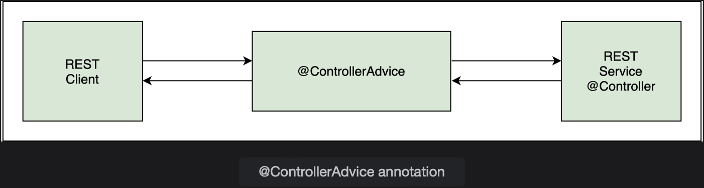
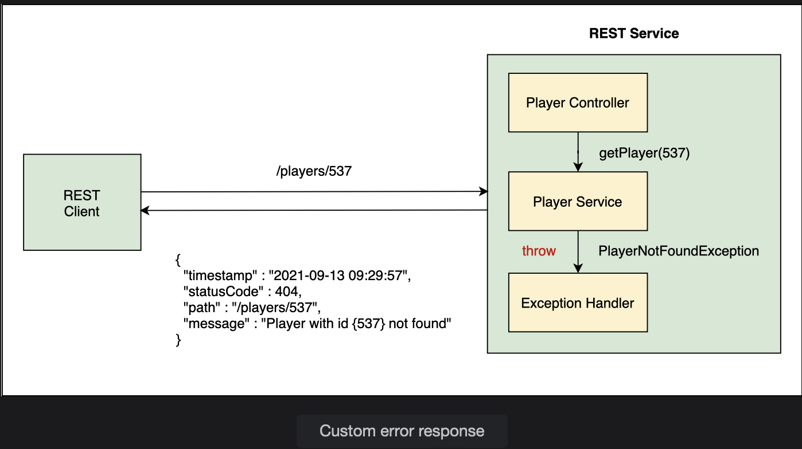

## Exception Handling II

Learn how a global exception handler works.

> We'll cover the following:
>
> - @ControllerAdvice
> - @ExceptionHandler
> - Generic exception handler

PlayerErrorResponse is an error response class containing information that we want to send to the client.  
 PlayerNotFoundException is a custom exception class. The REST service throws exceptions of this class when a player record is not found in the database.

## @ControllerAdvice

A best practice in exception handling is to have centralized exception handlers that can be used by all controllers in the REST API.  
 Since exception handling is a cross-cutting concern, Spring provides the @ControllerAdvice annotation.  
 This annotation intercepts requests going to the controller and responses coming from controllers.

The @ControllerAdvice annotation can be used as an interceptor of exceptions thrown by methods annotated with @RequestMapping or any of its shortcut annotation.  
The exception handling logic is contained in the global exception handler which handles all exceptions thrown by the PlayerController.

We will create a new class PlayerExceptionHandler, and annotate it with the @ControllerAdvice annotation so it can act as a global exception handler.

        @ControllerAdvice
        public class PlayerExceptionHandler {

        }

This class will have methods to handle different types of exceptions.  
We will write a handler method to catch the PlayerNotFoundException exception thrown by the methods in PlayerService class.  
This handler method will create an appropriate response for the client.

> Create a method playerNotFoundHandler() in the PlayerExceptionHandler class. The input to this method is the type of the exception it will handle as well as the HttpServletRequest object.
>
> In our case, the exception will be of type PlayerNotFoundException.  
> This method returns a ResponseEntity object containing the HTTP response when the exception occurs.
>
> An HTTP response message has three parts: response ine, header and body.  
> We can set these attributes in our handler method and configure the HTTP response.  
> The ResponseEntity object is generic and we can send any type as the response body.  
> In our case, the response body will contain an object of the PlayerErrorResponse class.

        public ResponseEntity<PlayerErrorResponse> playerNotFoundHandler (PlayerNotFoundException exception, HttpServletRequest req) {

        }

## @ExceptionHandler

The @ExceptionHandler annotation on a method, marks it as a method that will handle exceptions. Spring automatically checks all methods marked with this annotation when an exception is thrown.  
 If it finds a method whose input type matches the exception thrown, the method will be executed.

        @ExceptionHandler
        public ResponseEntity<PlayerErrorResponse> playerNotFoundHandler (PlayerNotFoundException exception, HttpServletRequest req) {

        }

Inside the handler method, we will create an object of the PlayerErrorResponse class and set its fields, then return it as a ResponseEntity object.

Recall from the last lesson, that PlayerErrorResponse class had the following fields:

        private ZonedDataTime timestamp;
        private int statusCode;
        private String path;
        private String message;

The code below creates a PlayerErrorResponse object called error. This will form the body of the error response.

        PlayerErrorResponse error = new PlayerErrorResponse(ZonedDateTime.now(), HttpStatus.NOT_FOUND.value(), req.getRequestURI(), ex.getMessage());

> - To set the current time, we have used the now() function.
> - The HTTP status code of NOT_FOUND is 404. To use the integer value, we have used HttpStatus.NOT_FOUND.value().
> - We have used the getRequestURI() method on the HttpServletRequest object to get the path at which the exception occurred.
> - The details about the error are contained in the exception and we have used the getMessage() method to extract the message and use it in our response.

In addition to the body of the response, we will also return the appropritate status code with the response. The status code for NOT_FOUND is 404. The last step is to create and return a ResponseEntity object as follows:

        return new ResponseEntity<>(error, HttpStatus.NOT_FOUND);

The ResponseEntity class provides a variety of constructors to create an object using the status code, header and body or a combination of the three.  
Here,we have used the constructor which creates a ResponseEntity object with a given body and status code. The other constructor variants for creating the ResponseEntity object are:

- ResponseEntity(HttpStatus status)
- ResponseEntity(MultiValueMap<String, String> headers, HttpStatus status)
- ResponseEntity(T body, MultiValueMap<String, String> headers, HttpStatus status)

The complete code of the handler method is shown below:

        @ExceptionHandler
        public ResponseEntity<PlayerErrorResponse> playerNotFoundHandler (PlayerNotFoundException ex,HttpServletRequest req) {
            PlayerErrorResponse error = new PlayerErrorResponse(ZonedDateTime.now(), HttpStatus.NOT_FOUND.value(), req.getRequestURI(), ex.getMessage());

            return new ResponseEntity<> (error, HttpStatus.NOT_FOUND);
        }

The body of the response will automatically be converted to JSON and sent to the client.

We can test the application by sending a GET request to /players/537. When the REST Service receives a bad request, it will return a custom JSON response instead of the 500 Internal Server Error. The response header also shows 404 status code.

## Generic exception handler

It is always a good idea to create a handler to catch all exceptions and send a custom response. We will define another exception handler method called genericHandler().  
The method signature is the same as the previous handler except for the input type, which is parent class, Exception (as opposed to PlayerNotFoundException used in the previous handler method).

        @ExceptionHandler
        public ResponseEntity<PlayerErrorResponse> genericHandler (Exception ex, HttpServletRequest req){

        }

Inside the method, we will create a PlayerErrorResponse object, which is the body of the response. Since this method is a generic exception handler, it will set the status code to 400, which corresponds to the HTTP status code for BAD_REQUEST

        @ExceptionHandler
        public ResponseEntity<PlayerErrorResponse> genericHandler (
                                                            Exception ex,
                                                            HttpServletRequest req){

            PlayerErrorResponse error = new PlayerErrorResponse(
                                                    ZonedDateTime.now(),
                                                    HttpStatus.BAD_REQUEST.value(),
                                                    req.getRequestURI(),
                                                    ex.getMessage());

            return new ResponseEntity<> (error, HttpStatus.BAD_REQUEST);
        }

The ResponseEntity object is returned with the response body and the HTTP status of BAD_REQUEST.

The new handler can be tested by sending a GET request to players/abc. This handler is also be executed in case of a bad POST request such as:

        {
            "name": "Federer",
            "nationality": "Switzerland",
            "birthDate": "22/05/84",
            "titles": 15
        }

Here, we are sending the birthDate in the wrong format. An exception is also thrown when the body is missing from the POST or PUT request.
