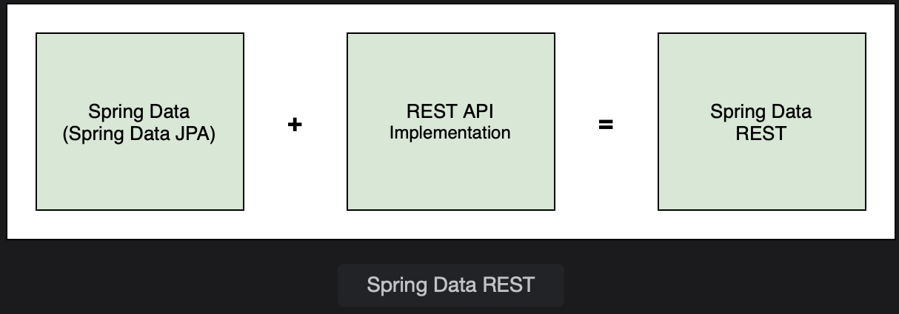
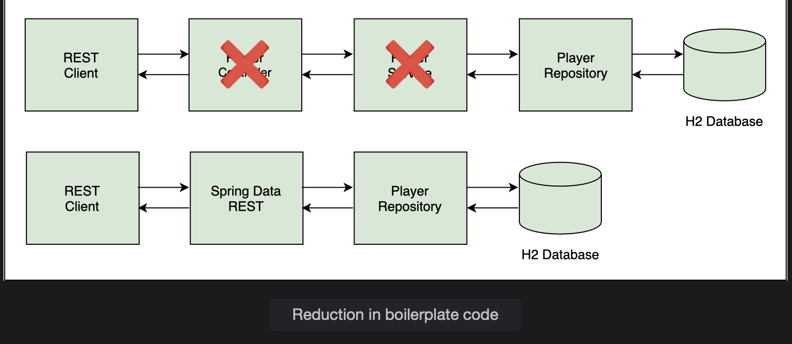

# Spring Data REST

Learn how to create a REST API with full CRUD functionality without writing any controller or service layer code using Spring Data REST.

> We'll cover the following:
>
> - Add dependency
> - Define entity
> - Create repository
> - HATEOAS
> - Customization
>   - Base path
>   - Sorting
>   - Paging
>   - Resource name

Spring Data REST is a project similar to Spring Data JPA which aims to eliminate boilerplate code. With Spring Data JPA, we get the basic CRUD functionality without writing any code simply by specifying the entity and the type of primary key.

Similarly, Spring Data REST provides a REST API based on the repository and entity without us having to write any code in the controller and service layer.

It uses the repository to expose endpoints to perform GET, POST, PUT, PATCH and DELETE on every entity in the application.  
Spring Data REST works with data sources implementing the repository programming model. It supports Spring Data JPA, Spring Data MongoDB, Spring Data Cassandra as well as other Spring Data projects.

Spring Data REST provides a basic REST API which can be customized. Custom queries can be added using JPQL and Query DSL.

Earlier, we saw how to implements a Tennis Player REST API. We had Player entity and created a PlayerRepository implementing the JpaRepository interface. Spring Data REST can provide us a similar API simply by scanning our repository and exposigin the /players endpoint.

Spring Data REST creates endpoints using the entity name by making the first letter lowercase and adding an "s" to the end of the name.  
 For example, we have the following repository interface:

        public interface PlayerRepository extends JpaRepository<Player, Integer> {

        }

Spring Data REST will convert the entity name Player to its uncapitalized, pluralized from players and expose the REST endpoints at /players.  
 It also exposes /players/{id} for each item managed by the repository.

To create a Spring Data REST application using Spring Boot, we need the following:

- spring-boot-starter-data-rest dependency in pom.xml
- an entity (e.g. Player)
- a repository interface (e.g. JpaRepository or CrudRepository)

## Add dependency

Create a Spring Boot application using the Spring Initializr. Provide io.datajek as the group id and tennis-player-spring-data-rest as the artifact id. Then, add the following dependencies:

- Spring Data JPA spring-boot-starter-data-jpa
- REST Repositories spring-boot-starter-data-rest
- H2 Database h2
- Spring Boot Devtools spring-boot-devtools

To add the Spring Data Rest functionality to an existing project, add the following dependency to the pom.xml file:

        <dependency>
            <groupId>org.springframework.boot</groupId>
            <artifactId>spring-boot-starter-data-rest</artifactId>
        </dependecncy>
