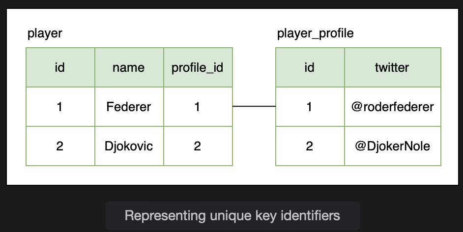
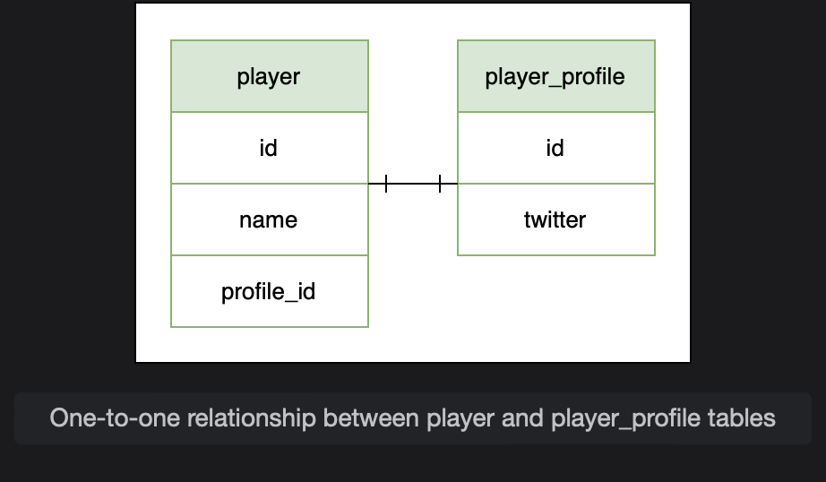
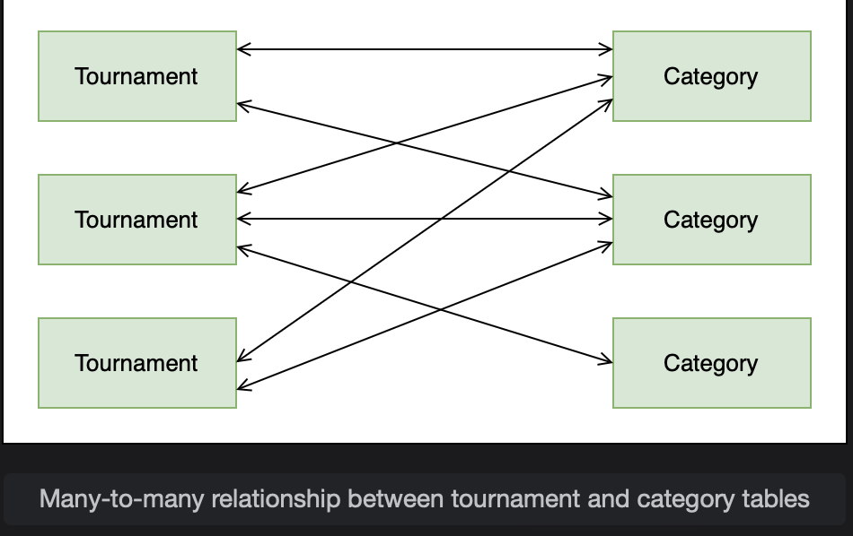
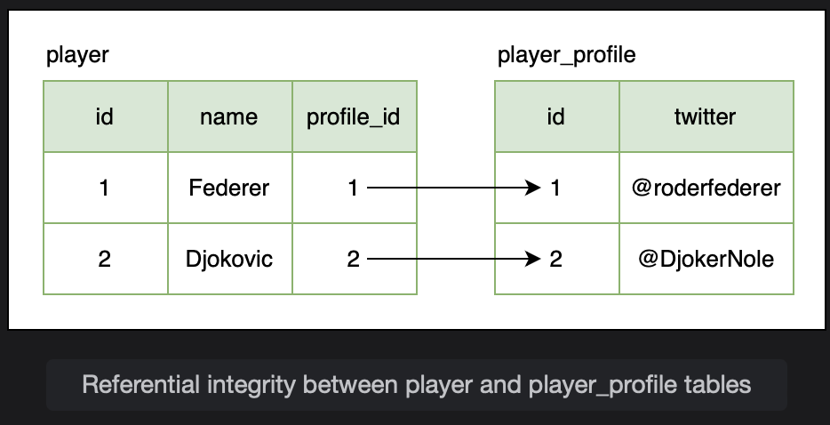
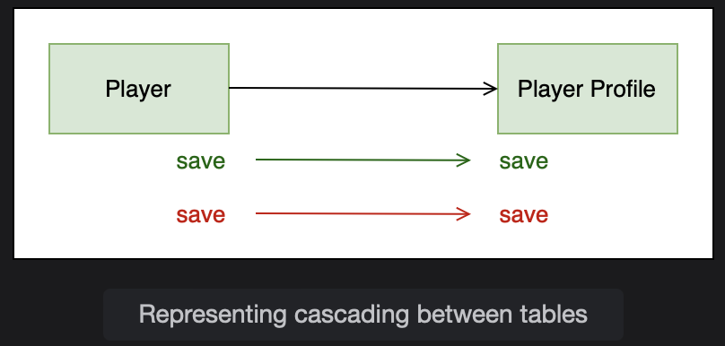
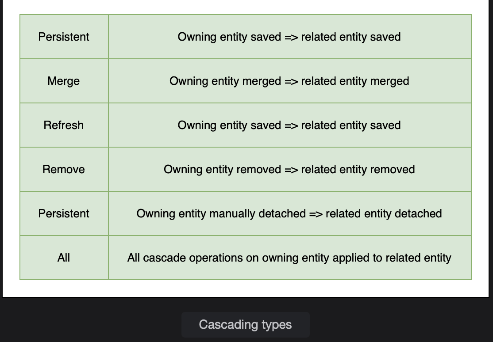
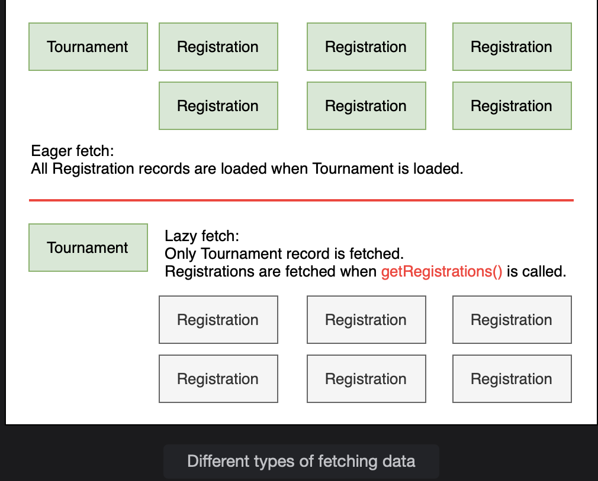
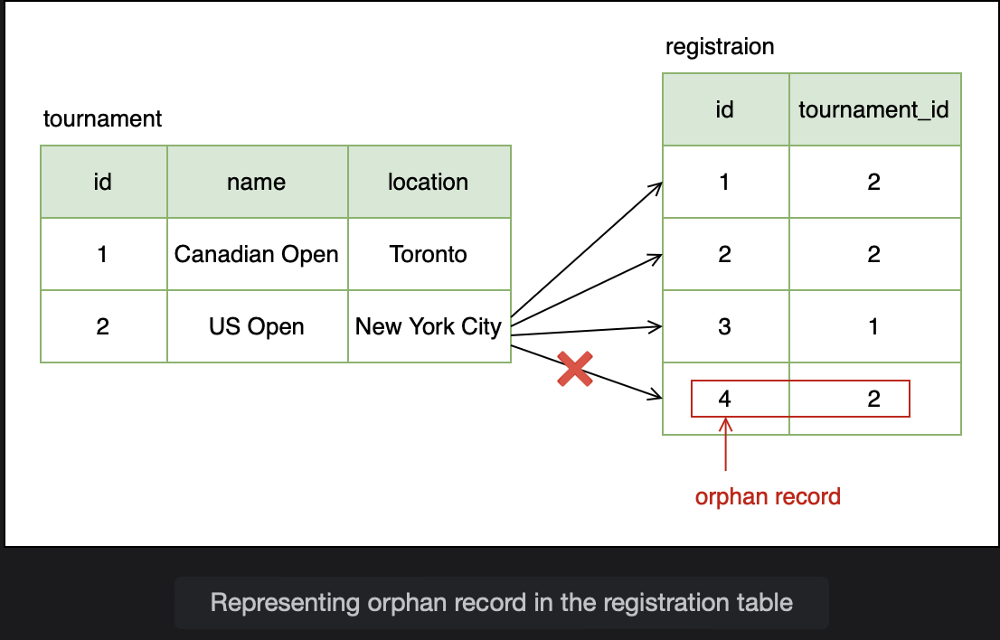

# Basic Concepts

Learn a few basic concepts of database relationshipd in Spring.

> We'll cover the following:
>
> - Primary Key
> - Foreign Key
> - Database relationships
>   - One to One relationship
>   - One to Many relationship
>   - Many to Many relationship
> - Referential integrity
> - Cascading
> - Fetch types
> - Orphan records

## Primary key

A primary key is used to uniquely identify a row in a table. The id column in the player table show below acts as a unique identifier for all records.  
 No two record can have the same primary key value.

## Foreign key

Primary key can be used to link two tables together. When a primary key of one table is used in another table, it is known as a foreign key.  
 To link the player and player_profile tables, the id column from the player_profile table is placed in the player table.  
 The column profile_id is called the foreign key column and is used to point to the record in the player_profile table that is linked to the record in the player table.

## Database relationships

The tables in a database are linked in different ways.

#### One to One relationship

When one row in table_a corresponds to one row in table_b, then it is called a one-to-one relationship.  
 Take the example of player and player_profile tables.  
 One player has one player profile entry, so there is a one-to-one relationship between the tables.

#### One to Many relationship

When one row in table_a corresponds to many rows in table_b, then it is called a one-to-many relationship.  
 The inverse of a one-to-many relationship is a many-to-one relationship where many rows in table_b corresponds to one row in table_a.  
 For example, a player can register for many tournaments. There is one-to-many relationship between the player table and the resigtration table.

#### Many to Many relationship

When one row in table_a corresponds to many rows in table_b and one row in table_b corresponds to many rows in table_a, then we have what is called a many-to-many relationship.  
 Take the example of tournaments and playing categories (like singles, doubles etc.). One tournament features one than one playing category. In the same way, one playing category is part of many tournaments. There is a many-to-many relationship between the tournament and category tables.

## Referential integrity

When two tables are related to one another, data should reflect a consistent state. All foreign keys should refer to valid, existing primary key values.  
 For example, a profile belongs to a player so the player must exist. If a player record is deleted, then the corresponding record in the player profile table should also be deleted.

Absence of referential integrity can lead to records being lost in the database.

## Cascading

Cascading means propagating an operation from the owning entity to the related entity.  
 When a record in the owning entity (parent table) is saved, updated or deleted, the change should be reflected in the related entity (child table) as well.

If we save a Player object containing a nested Profile object, the save operation is cascaded from the player table to the player_profile table and two records are inserted in the database.

JPA offers different cascading types which are shown in the table below:

## Fetch types

There are two ways in which data is loaded: eager and lazy.  
 Eager fetch means that when a record is fetched from the database, all the associated records from related tables are also fetched.

> So if we fetch a tournament record, all the registrations for the tournament are also fetched.

Eager fetch is the default fetch type used by Hibernate but it is not always the most efficient.  
Lazy fetch on the other hand, fetches the records only when they are needed.

## Orphan records

When we remove the relationship between a parent and child, the child record becomes an orphan record meaning that it does not have a parent record.  
 Consider the example of tournament and registration tables where a player withdraws from a tournament. The registration gets removed from the tournament entity. The registration record becomes an orphan record. Orphan records mean that the database is in an inconsistent state

