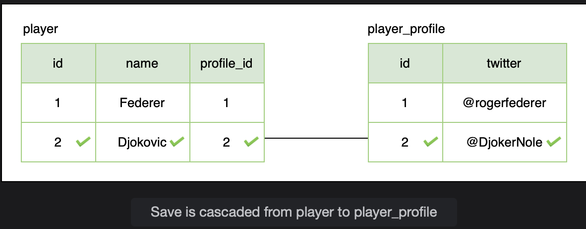
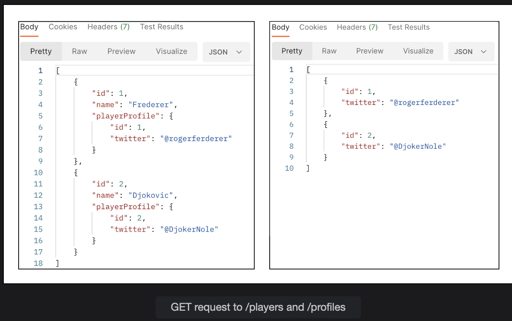

# One-to-One Unidirectional Relationship

Learn how to model a unidirectional 1-1 relationship.

> We'll cover the following:
>
> - One-to-One relationship
>   - cascade property
>   - @JoinColumn
>   - Persisting entities
> - Hibernate implementation of @OneToOne

To model a one-to-one relationship, consider the scenario where a player has a profile that stores his details. We have a player table which stores the basic information about the player like id and name and a player_profile table which stores the additional details like the social media accounts of the players.  
There is a one-to-one relationship between player and player-profile tables, and in this lesson, we will model it as a one-way/ unidirectional relationship.

> We will begin by creating a package called onetoone.  
> Create a Player class and mark it as an entity using @Entity annotation.  
> We will only create id and player name fields at the moment to keep this example simple.
>
>           package io.datajek.databaserelationships.onetoone;
>
>           @Entity
>           public class Player {
>               private int Id;
>               private String name;
>           }
>
> Since Id is the primary key, we will mark it with @Id annotation and let Hibernate generate values for this column using the @GeneratedValue annotation and a GenerationType of Identity.
>
>       @Entity
>       public class Player {
>           @Id
>           @GenerateValue(stratedy = GenerationType.IDENTITY)
>           private int Id;
>           private String name;
>           // ..
>       }

Hibernate requires a default constructor. We will also create an overloaded constructor to create the object using fields, getters and setters for the fields, and a toString() method.

> Next, we will create the PlayerProfile class in the onetoone package to hold miscellaneous information about a player and also mark it as an entity. For now, this class will only store the player’s Twitter account handle.
>
>       package io.datajek.databaserelationships.onetoone;
>       @Entity
>       public class PlayerProfile {
>           private int Id;
>           private String twitter;
>       }
>
> We will mark the primary key with @Id annotation and generate the constructors, getters, setters and ToString() method as we did for the Player class.
>
>       @Entity
>       public class PlayerProfile {
>           @Id
>           @GeneratedValue(strategy = GenerationType.IDENTITY)
>           private int Id;
>           private String twitter;
>           //constructors
>           //getters and setters
>       }

If we run the application now, and visit the H2 console at http://localhost:8080/h2-console (and use jdbc:h2:mem:testdb as the connection URL), we can see that two tables player and player_profile have been created. Right now, there is no relationship between the two tables.

## One-to-One relationship

In SQL, we represent relationships using primary key and foreign key. Foreign keys are used to link tables together. A foreign key is a field in one table that refers to the primary key in another table. We will see how the same can be achieved using Hibernate (which is the default implementation of Spring Data JPA).

For the example taken in this lesson, the Player class has a one-to-one relationship with the PlayerProfile class. To show this relationship, we will add a field PlayerProfile to the Player class and use the JPA annotation @OneToOne on this field.

        @Entity
        public class Player {
            @Id
            @GeneratedValue(strategy = GenerationType.IDENTITY)
            private int Id;

            private String name;

            @OneToOne
            private PlayerProfile playerProfile;
        }

@OneToOne is a JPA annotation which maps a source entity to a target entity.

#### cascade property

The cascade property ensures that changes made to a Player entity are reflected in the PlayerProfile entity. The PlayerProfile entity does not have a meaning of its own, rather, it defines the Player entity. If we delete a Player entity, the associated details should also be deleted.

Cascading allows an operation on the Player entity to be propagated to the PlayerProfile entity.

        @OneToOne(cascade = CascadeType.ALL)
        private PlayerProfile playerProfile;

We have set the CascadeType to ALL.  
This means that all JPA and Hibernate specific operations on the Player entity will be propagated to the PlayerProfile entity.

> Note: The absence of the cascade property, results in the TransientPropertyValueException exception when Hibernate tries to save a Player object containing a nested PlayerProfile object.

#### @JoinColumn

In relationships, one side is the owning side.  
We use the @JoinColumn annotation on the owning side.  
 Here, the Player class is the owning side of the relationship. The @JoinColumn annotation specifies the name of the foreign key column in the player table. We will call the column profile_id.  
 If the name is not specified, then JPA names the column based on some rules.  
 In the player_profile table, the column that is being referenced is id.  
 The name of the corresponding field in the PlayerProfile class is Id, which we specify as referencedColumnName.

        @Entity
        public class Player {
            @Id
            @GeneratedValue(strategy = GenerationType.IDENTITY)
            private int id;

            private String name;

            @OneToOne(cascade= CascadeType.ALL)
            @JoinColumn(name="profile_id", referencedColumnName="id")
            private PlayerProfile playerProfile;
        }

Create a getter and setter for the new field and update the ToString() method.

After adding the @OneToOne annotation, if we run the application and check the H2 database, we can see that the player table has changed.  
 It now contains a profile_Id column, which references the id column in the player_profile table.  
 The player table is called the owning table because here we store the foreign key.

Is is unidirectional relationship because we have the reference of the PlayerProfile entity in the Player entity but we don't have any reference of the Player entity in the PlayerProfile entity.  
 We can retrieve the PlayerProfile object using the Player object but not the other way around.

#### Persisting entities

Next, we will create repositories for both classes, Player and PlayerProfile, that extend the JpaRepository interface.  
Since JpaRepository is a generic type, we need to specify the type of object as well as the datatype of the primary key.

We will create a package named repository and create two interfaces named PlayerRepository and PlayerProfileRepository and annotate them with @Repository to leverage the exception translation facility offered by Spring.

            package io.datajek.databaserelationships.onetoone;

            @Repository
            public interface PlayerRepository extends JpaRepository <Player, Integer> {}

Let's do it for PlayerProfile class:

            package io.datajek.databaserelationships.onetoone;

            @Repository
            public interface PlayerProfileRepository extends JpaRepository <PlayerProfile, Integer> {}

After creating repositories, we will create classes in the service layer to perform the CRUD operations on the entities.  
First, create a package called service for all the service layer classes.  
 The PlayerService class is shown below.  
 The PlayerProfileService class is also defined in the same manner.

            package io.datajek.databaserelationships.onetoone;

            @Service
            public class PlayerService {

                @Autowired
                PlayerRepository repo;

                public List<Player> allPlayers() {
                    return repo.findAll();
                }

                public Player addPlayer(Player player) {
                    player.setId(0);
                    return repo.save(player);
                }
                //...
            }

We will create controller classes and use Postman to create and persist entities.  
First, create a package named controller for all the controller classes of the project.  
Then, create two classes PlayerController and PlayerProfileController in the newly created package.

Use the @RestController annotation on the classes to create a RESTful controller.  
The @RequestMapping annotation on class level creates a base mapping for the methods in the class.  
 We will use the \players mapping for the PlayerController class and \profiles mapping for the PlayerProfileController class.

The controllers contain methods to map GET, POST, and DELETE requests.

        package io.datajek.databaserelationships.onetoone;

        @RestController
        @RequestMapping("/players")
        public class PlayerController {
            @Autowired
            PlayerService service;

                //GET all players
                //GET player by Id
                //POST player
                //DELETE player
        }

Let's do it for PlayerProfileController:

        package io.datajek.databaserelationships.onetoone;

        @RestController
        @RequestMapping("/profiles")
        public class PlayerProfileController {
            @Autowired
            PlayerProfileService service;

                //GET all player profiles
                //GET player profile by Id
                //POST player profile
                //DELETE player profile
        }

If we run the application and send a GET request to http://localhost:8080/players/ or http://localhost:8080/profiles/, we get [] as a response since the tables are empty at the moment.

We can create a Player entity by sending a POST request to /players with the following request body:

        {
            "name": "Federer"
        }

From the response, it can be seen that Hibernate assigns the player an id of 1.  
Next we will create a PlayerProfile entity by sending a POST request to /profiles.s

        {
            "twitter": "@rogerfederer"
        }

Let's have a look at the created object:

Right now, both entities are not connected.  
To assign the PlayerProfile to Player, we need to create a PUT mapping in the PlayerController class.  
This will enable us to send a request to /players/{id}/profiles/{profile_id} and update the Player entity.  
Create a method named assignDetail() in the PlayerController as follows:

        @PutMapping("/{id}/profiles/{profile_id}")
        public Player assignDetail(@PathVariable int id, @PathVariable int profile_id) {
            PlayerProfile profile = profileService.getPlayerProfile(profile_id);
            return service.assignProfile(id, profile);
        }

Using the profile_id, we retrieve the PlayerProfile entity and then pass it to the assignProfile method in the PlayerService class.

The assignProfile method in the PlayerService class is responsible for updating a Player record.  
It simply uses the setter method for the playerProfile field and then calls save() to update the record in the database.

        public Player assignProfile(int id, PlayerProfile profile) {
            Player player = repo.findById(id).get();
            player.setPlayerProfile(profile);
            return repo.save(player);
        }

With the above methods in place, we can send a PUT request to /players/1/profiles/1. This request will update the Player with id 1 and assign the PlayerProfile object with id 1 to it.

A GET request to /players shows that the relationship has been established.

We can also create a Player object with a nested PlayerProfile object as follows:

        {
            "name": "Djokovic",
            "playerProfile": {
                "twitter": "@DjokerNole"
            }
        }

This will not only insert a row in the player table but also insert a corresponding row in the player_profile table.  
Hibernate fires two INSERT queries because we have set the CascadeType to ALL. This ensures that changes to the player table are propagated to the player_detail table.

We can run the application and check the database tables in the H2 console (at /h2-console with jdbc:h2:mem:testdb as datasource URL) to verify that the player record has the correct foreign key for the player_profile record.

This is an example of a unidirectional one-to-one relationship. It is possible to retrieve a PlayerProfile object using a Player object but no way to retrieve a Player object using a PlayerProfile object, as can be seen from the GET request to /players and /profiles.

The above results can be verified from the web console of H2 database by visiting /h2-console with jdbc:h2:mem:testdb as the connection URL.

## Hibernate implementation of @OneToOne

Hibernate supports three variations of the @OneToOne mapping.

- Using foreign key with the @JoinColumn annotation.
- Using a common join table which has foreign keys of both tables.  
   The @JoinTable annotation defines a new table name which has the foreign key from both tables.  
   This helps in modelling optional one-to-one relationships. If a player does not have a PlayerProfile entry, we have to use null value in that column.
- Using a shared primary key to save space.  
   This approach uses a common primary key (player_id in this case) in both tables using the @PrimaryKeyJoinColumn.  
   It eliminates the need of having an Id column for the player_profile table.

The figure below illustrates the three ways in which @OneToOne annotation can be used.

