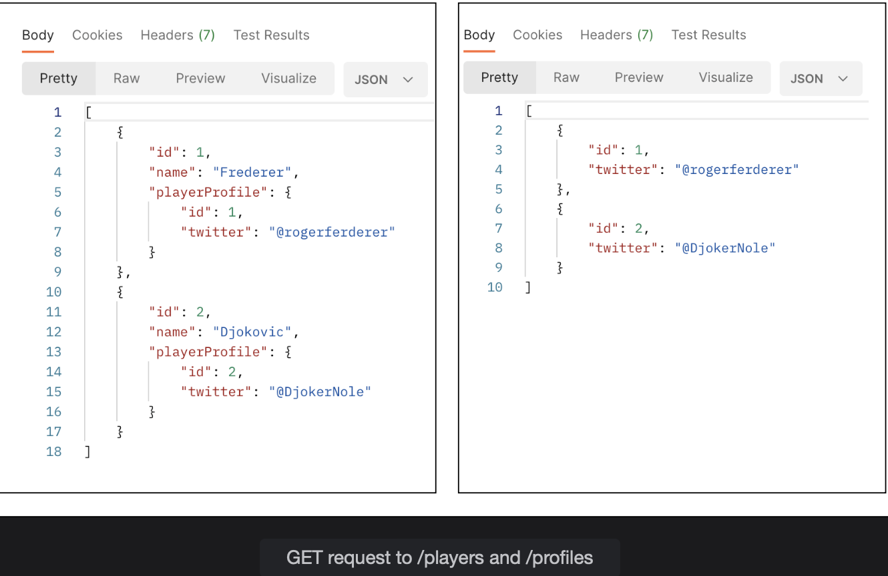
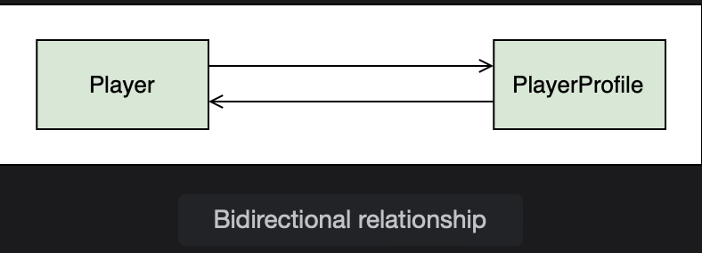
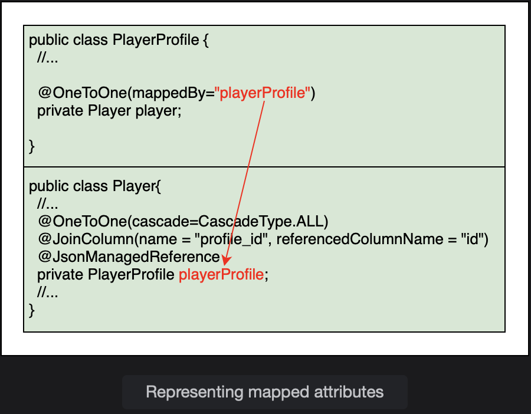
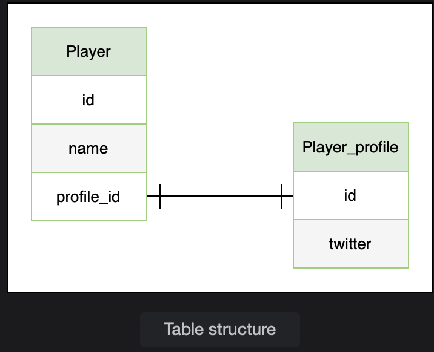
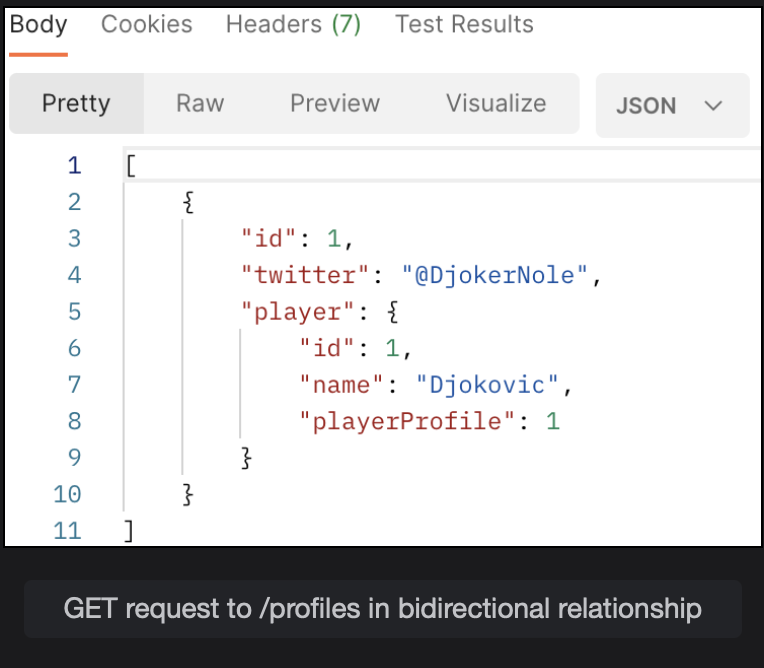
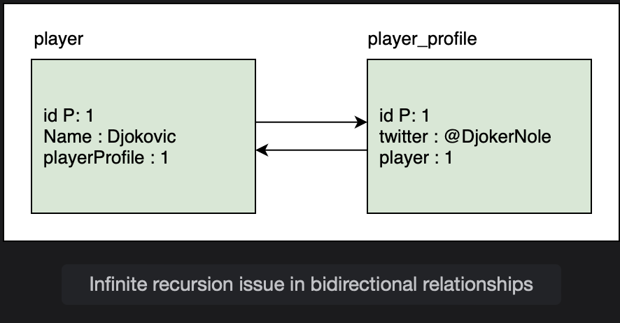
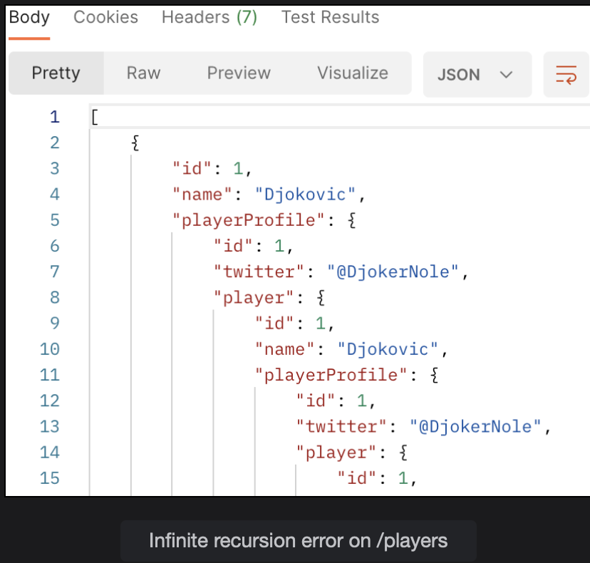
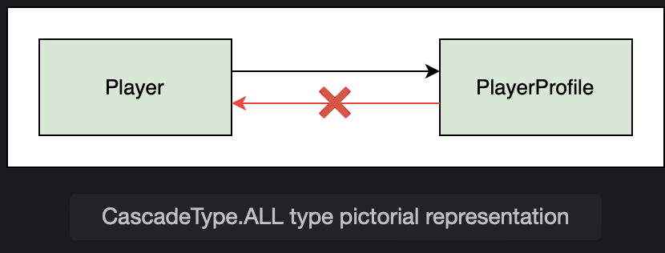
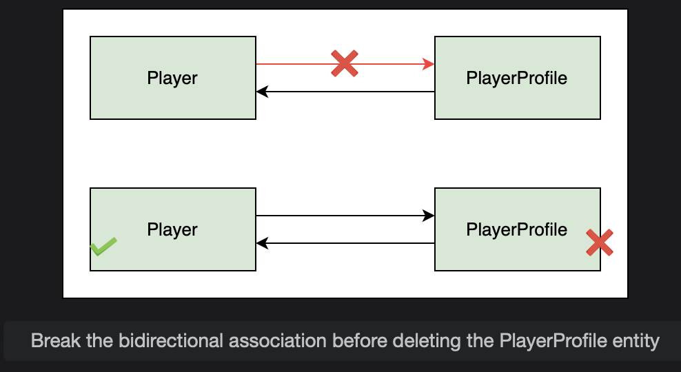

# One-to-One Bidirectional Relationship

Learn how to make the one-to-one relationship bidirectional and resolve the JSON infinite recursion issue.

> We'll cover the following:
>
> - Bi-directional relationship
>   - mappedByattribute
> - JSON Infinite Recursion
>   - Solution 1: @JsonManagedReference and @JsonBackReference
>   - Solution 2: @JsonIdentityInfo
> - Cascade Type
>   - optional attribute:
> - Pros and cons of bidirectional relationship

Right now, we have a unidirectional one-to-one mapping which means that if we have a Twitter account, we cannot find the name of the player who has that account.  
A GET request to /profiles only gets the PlayerProfile object and not the Player it is associated with.

It is however possible to find the Twitter account, if we have the Player entity.  
As can be seen from a GET request to /players, the PlayerProfile entities are also fetched.

In the unidirectional one-to-one relationship, the Player class maintains the relationship. The PlayerProfile class cannot see any change in the relationship.  
To make this relationship bidirectional, we need to make some modifications to the PlayerProfile class.  
 We will add a field to reference back to the Player class and add the @OneToOne annotation.  
 We will also add getter and setter methods to set the Player value in the PlayerProfile class. This will enable us to fetch the entities in both directions.

## Bi-directional relationship

To set up a bidirectional relationship, we will add a field of Player class in the PlayerProfile class and add getter and setter methods for the field.  
 This field holds the reference to the associated Player entity.

        package io.datajek.databaserelationships.onetoone;

        @Entity
        public class PlayerProfile {
            @Id
            @GeneratedValue(GenertionType.IDENTITY)
            private int id;
            private String twitter;

            private Player player;
            //add getter and setter for player field.
        }

The toString() method also needs to be updated to include the newly added player field.

Next, we will add the @OneToOne annotation on the player field.

#### mappedByattribute

mappedBy is an optional attribute of the @oneToOne annotation which specifies the name of the field which owns the relationship.  
 In our case, it is the playerProfile field in the Player class.  
 The mappedBy attribute is placed on the inverse side on the relationship only.  
 The owning side cannot have this attribute.

        @Entity
        public class PlayerProfile {
            @Id
            @GeneratedValue(GenertionType.IDENTITY)
            private int id;

            private String twitter;

            @OneToOne(mappedBy="playerProfile")
            private Player player;
        }

Let's have a look at its pictorial representation:

If we visit the web console of the H2 database (at http://localhost:8080/h2-console with jdbc:h2:mem:testdb as the connection URL), we will see that there is no change in the database structure.  
The primary key of the player_profile table is stored as the foreign key in the player table as shown in the Entity Relationship Diagram below.  
On the Java side however, we can now access the Player entity using the PlayerProfile entity.

To test the bidirectional relationship, we will create a Player with a nested PlayerProfile object using the following JSON POST request to http://localhost8080/players:

        {
            "name": "Djokovic",
            "playerProfile": {
                "twitter": "@DjokerNole"
            }
        }

This request results in two INSERT queries in the player and player_profile tables respectively.

Bidirectional relationship means that Djokovic owns the @DjokerNole Twitter account and vice versa, the @DjokerNole account belongs to Djokovic.  
If we now send a GET request to /profiles we will get the player details as well.

## JSON Infinite Recursion

If you are following along in your local dev environment, you must have encountered an error when trying to access /profiles.

When using a bidirectional relationship, JSON throws an infinite recursion error when we try to retrieve the objects.  
 This is because the Player object contains the reference of PlayerProfile object and the PlayerProfile object also contains the reference to the Player object.

The response in Postman looks like this:

#### Solution 1: @JsonManagerReference and @JsonBackReference

To solve this issue, we can use the @JsonManagedReference and @JsonBackReference annotations in the classes.  
 As a result, only the owning side of the relationship is serialized and the inverse side is not serialized.

The @JsonManagedReference annotation is used on the playerProfile field in the owning side (Player class). On the inverse side (PlayerProfile class), the @JsonBackReference annotation is used to the player field.  
 These annotations solve the infinite recursion problem.

        public class Player {
            // ...
            @OneToOne(cascade = CascadeType.ALL)
            @JoinColumn(name = "profile_id", referenceColumnName = "id")
            @JsonManagedReference
            private PlayerProfile playerProfile;
            // ...
        }

Now let's use the @JsonBackReference annotation:

        public class PlayerProfile {
            // ...
            @OneToOne(mappedBy = "playerProfile")
            @JsonBackReference
            private Player player;
            // ...
        }

#### Solution 2: @JsonIdentityInfo

Another solution is to use the @JsonIdentityInfo annotation at class level.  
 Both Player and PlayerProfile classes are annotated with @JsonIdentityInfo to avoid infinite recursion while converting POJOs to String.

        @JsonIdentityInfo(generator = ObjectIdGenerators.PropertyGenerator.class, property = "id")

The property attribute specifies the property name of the target reference. Here, id field is used to break out of the recursion. The first time id is encountered, it is replaced with the object and for subsequent occurrences of id, the numerical value is used instead of replacing it with the object.

## Cascade Type

For the bidirectional relationship, we can specify the cascade type in the PlayerProfile class as follows:

        @OneToOne(mappedBy = "playerProfile", cascade = CascadeType.ALL)
        private Player player;

CascadeType.ALL means that if we delete a PlayerProfile object, the associated Player object will also be deleted.

If we do not want that to happen, we need to break the association between the two objects before calling delete() on the PlayerProfile object.

The deletePlayerProfile method in the PlayerProfileService class is shown below. The following code removes the link between the PlayerProfile and Player object by manually setting the references to null before deleting from the database.

        public void deletePlayerProfile(int id) {
            PlayerProfile tempPlayerProfile = repo.findById(id).get();
            //set the playerProfile field of the Player object to null
            tempPlayerProfile.getPlayer().setPlayerProfile(null);
            //set the player field of the PlayerProfile object to null
            tempPlayerProfile.setPlayer(null);
            //save changes
            repo.save(tempPlayerProfile);
            //delete the PlayerProfile object
            repo.delete(tempPlayerProfile);
        }

Now when the PlayerProfile object is deleted, the Player object is not affected.

#### optional attribute:

The @OneToOne annotation has an optional attribute. By default the value is true meaning that the association can be null.  
 We can explicitly set it to false for the playerProfile attribute in the Player class:

        @OneToOne(cascade=CascadeType.ALL, optional = false)
        @JoinColumn(name = "profile_id", referencedColumnName = "id")
        private PlayerProfile playerProfile;

If the value of the optional attribute is set to false, then we will get an error when a Player object is added without an associated PlayerProfile object.

The following POST request to \players now returns a DataIntegrityViolationException as the playerProfile field cannot be left blank.

        {
            "name": "Federer"
        }

However, adding a Player with a nested PlayerProfile object, as shown below, does not result in an error.

        {
            "name": "Djokovic",
            "playerProfile": {
                "twitter": "@DjokerNole"
            }
        }

> **Note:** When we add the PlayerProfile object first and then add the Player object by using the reference of the PlayerProfile object, JPA throws the detached entity passed to persist error.
>
> This error can be removed by changing the cascade type in the Player class to CascadeType.Merge.
>
> **REASON:** save() method calls persist() for new entities and merge() for existing entities.  
>  Player is a new entity so persist() is called and the operation is cascaded to PlayerProfile.  
> However, since the PlayerProfile already exists, it needs to be merged, not persisted. When we change the cascade type to MERGE, persist() is not cascaded to PlayerProfile and the exception is avoided.
>
> However, if we add a Player object with a nested PlayerProfile object now, we will get the Not-null property references a transient value error.

## Pros and cons of bidirectional relationship

Bidirectional relationships are better than unidirectional relationships in terms of performance as both ends of the relationship are aware of any changes.

When using bidirectional relationships, consistency must be ensured.  
 If a Player object references a PlayerProfile object, the same PlayerProfile object must reference back to the Player object.  
 Failure to ensure consistency can lead to unpredictable JPA behavior.

A con of having bidirectional association is that it may make the application vulnerable in terms of security since the referenced side can now be used to access the owning side (we can access the Player object using the PlayerProfile object).  
 Infinite recursion is also an issue when using bidirectional relationships with Jackson, Hibernate JPA, and/or Elasticsearch implementations.
