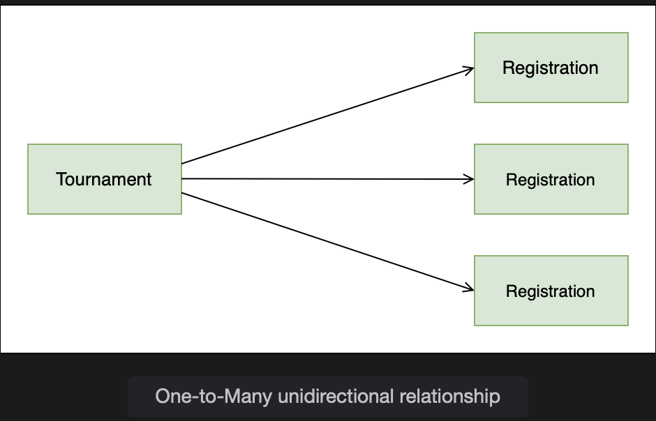
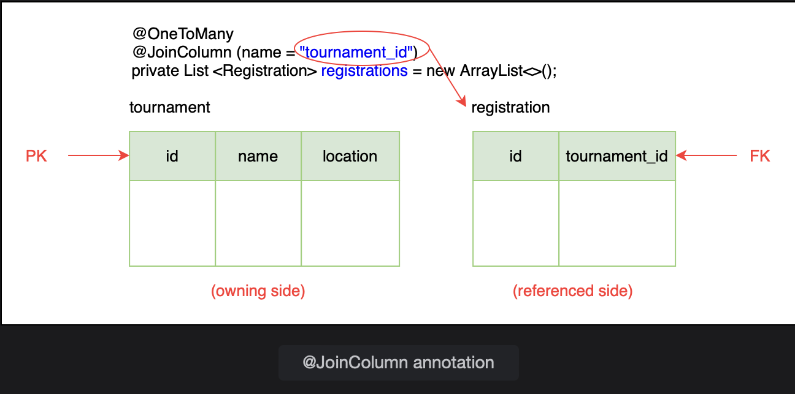
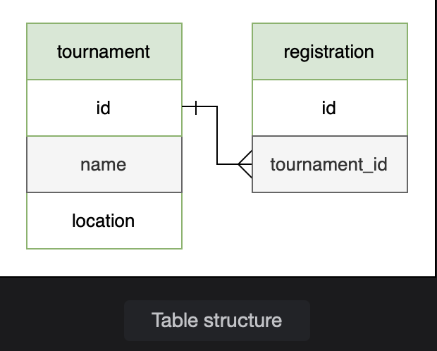
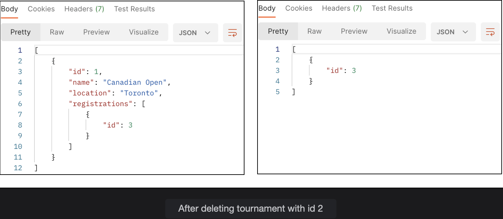
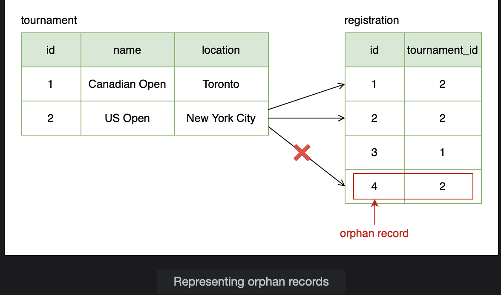
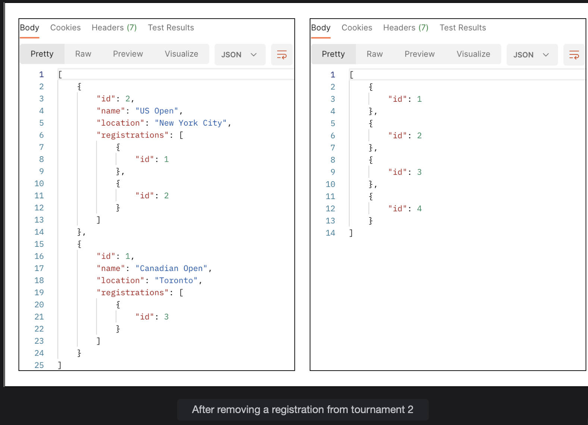
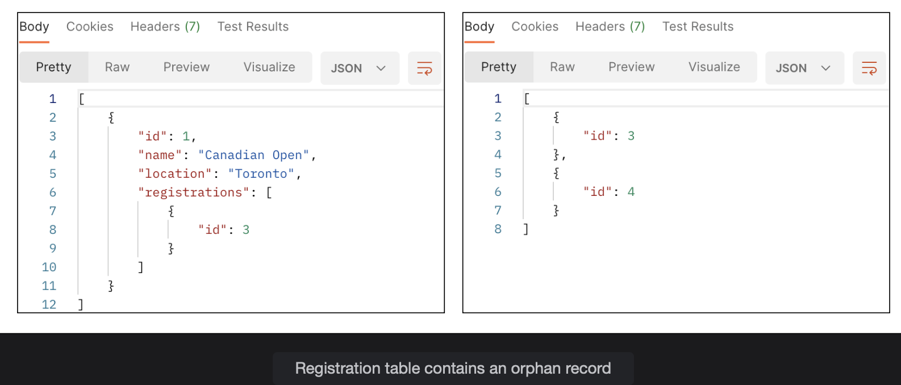
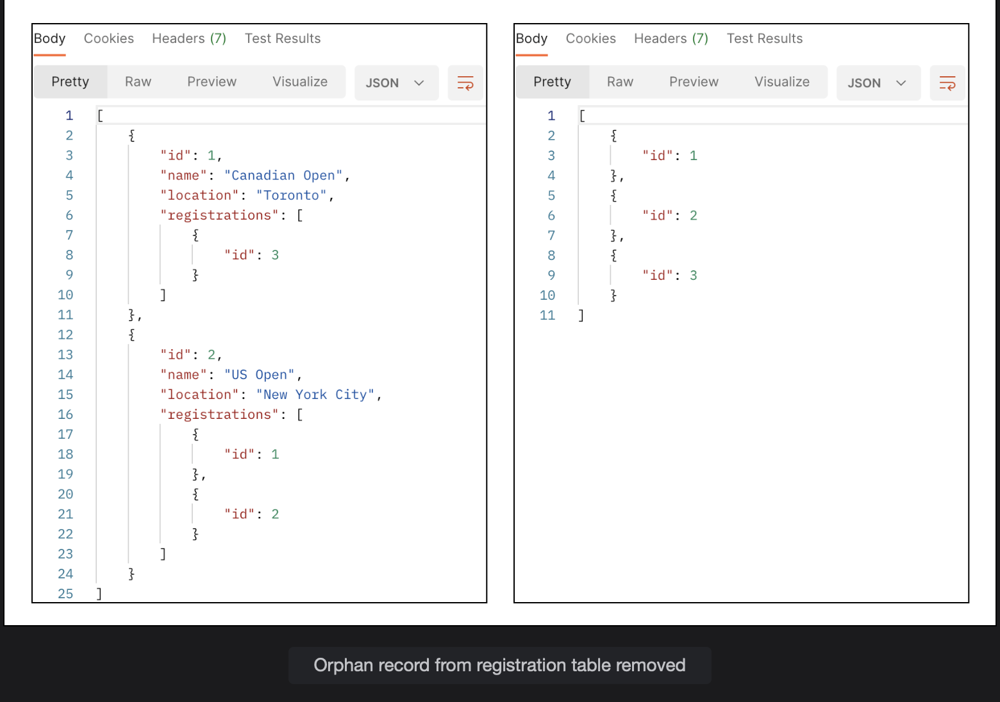
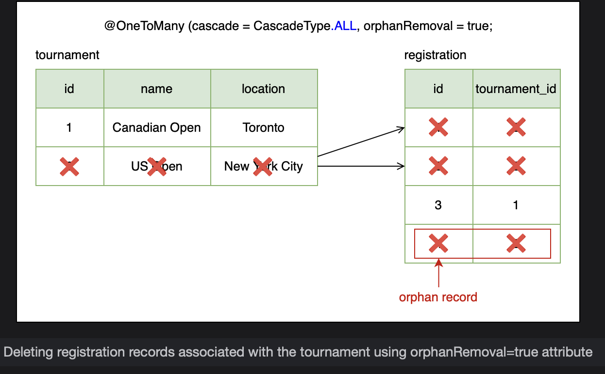

# One-to-Many Unidirectional Relationship

Learn how to implement one-to-many relationships and about the orphan removal attribute.

> We'll cover the follwing:
>
> - @OneToMany
> - Cascade type
> - Orphan records
>   - orphanRemoval attribute

To show the one-to-many relationship, we will model the case where many players can register for a tournament.  
 We will create a tournament table and a registration table to model this relationship.

Unidirectional one-to-many relationship means that only one side maintains the relationship details. So given a Tournament entity, we can find the Registrations but we cannot find Tournament details from a Registrations entity.

> To model the one-to-many relationship, create a new package onetomany.uni and define a Tournament class with three fields: id, name, and location.  
>  The id field is the primary key. We can also save other details like the dates in which the tournament takes place, the type of surface on which it will be played, and the number or rounds etc.

        package io.datajek.databaserelationships.onetomany.uni;

        @Entity
        public class Tournament {
            @Id
            @GeneratedValue(strategy = GenerationType.IDENTITY)
            private int id;
            private String name;
            private String location;
            //getters and setters
            //constructor
            //toString method
        }

Next, define the Registration class with just one field, id, for now. The id field is the primary key for the table.  
 We will add more fields later.

The Registration class can store information about the registration date, the type of match (single/doubles) for which the player registers, and the rank assigned to the player (seed) etc.

        package io.datajek.databaserelationships.onetomany.uni;

        @Entity
        public class Registration {
            @Id
            @GeneratedValue(strategy=GenerationType.IDENTITY)
            private int id;
            //getters and setters
            //constructor
            //toString method
        }

> **NOTE:** Since a player registers for a tournament, a registration object should be associated with a player object.

Now, we will update the Tournament class to show the registrations. Since a tournament can have multiple registrations, we will add a List of Registrations as a new field.

        public class Tournament {
            //...
            private List<Registration> registrations = new ArrayList<>();
            //generate getter and setter methods
            //update constructor & toString()
        }

## @OneToMany

The Tournament class has a one-to-many relationship with the Registration class as one tournament can have multiple registrations.  
 This can be modelled by the @OneToMany annotation. In a one-to-many relationship, the primary key of the one side is placed as a foreign key in the many side.

The @JoinColumn annotation shows that this is the owning side of the relationship.  
 tournament_id will be added as a foreign key column in the registration table.

        @OneToMany
        @JoinColumn(name="tournament_id")
        private List<Registration> registrations = new ArrayList<>();

> **Note:** In the absence of the @JoinColumn annotation, Hibernate creates a join table for the one-to-many relationship containing the primary keys of both the tables.

> If the application is run, it creates the database structure shown below. Here tournament_id is the foreign key column. We can verify this using the H2 web console (at http://localhost:8080/h2-console with jdbc:h2:mem:testdb as the connection URL).

## Cascade type

Next, we will choose the cascade type for this relationship. When a tournament is deleted we will delete the associated registrations as well. This can be achieved by choosing CascadeType.ALL.

        @OneToMany(cascade=CascadeType.ALL)
        @JoinColumn(name="tournament_id")
        private List<Registration> registrations = new ArrayList<>();

To set up the association between tournament and registration, we will add a method in the Tournament class that assigns a Registration object to a Tournament object.

        public void addRegistration(Registration reg) {
            registrations.add(reg);
        }

> Now we will create the repository, service and controller classes for Registration and Tournament in the appropriate packages.  
>  The repository interfaces are named TournamentRepository and RegistrationRepository and extend the JpaRepository interface.
>
> The REST controllers TournamentController and RegistrationController have a @RequestMapping of /tournaments and /registrations respectively.
>
> The controller classes call methods the in service layer classes, TournamentService and RegistrationService.
>
> All the above mentioned interfaces and classes are shown in the code widget below.
>
> We need a PUT mapping in the TournamentController class to assign a registration to a tournament.
>
> The addRegistration method with /{id}/registrations/{registration_id} mapping adds a registration with registration_id to a tournament with id as its key.

        @PutMapping("/{id}/registrations/{registration_id}")
        public Tournament addRegistration(@PathVariable int id, @PathVariable int registration_id) {
            Registration registration = registrationService.getRegistration(registration_id);
            System.out.println(registration);
            return service.addRegistration(id, registration);
        }

The corresponding service layer method in TournamentService class is shown:

        public Tournament addRegistration(int id, Registration registration) {
            Tournament tournament = repo.findById(id).get();
            tournament.addRegistration(registration);
            return repo.save(tournament);
        }

To test the application, first add two tournaments using the following POST requests to /tournament:

        {
            "name": "Canadian Open",
            "location": "Toronto"
        }

Here's the second JSON object:

        {
            "name": "US Open",
            "location": "New York City"
        }

Next, we will add four registrations by sending POST request with an empty body to /registration:

        {}

Out of the four registrations, we will associate one with the first tournament and three with the second tournament. This can be achieved by sending the following PUT requests:

- http://localhost:8080/tournaments/1/registrations/3
- http://localhost:8080/tournaments/2/registrations/1
- http://localhost:8080/tournaments/2/registrations/2
- http://localhost:8080/tournaments/2/registrations/4

A GET request to /tournaments shows the tournaments along with their registrations. The same can be verified using the H2 web console.

> **Note:** Creating a Collection from the above-mentioned POST and PUT requests can help reduce setup time for subsequent tests.

If we delete the tournament with id 2 by sending a DELETE request to /tournaments/2, the tournament is deleted along with its three registrations. The registration table has only one registration left.

## Orphan records

An orphan record is a record with a foreign key value that points to a primary key value that no longer exists.  
 Orphan records point to a lack of referential integrity which means that the data in the tables is not in a consistent state.

> In our example, the registration record has a foreign key value of tournament_id. We can remove a registration from a tournament by breaking the association between the two. In such a case, the record in the registration table would become an orphan as it is no longer linked to any entry in the tournament table. The following figure shows an orphan record:

To demonstrate the concept, we will create a method removeRegistration() which breaks the association between a Tournament and a Registration object.

        public void removeRegistration(Registration reg) {
            if (registration != null)
                registrations.remove(reg);
        }

We will create a new PUT mapping of /tournaments/{id}/remove_registrations/{registration_id} in the TournamentController class.  
 The removeRegistration method removes the registration entity having registraion_id as its key from the Tournament entity specified using id.

        @PutMapping("/{id}/remove_registrations/{registration_id}")
        public Tournament removeRegistration(@PathVariable int id, @PathVariable int registration_id) {
            Registration registration = registrationService.getRegistration(registration_id);
            return service.removeRegistration(id, registration);
        }

Notice, that the controller calls the service class method, removeRegistration, which simply delegates the call to the removeRegistration method of the Tournament class.

Cascade type REMOVE only cascades the delete operation to child records which are linked to the parent. To show how it works, we will create the same scenario as before (with 2 tournaments and 4 registrations by assigning one registration to the first tournament and three registrations to the second tournament).

With the above changes in place, run the application again and create two tournaments and four registrations. Then, associate the registrations with the two tournaments as described above.

We will remove one registration from tournament with id 2 by sending a PUT request to /tournaments/2/remove_registrations/4.  
 Now the tournament has two registrations left.  
 Note, that we did not delete the registration, but only removed it from the tournament. The registration record is not associated with any tournament and is an orphan record.

The current state of the database is reflected from the response to GET requests to /tournaments and /registrations as shown below:

Next, delete the tournament by sending a DELETE request to /tournaments/2. The delete operation is cascaded to the registration table and two records associated with the tournament are deleted. If we perform a GET on /registrations, we can see the orphan record with id 4 is still in the table.

## orphanremoval attribute

The @OneToMany annotation has an orphanRemoval attribute, which can be used to delete records that have been orphaned.

        @OneToMany(cascade=CascadeType.ALL, orphanRemoval=true)
        @JoinColumn(name="tournament_id")
        private List<Registration> registrations = new ArrayList<>();

To test how this attribute differs from CascadeType.REMOVE, we will recreate the same scenario with two tournament and four registration entries and establish one-to-many associations as mentioned above.

Remove registration with id 4 from tournament 2 using a PUT request to /tournaments/2/remove_registrations/4. The orphanRemoval attribute triggers a remove operation for the Registration object no longer associated with the Tournament object thereby leaving the database in a consistent state.

Now we can delete tournament with id 2. GET request to /registrations shows one registration remaining in the table. The registration which was assigned to tournament with id 2 and later removed became an orphan and was removed because we set the orphanRemoval attribute to true.

The difference between orphanRemoval and CascadeType.REMOVE should be clear from the above example.  
 Using cascade type REMOVE only deleted the two registrations associated with the tournament and left the orphaned record in the table.
