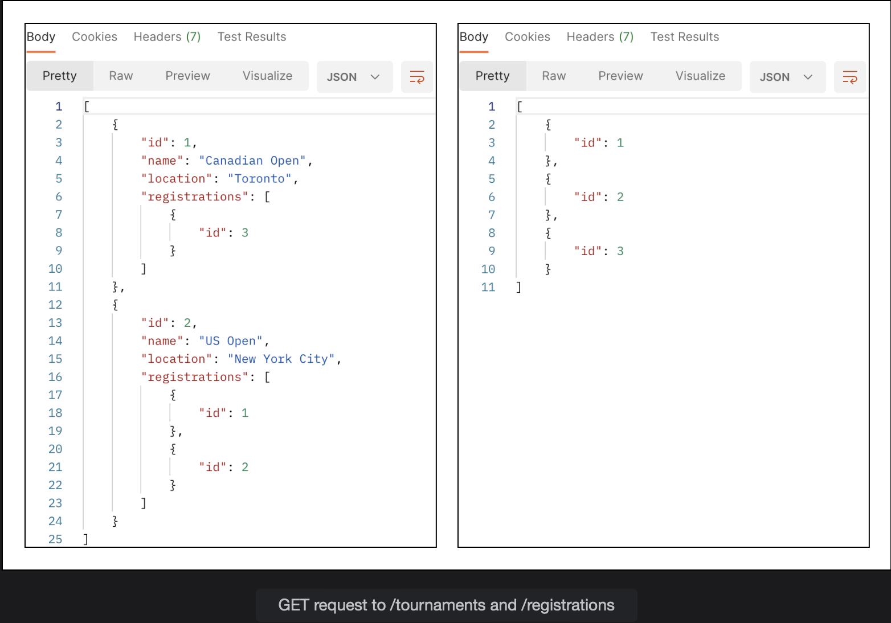
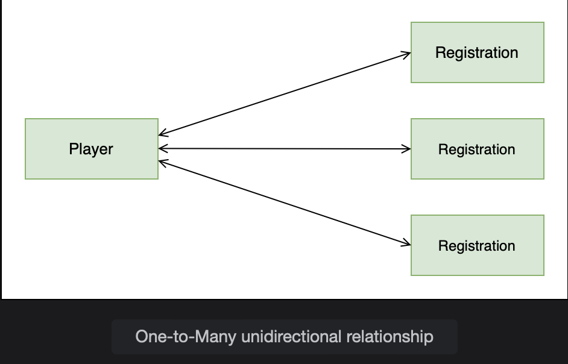
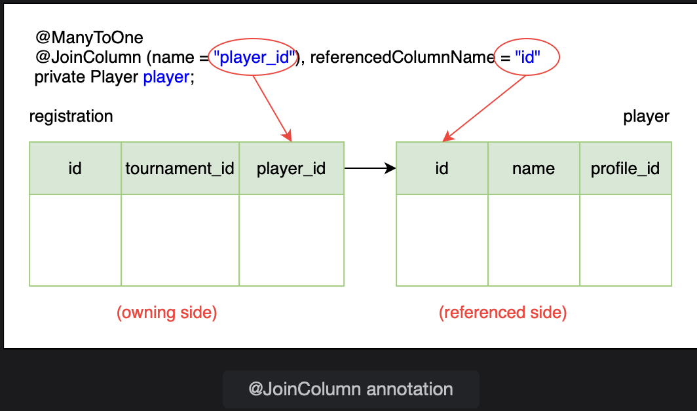
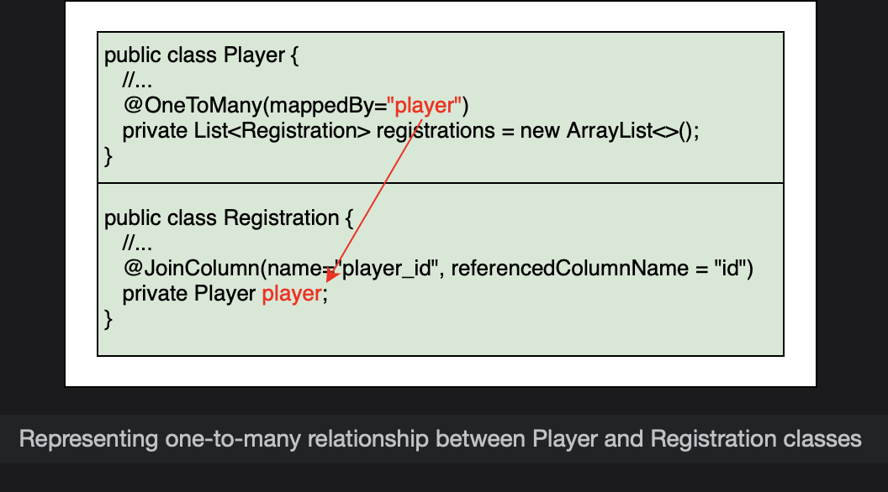
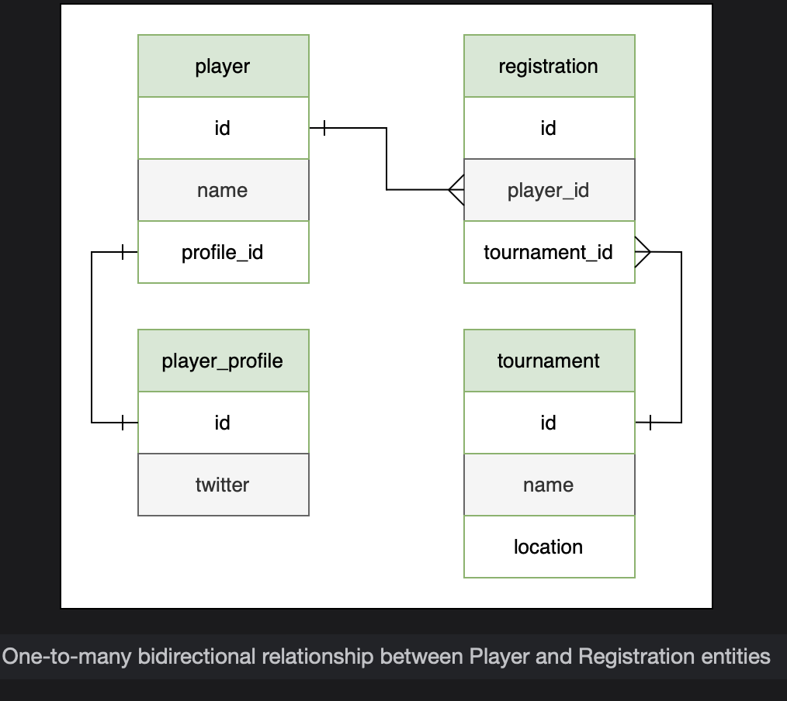
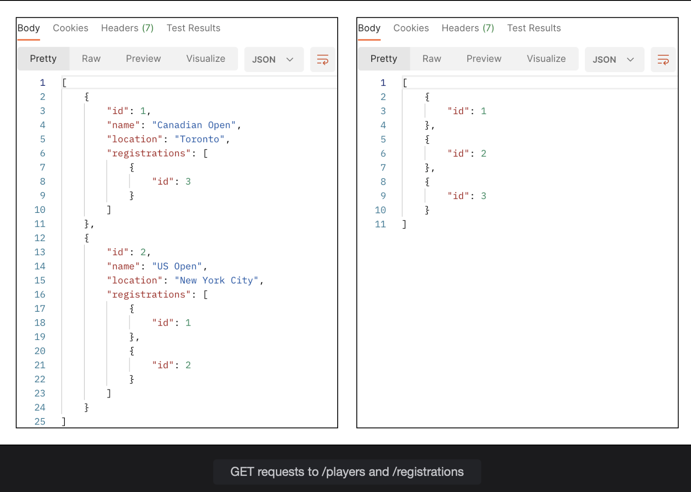
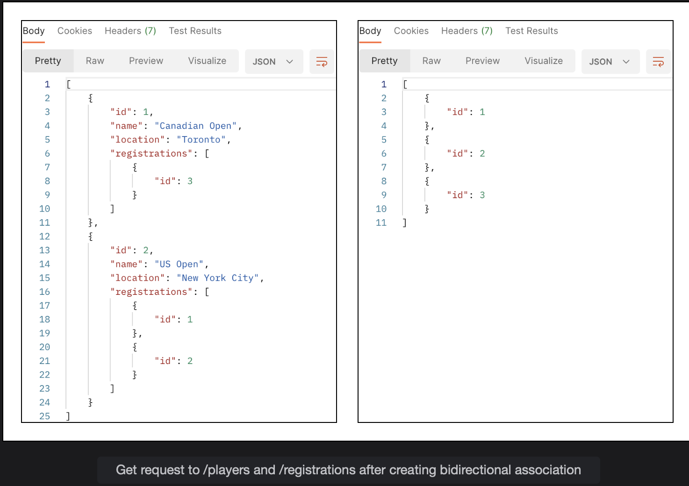
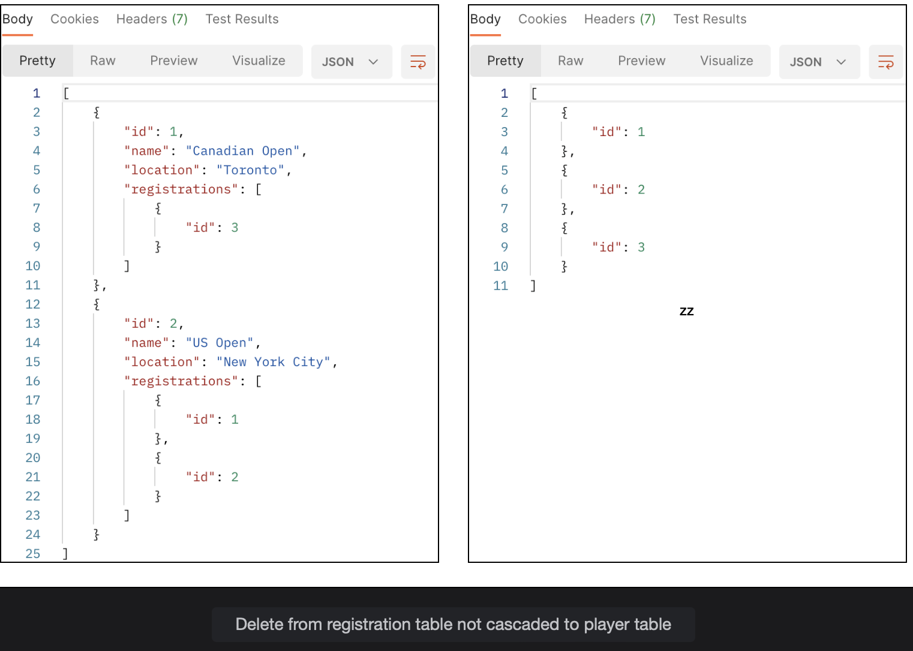

# One-to-Many Bidirectional Relationship

Learn how to create a one-to-many relationship.

> We'll cover the following
>
> @ManyToOne
> Cascade type
> @OneToMany

In this lesson we will create a bidirectional one-to-many relationship where a Player can have many Registrations.

> Let’s add some real life constraints to the model.
>
> - The first one being that every Registration object must be associated with a Player object.
> - Secondly, when we delete a Registration object, the associated Player object should not be deleted.
>
> A bidirectional association between Player and Registration means that we can get all the Registration objects if we have a Player object and vice versa, we can get a Player by using the Registration.  
>  Compare this to the unidirectional one-to-many relationship, where we could find the Registration objects given a Tournament but we could not find the Tournament from a Registration object.

The inverse of one-to-many relationship is many-to-one, where many registrations map to one player.

> For the bidirectional relationship example, create a new package named bi inside the onetomany package.  
>  Copy the Registration and Tournament classes from the onetomany.uni package and the Player and PlayerProfile classes from the onetoone package along with the associated repository, service and controller classes to the onetomany.bi package.
>
> We will start with updating the Registration class. To have a bidirectional relationship, we will add a player field in the Registration class. Generate getter and setter methods for the new field and update the constructor and toString() methods.

        @Entity
        public class Registration {
            @Id
            @GeneratedValue(strategy=GenerationType.SEQUENCE)
            private int id;
            private Date registrationDate;

            private Player player;
            //getters and setters
            //constructor
            //toString method
        }

## @ManyToOne

There is a many-to-one relationship between the Registration and Player classes where many registrations can map to one player. The many side of a many-to-one bidirectional relationship is always the owning side of the relationship.

To model this relationship, we will use the @ManyToOne annotation with @JoinColumn specifying the column that corresponds to the foreign key column in the registration table.  
 The player table has a column id which will become the foreign key column player_id in the registration table. This is how the Registration knows how to find its Player.

        @ManyToOne
        @JoinColumn(name="player_id", referencedColumnName="id")
        private Player player;

The @JoinColumn annotation also shows that this is the owning side of the relationship.

## Casecade type

Next, we will choose the cascade type for this relationship. If a Registration object is deleted, the associated Player should not be deleted.  
 This means that the delete operation should not be cascaded. Since we have fine grain control over the cascade types, we will list all of them except for REMOVE.

        @ManyToOne(cascade={CascadeType.PERSIST, CascadeType.MERGE, CascadeType.DETACH, CascadeType.REFRESH})
        @JoinColumn(name="player_id", referencedColumnName = "id")
        private Player player;

Now we will update the Player class to show tournament registrations. Since a player can have multiple registrations, we will add a List of Registrations as a new field to the class.

        private List<Registration> registrations = new ArrayList<>();
        //generate getter and setter methods

## @OneToMany

The Player class has a one-to-many relationship with the Registration class as one player can register for many tournaments. This can be modelled by the @OneToMany annotation.

Since the many side (Registration) is the owning side of a bidirectional relationship, we will use the mappedBy attribute here (in the Player class) to specify that this is the inverse side of the relationship.

        @OneToMany(mappedBy="player", cascade= CascadeType.ALL)
        private List<Registration> registrations = new ArrayList<>();

We are using cascade type ALL here because we want a player’s registrations to be deleted when the player record is deleted.

The player in the mappedBy attribute references the player field in the Registration class. Hibernate looks at the @JoinColumn annotation on the player field to find the foreign key column.

Next, we will add a method to the Player class that sets the bidirectional relationship. In this method, we will add a Registration object to the Player and also update the Registration to reflect that it belongs to this Player.

        //set up bidirectional relationship with Registration class
        public void registerPlayer(Registration reg) {
            //add registration to the list
            registrations.add(reg);
            //set the player field in the registration
            reg.setPlayer(this);
        }

In the PlayerController class, we will add a new PUT mapping to associate a Registration with registration_id with a Player having id as key as follows:

        @PutMapping("/{id}/registrations/{registration_id}")
        public Player assignRegistration(@PathVariable int id, @PathVariable int registration_id) {
            Registration registration = registrationService.getRegistration(registration_id);
            return service.assignRegistration(id, registration);
        }

The controller class method invokes the service class method assignRegistration() with the player’s id and a Registration object. The method in PlayerService class is shown:

        public Player assignRegistration(int id, Registration registration) {
            Player player = repo.findById(id).get();
            player.registerPlayer(registration);
            return repo.save(player);
        }

> After setting up the bidirectional relationship between Player and Registration entities, the updated ERD of our database is shown below. The same can be verified from the web console of H2 database (at http://localhost:8080/h2-console with jdbc:h2:mem:testdb as the connection URL).

To test the application, first create a player object by sending a POST request to /players as follows:

        {
            "name": "Djokovic",
            "playerProfile": {
                "twitter" : "@DjokerNole"
            }
        }

Next, create three registration entities by sending POST requests to /registrations with an empty request body:

        {}

Right now, the Player and Registration objects are not connected, as can be seen from the image below:

To set up a bidirectional mapping, send a PUT request to /players/1/registrations/1. This will connect the Player with id 1 with the Registration having id 1.

To assign Registration object with id 3 to the same player send another PUT request to /players/1/registrations/3.

We can confirm the bidirectional association by sending GET requests to /players and /registrations.

To confirm if the cascade is working correctly, delete one registration associated with the player by sending a DELETE request to /registrations/3. The registrations table has two records left. A GET request to /players confirms that the delete operation is not cascaded and the player exists in the database. Only the registration record is removed from the player. The results can also be verified from the H2 database.

