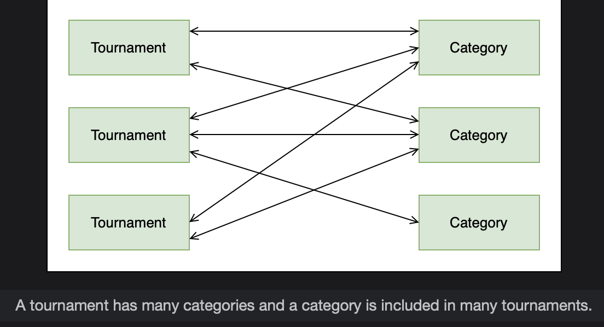
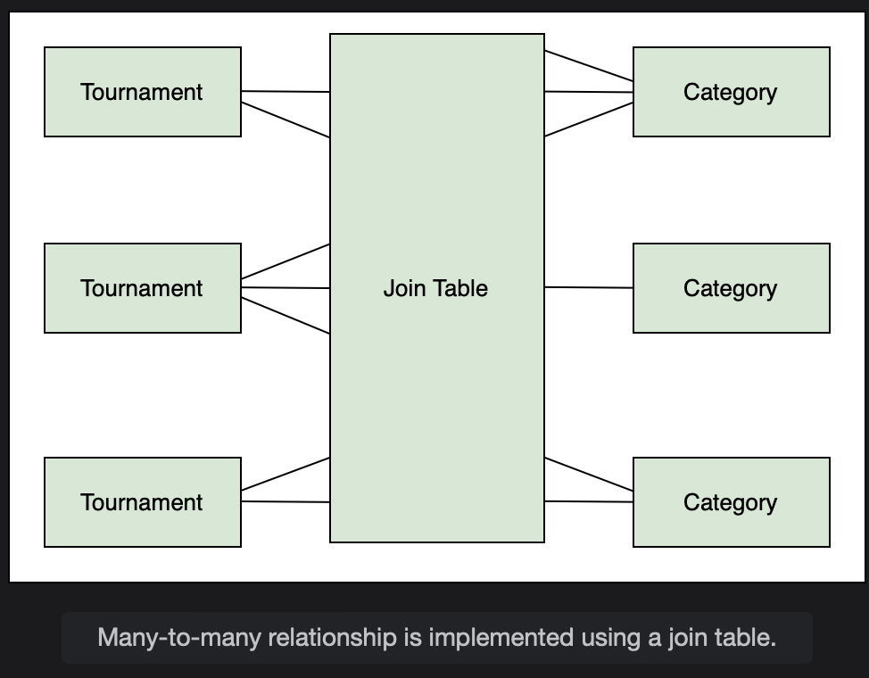
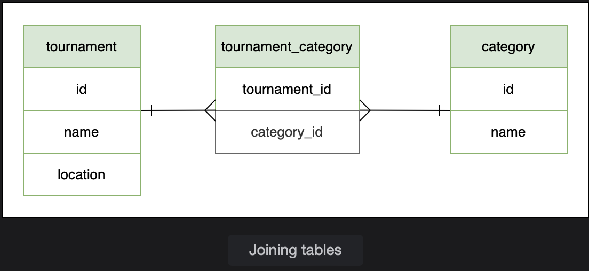
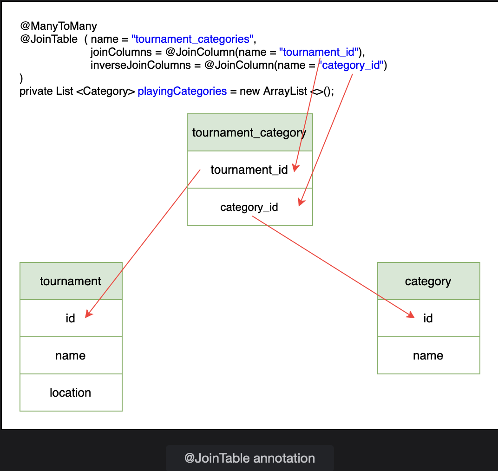
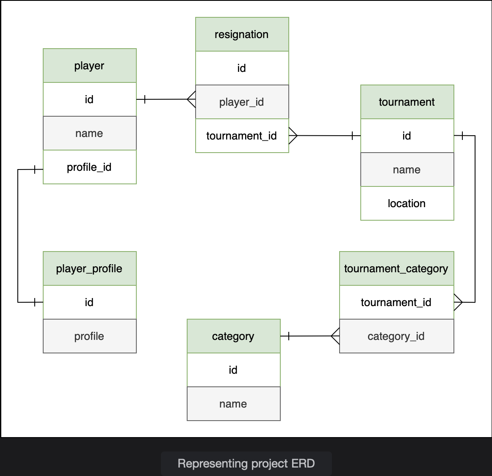
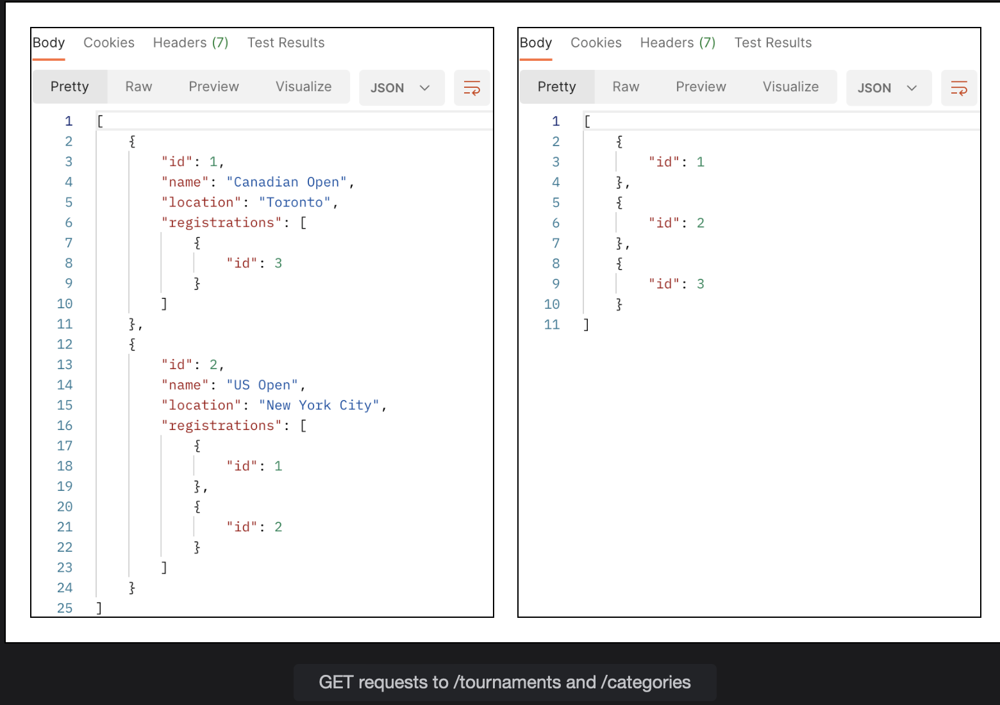
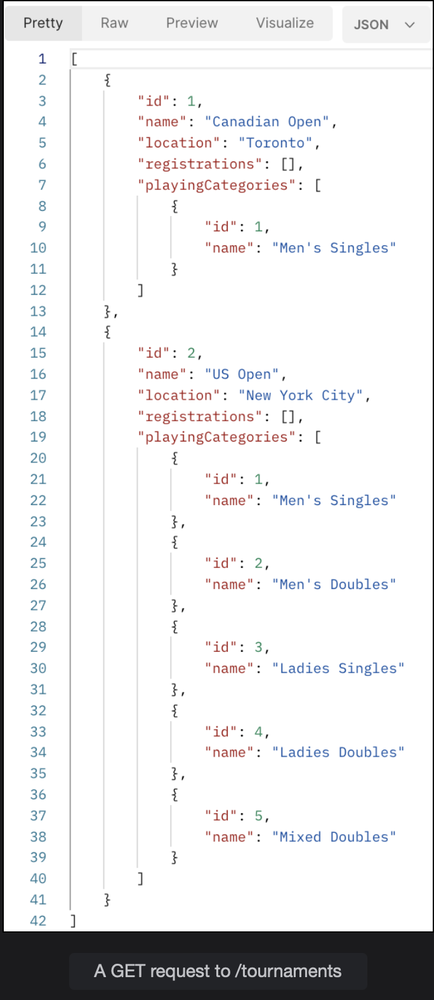
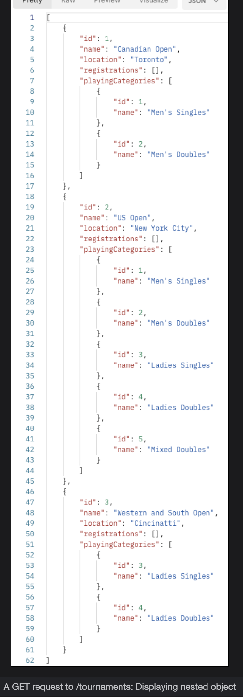
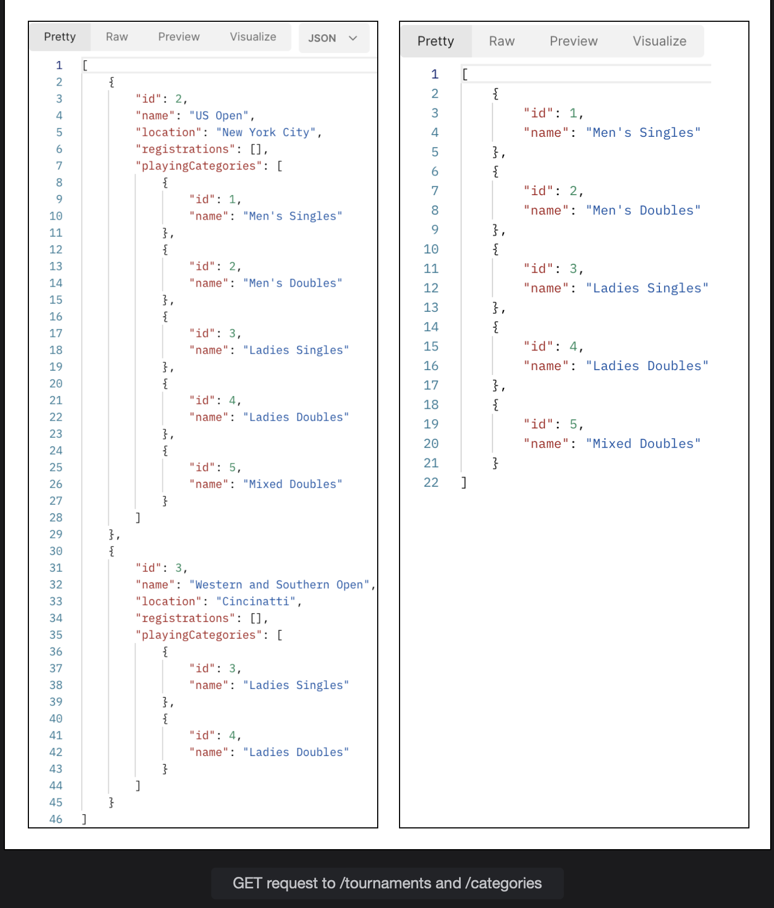

# Many-to-Many Unidirectional Relationship

Learn about implementing a many-to-many relationship using a join table.

> We'll cover the following
>
> @ManyToMany
> @JoinTable
> joinColumns and inverseJoinColumns
> Cascade type

Every tournament has some playing categories like singles and doubles for men and/or ladies. In addition, all four grand slam tournaments have the mixed doubles category. Other less known categories are wheelchair tennis and beach tennis. This scenario fits well into the many-to-many relationship where many categories are part of a tournament and many tournaments have the same playing categories.

We have already created the Tournament class. In this lesson, we will create the Category class and then join the two with a many-to-many relationship. In databases, this relationship is modelled using a join table which has the primary keys of both tables in the relationship.

We will also model two real life constraints.

- The first one is that one playing category should appear only once in the category table (we don’t want multiple entries for the same category).
- The second constraint is that when a tournament entry is deleted, the associated playing categories should not be deleted and vice versa.

> For the many-to-many database relationship example, create a package manytomany and copy all the files from the bi package inside the onetomany package. These include the Player, PlayerProfile, Registration, and Tournament classes and the associated repository, service, and controller classes.
>
> We will begin by creating a new class, Category in the io.datajek.databaserelationships.manytomany package. This class has two fields, id and name, where id is the primary key. Since we do not want the same category name to appear more than once, we will impose the unique key constraint using the unique attribute of the @Column annotation.

        package io.datajek.databaserelationships.manytomany;

        @Entity
        public class Category {
            @Id
            @GeneratedValue(strategy=GenerationType.IDENTITY)
            private int id;

            @Column(unique=true)
            private String name;
            //constructors
            //getters and setters
        }

@Column(unique=true) ensures that the same category name is not entered more than once.

For a many-to-many relationship, any side can become the parent/ owner. It depends on how the business rules are defined. Let’s say, we cannot have a tournament without a category attached to it but we can have a category that is not associated with any tournament. Given this scenario, a category can exist on its own but a tournament needs to have one or more categories associated with it. So, Category becomes the owning/parent side and Tournament becomes the referenced/ child side.

In a unidirectional many-to-many relationship, we put the relationship on the child side. So, in the Tournament class we have to put a link to the Category class. Since a tournament can have more than one categories, we will create a List of categories as follows:

        @Entity
        public class Tournament {
            //...
            private List<Category> playingCategories = new ArrayList<>();
            //...
        }

Create a getter and setter method for this field.

## @ManyToMany

The @ManyToMany annotation is used to create a many-to-many relationships between two entities.

        @ManyToMany
        private List<Category> playingCategories = new ArrayList<>();

## @JoinTable

The many-to-many relationship is different from the relationships that we have seen so far. Here, the foreign keys are stored in a separate table called a join table instead of being placed inside the parent table or the child table. The join table connects two tables and contains the foreign keys of both tables. The tournament and category tables do not contain the keys of each other; rather the primary keys of both these tables go in the join table.

## joinColumns and inverseJoinColumns

joinColumns attribute specifies the column(s) in the owner table that becomes a foreign key in the join table. inverseJoinColumns attribute specifies the foreign key column(s) from the inverse side.

For a unidirectional relationship, the Category class does not need any information about the tournaments. Here, we are setting the category in the tournament. When a tournament is saved, it creates a join table entry with the appropriate keys.

The addCategory() method in the Tournament class sets up the many-to-many relationship:

        //set up many-to-many relationship
        public void addCategory(Category category) {
            playingCategories.add(category);
        }

In the TournamentController we will add a PUT mapping /{id}/categories/{category_id} to assign a Category with category_id to a Tournament with id as key.

        @PutMapping("/{id}/categories/{category_id}")

        public Tournament addCategory(@PathVariable int id, @PathVariable int category_id) {
            Category category = categoryService.getCategory(category_id);
            return service.addCategory(id, category);
        }

The corresponding method in the TournamentService class are shown below:

        public Tournament addCategory(int id, Category category){
        Tournament tournament = repo.findById(id).get();
        tournament.addCategory(category);
        return repo.save(tournament);
        }

## Cascade type

We will not use cascade type REMOVE as we do not want to delete tournaments when we delete a category. We will also not use cascade type PERSIST, because that will cause an error if we try to add a tournament with nested category values.

        @ManyToMany(Cascade = CascadeType.MERGE, CascadeType.DETACH, CascadeType.REFRESH)

The ERD of the project is shown below. The same table structure can be verified from the web console of H2 database (at http://localhost:8080/h2-console with jdbc:h2:mem:testdb as the connection URL). Note that the code widget below does not show the implementation of all classes.

To test the many-to-many relationship, we will add two tournaments by sending POST requests to /tournaments as follows:

        {
            "name": "Canadian Open",
            "location": "Toronto"
        },
        {
            "name": "US Open",
            "location": "New York City"
        }

Next, we will add five categories by sending POST requests to /categories as follows:

        {
            "name" : "Men's Singles"
        },
        {
            "name" : "Men's Doubles"
        },
        {
            "name" : "Ladies Singles"
        },
        {
            "name" : "Ladies Doubles"
        },
        {
            "name" : "Mixed Doubles"
        }

GET request to /tournaments and /categories has the following response:

Right now, the Tournament and Category objects are not connected. We will assign categories with id 1 and 2 to Toronto Open having id 1 by sending the following PUT requests:

- /tournaments/1/categories/1
- /tournaments/1/categories/2

Assign all five categories to the US Open having id 2 with the following PUT requests:

- /tournaments/2/categories/1
- /tournaments/2/categories/2
- /tournaments/2/categories/3
- /tournaments/2/categories/4
- /tournaments/2/categories/5

> Note: Grouping these requests in a Collection can help reduce the run time.

We can also add a tournament with nested category objects as follows:

        {
            "name":"Western and Southern Open",
            "location":"Cincinatti",
            "registrations": null,
            "playingCategories":[{
                "id":3
            },
            {
                "id":4
            }]
        }

A GET request to /tournaments shows the three tournaments along with their categories.

We can test cascade by deleting a tournament and seeing if the categories also get deleted. Send a DELETE request to /tournaments/1 to delete tournament with id 1. GET request to /tournaments and /categories show that the tournament gets deleted but the categories are not deleted.

The results can also be verified from the H2 database web console.
