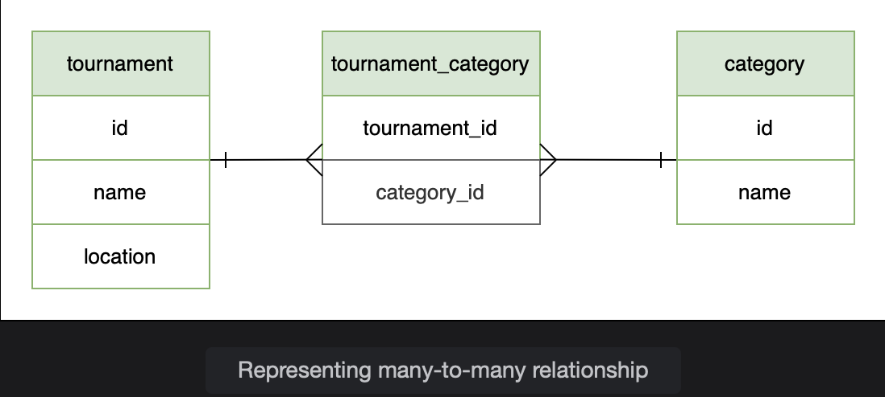
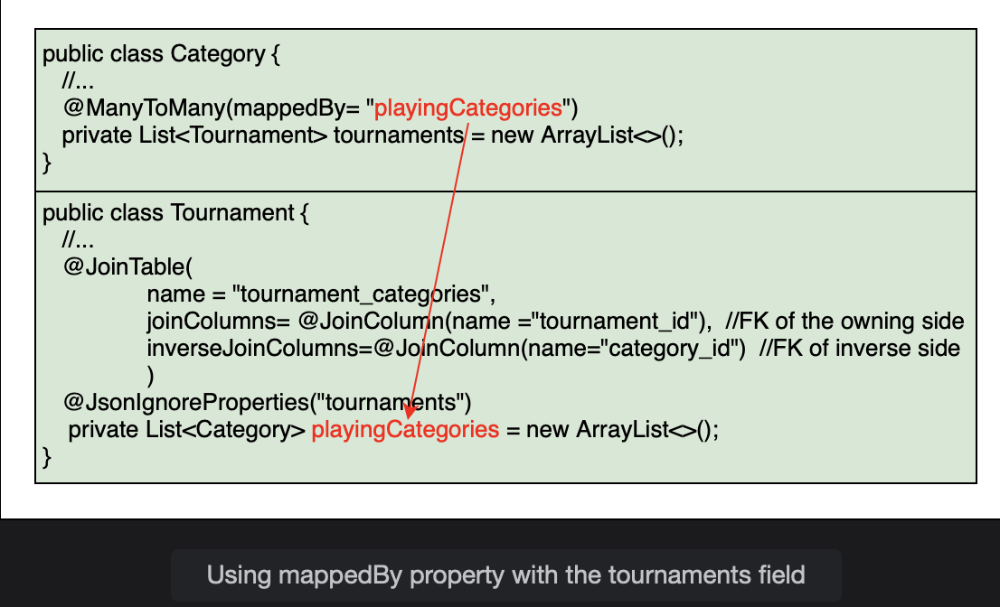
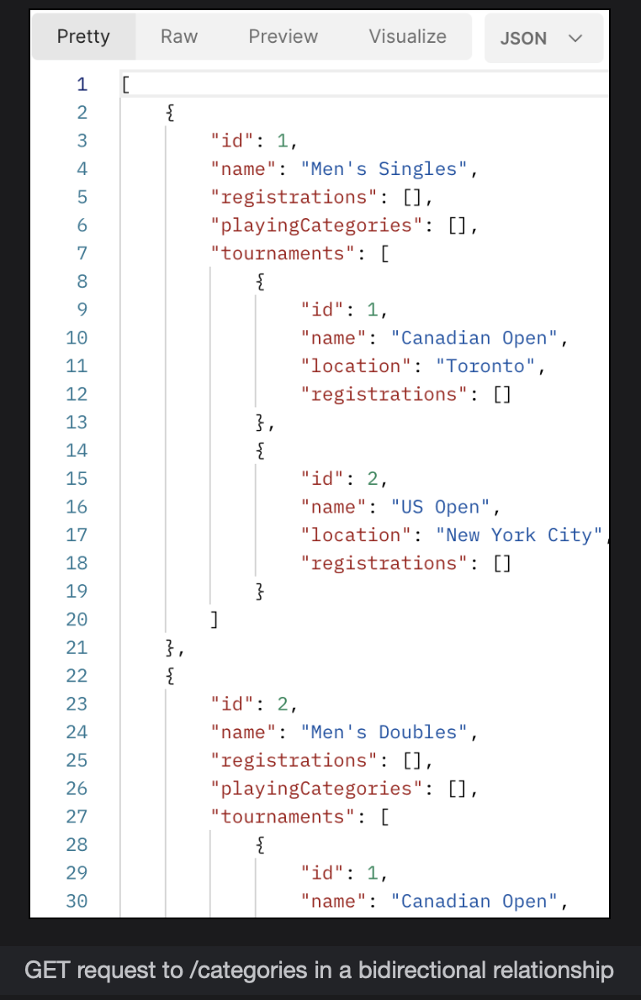

# Many-to-Many Bidirectional Relationship

Learn how to change the unidirectional many-to-many relationship to a bidirectional relationship.

> We'll cover the following
>
> mappedBy property
> @JsonIgnoreProperties

In a bidirectional relationship, each side has a reference to the other. In our example, the Category class did not have any reference to the Tournament class. Now we will add a reference to the Tournament class so that the relationship can be navigated from both sides. This will have no effect on the underlying database structure. The join table tournament_catogories already has the foreign keys of both the tournament and category tables, and it is possible to write SQL queries to get tournaments associated with a category.

For a many-to-many relationship, we can choose any side to be the owner. The relationship is configured in the owner side using the @JoinTable annotation. On the target side we use the mappedBy attribute to specify the name of the field that maps the relationship in the owning side. From the database design point of view, there is no owner of a many-to-many relationship. It would not make any difference to the table structure if we swap the @JoinTable and mappedBy.

We will begin by creating a List of tournaments in the Category class, along with the getter and setter methods.

        package io.datajek.databaserelationships.manytomany;

        @Entity
        public class Category {
            @Id
            @GeneratedValue(strategy=GenerationType.IDENTITY)
            private int id;

            @Column(unique = true)
            private String name;

            private List<Tournament> tournaments = new ArrayList<>();
            //...
        }

## mappedBy property

On the tournaments field created above, use the @ManyToMany annotation with the mappedBy property. This shows the value that is used to map the relationship in the Tournament class.

        @ManyToMany(mappedBy= "playingCategories")
        private List<Tournament> tournaments = new ArrayList<>();

Here‘s the pictorial representation of the code above:

We will also use the cascade property to cascade all operations except REMOVE because we do not want to delete all associated tournaments, if a category gets deleted.

        @ManyToMany(mappedBy= "playingCategories",cascade= {CascadeType.DETACH, CascadeType.MERGE, CascadeType.PERSIST, CascadeType.REFRESH},fetch=FetchType.LAZY)
        private List<Tournament> tournaments = new ArrayList<>();

It is the responsibility of the application to manage a bidirectional relationship. When we add a category to a tournament, we must also add the tournament to that category to preserve the relationship in both directions. Failure to do so may result in unexpected JPA behavior.

We will update the addCategory() method in the Tournament class to set up the bidirectional relationship by adding the tournament to the category.

        public void addCategory(Category category) {
            playingCategories.add(category);
            //set up bidirectional relationship
            category.getTournaments().add(this);
        }

Similarly, we will update the removeCategory() method in the Tournament class to remove the association from both sides.

        public void removeCategory(Category category) {
            if (playingCategories != null)
                playingCategories.remove(category);
            //update bidirectional relationship
            category.getTournaments().remove(this);
        }

## @JsonIgnoreProperties

JSON gets into infinite recursion when trying to de-serialize bidirectional relationships. We have seen two ways to solve this issue in the One-to-One Bidirectional Relationship lesson. Here, we will see yet another approach to avoid infinite recursion. We can use the property that we want to ignore with the @JsonIgnoreProperties. This annotation can be used at field level in both the Tournament and Category class.

        @JsonIgnoreProperties("tournaments")
        private List<Category> playingCategories = new ArrayList<>();

Similarly for Category class:

        @JsonIgnoreProperties("playingCategories")
        private List<Tournament> tournaments = new ArrayList<>();

> Note: In a many-to-many relationship, there is no owner when it comes to the table structure. This is different from a one-to-many relationship where the many side is always the owning side containing the key of the one side.

To test this application, we will add two tournaments and five categories.

To create tournament entries, send POST request to /tournaments as follows:

        {
            "name": "Canadian Open",
            "location": "Toronto"
        },
        {
            "name": "US Open",
            "location": "New York City"
        }

Then, add five categories by sending POST requests to /categories as follows:

        {
            "name" : "Men's Singles"
        },
        {
            "name" : "Men's Doubles"
        },
        {
            "name" : "Ladies Singles"
        },
        {
            "name" : "Ladies Doubles"
        },
        {
            "name" : "Mixed Doubles"
        }

A GET request to /categories now shows the tournaments associated with each category. This is different from the many-to-many unidirectional relationship; the Category had no information about Tournament.

We can also test the cascade options by deleting a tournament or category and verify the results using the web console of H2 database (at http://localhost:8080/h2-console with jdbc:h2:mem:testdb as the connection URL).
