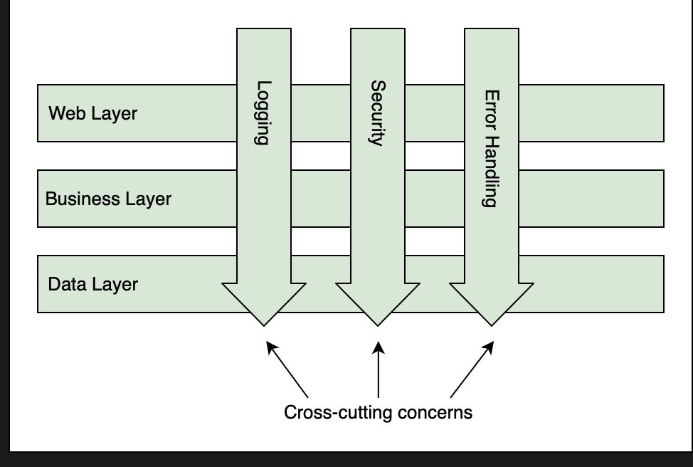
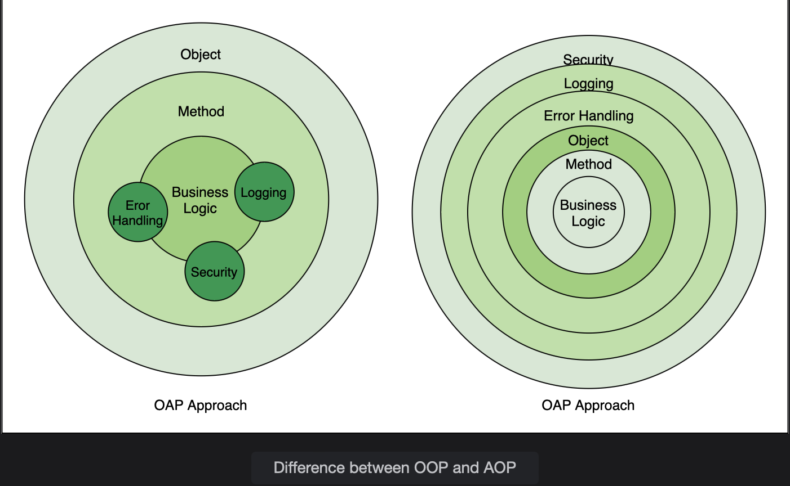

# Aspect Oriented Programming

Learn what is Aspect Oriented Programming and better understand this concept with the help of an example.

> We'll cover the followin:
>
> - What is AOP?
> - spring-aop
>   - Example

## What is AOP?

Aspect Oriented Programming (AOP) is the best approach for implementing cross-cutting concerns.  
Applications are divided into layers like web, business, data, etc. Each layer works independently. There are some concerns that are common across layers.  
These include security, logging, transaction management, auditing, error handling, performance tracking, etc.  
These concerns are **present in all the layers and are thus called cross-cutting concerns**.

AOP provides an easy way to add concerns like printing logs or tracking performance of methods across layers.  
 For example, we may want to print logs of methods that provide a certain feature.  
 These methods may belong to the web, business, or data layer.  
 Using the OOP approach, we can call the logger from these methods.  
 The problem with such an approach is that in future, if the logs are not needed anymore, or if they are needed for another group of methods, we will have to make changes to the source code. **By following the AOP approach, such changes are easy to maintain.**  
 Instead of changing the source code, concerns are implemented separately.  
 Thus, any cross-cutting concern can be added and removed without recompiling the complete code by only changing the config files.  
 The logging functionality can be defined separately and applied to any method belonging to any layer easily.

## spring-aop

spring-aop is a popular implementation of AOP provided by Spring.  
 It is not as powerful as AspectJ.  
 spring-aop can be used to intercept any calls to the beans managed by Spring. Once method calls are intercepted, cross-cutting concerns can be applied before, after, or around the method logic.

#### Example

Let’s now understand AOP with an example. We will make a modified version of the movie recommender system example. There are two classes in the business layer implementing two techniques for finding movies to recommend.  
The data layer contains two classes namely User and Movie.

> Create a Spring Boot application using the Spring Initializr. The group id is io.datajek.springaop, while the artifact id is movie-recommender-aop.  
> Right now, we do not need to add any dependency to the project. Once the project has been created and imported in the IDE, we will add the spring-aop dependency to pom.xml as follows:
>
>           <dependency>
>               <groupId>org.springframework.boot</groupId>
>               <artifactId>spring-boot-starter-aop</artifactId>
>           </dependency>
>
> Maven will download the spring-aop and aspectj-core jars when the file is saved. These jars will bring in the AOP functionality to our application.
>
> Next, we will create two business classes, FilteringTechnique1 and FilteringTechnique2, and mark them with the @Service annotation.  
> We will create a separate package to keep our business logic in one place. FilteringTechnique1 recommends movies based on their similarity, while FilteringTechnique2 takes the user’s watch history into account.
>
> We will create two classes, Movie and User, in the data layer. These classes will be placed in a separate package, and will contain the @Repository annotation to denote that they belong to the data access layer.
>
>       @Repository
>       public class Movie {
>           public String getMovieDetails() {
>               // interacts with the Movie repository
>               return "movie details";
>           }
>       }
>
> Let's create the respective method for User class:
>
>       @Repository
>       public class User {
>           public String getUserDetails() {
>           // interacts with the User repository
>           return "user details";
>           }
>       }

The Movie and User classes have a method that returns some dummy information. Classes FilteringTechnique1 and FilteringTechnique2 interact with classes in the data layer as follows:

        @Service
        public class FilteringTechnique1 {
            @Autowired
            private Movie movie;

            public String contentBasedFiltering() {
                String movieDetails = movie.getMovieDetails();
                return movieDetails;
            }
        }

Let's have a look at the other class:

        @Service
        public class FilteringTechnique2 {
            @Autowired
            private User user;

            public String collaborativeFiltering() {
                String userDetails =  user.getUserDetails();
                return userDetails;
            }
        }

We will have the MovieRecommenderAopApplication class implement the CommandLineRunner interface which will enable us to write dynamic code.  
CommandLineRunner is used when we want to execute some code right after the context is loaded and as soon as the startup completes.

We will autowire the business class objects and use them to call the methods and display the output in the log as follows:

        @SpringBootApplication
        public class MovieRecommenderAopApplication implements CommandLineRunner{
            private Logger logger = LoggerFactory.getLogger(this.getClass());

            @Autowired
            private FilteringTechnique1 filter1;

            @Autowired
            private FilteringTechnique2 filter2;

            public static void main(String[] args) {
                SpringApplication.run(MovieRecommenderAopApplication.class, args);
            }

            @Override
            public void run(String... args) throws Exception {
                logger.info("{}",filter1.contentBasedFiltering());
                logger.info("{}",filter2.collaborativeFiltering());
            }
        }
