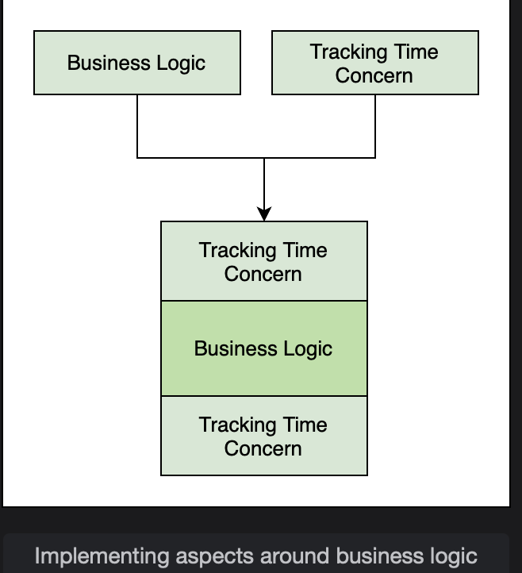

# Terminology

Learn about a few basic concepts of AOP.

> We'll cover the following:
>
> - Aspect
> - Pointcut
> - Advice
> - Joinpoint
> - Weaving
> - Weaver

## Aspect

An aspect is a Java class that implements cross-cutting concerns.  
The @Aspect annotation is used to define a class as an aspect.
An aspect is a combination of the kinds of methods to intercept and what to do after intercepting them.

Aspects can define functionality for any concerns like logging, performance management, or transaction management that cuts across multiple application layers.

## Pointcut

Pointcuts are expressions that determing which method calls will be intercepted.  
These expressions determine whether an advice needs to be executed or not. Pointcuts are defined following a particular syntax.

Pointcuts should be carefully defined, as they determine how many calls will be intercepted.

## Advice

The tasks performed after intercepting a method call are called advice. It is the logic of the methods in a class marked with @Aspect.  
 Advices are basically the methods that get executed when a method calls meets a pointcut.  
 These methods can get executed before, around the time of, or after the execution of the intercepted method call.  
 There are different advice types as shown below.

## Joinpoint

All method calls that are intercepted are joinpoints. It is a point in the program execution where an aspect can be plugged in.  
It contains the name of the intercepted method call.

The following figure shows the big picture of how AOP works:

## Weaving

The process of implementing AOP around method calls is called **weaving**.  
Weaving links an aspect with objects in the application to create an advised object. The aspect is called at the **right moment**.

For example, if we are tracking the execution time of some methods in our application, the weaving process will be like this:

## Weaver

The framework that ensures that an aspect is invoked at the right time is called a **weaver.**
