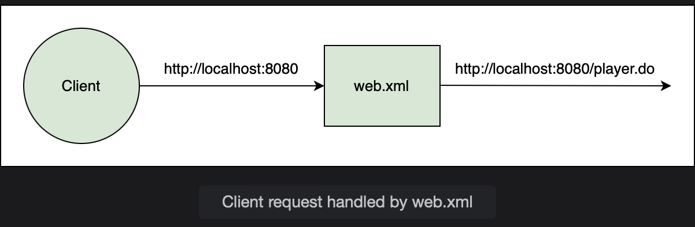

# Setting up a Web Application

Learn how to create a simple web application that runs using Tomat server.

> We'll cover the following:
>
> - Creating a simple Maven project
> - Java EE Web API dependency
> - Plugins for Maven compiler and Tomcat
> - web.xml file

## Creating a simple Maven project

We will create a web application using Maven as it makes development easier.  
 **Maven is a Java build tool which manages all the dependencies of an application.**

Create a simple Maven project using the IDE of your choice. Maven provides a set of sample projects which are called archetypes with predefined configuration.

We will skip the archetype selection for this project as we want to configure the application ourselves. The name of a Maven project has two parts, group Id and artifact Id. We have supplied the following values:

Group id: io.datajek.springmvc

Artifact id: tennis-player-web

Packaging: War (web archive)

The packaging type is set to **WAR because we are creating a web project**.

A **WAR file contains servlet, JSP, XML, CSS, HTML and JS files that can be deployed on a servlet container** while a **JAR file contains Java classes and associated metadata as a single file**.

> Once the project is created, we can see a hierarchy of folders.
>
> - The source code is placed in src/main/java.
> - Any resources like a property file or XML file goes in src/main/resources.
> - All test code is placed in src/test/java.
> - Any resources for the test code reside in src/test/resources.

## Java EE Web API dependency

The pom.xml shows the basic information about the group Id and artifact Id that we provided.  
To run a web application, we need a number of dependencies or jars. Maven downloads those jars, saving us the time to manually download them.  
We will add the Java EE Web API dependency to the pom.xml file as follows:

        <dependencies>
            <dependency>
                <groupId>javax</groupId>
                <artifactId>javaee-web-api</artifactId>
                <version>6.0</version>
                <scope>provided</scope>
            </dependency>
        </dependencies>

We will run a Java EE 6 application where servlets extend the HttpServlet class.  
We need to provide the jar to the compiler is defined. The javaee-web-api dependency added above downloads the API containing the HttpServlet among other jars.

## Plugins for Maven compiler and Tomcat

To compile the application, we will add the maven-complier-plugin. This will take care of compiling the Java classes and building the jars and wars using version 1.8.  
To be able to run the web application in Tomcat, we will add the tomcat7-maven-plugin. This plugin downloads Tomcat and runs the web application in it. The plugins are added to the pom.xml file as shown below:

        <build>
            <pluginManagement>
                <plugins>
                <plugin>
                    <groupId>org.apache.maven.plugins</groupId>
                    <artifactId>maven-compiler-plugin</artifactId>
                    <version>3.2</version>
                    <configuration>
                        <verbose>true</verbose>
                        <source>1.8</source>
                        <target>1.8</target>
                        <showWarnings>true</showWarnings>
                    </configuration>
                </plugin>
                <plugin>
                    <groupId>org.apache.tomcat.maven</groupId>
                    <artifactId>tomcat7-maven-plugin</artifactId>
                    <version>2.2</version>
                    <configuration>
                        <path>/</path>
                        <contextReloadable>true</contextReloadable>
                    </configuration>
                </plugin>
                </plugins>
            </pluginManagement>
        </build>

## web.xml file

web.xml is the starting point for any web application.  
This is where Tomcat, or any other Java EE implementation server, starts looking for servlets.

We will create this file in src/main/webapp/WEB-INF/ folder.  
web.xml file contains header information for the application (shown in the widget below). After the metadata, we will define the landing page for our application using the <welcome-file> tag. A welcome file is automatically invoked by the server if no other file name is specified. We will call our welcome file, player.do.The following line defines a redirection for localhost:8080 as localhost:8080/player.do:

        <welcome-file-list>
            <welcome-file>player.do</welcome-file>
        </welcome-file-list>

The complete web.xml file is shown in the code widget at the end of the lesson.

**web.xml**

        <web-app xmlns="http://java.sun.com/xml/ns/javaee"
         xmlns:xsi="http://www.w3.org/2001/XMLSchema-instance"
         xsi:schemaLocation="http://java.sun.com/xml/ns/javaee http://java.sun.com/xml/ns/javaee/web-app_3_0.xsd"
    version="3.0">

            <display-name>Tennis Player DB</display-name>

            <welcome-file-list>
                <welcome-file>player.do</welcome-file>
            </welcome-file-list>

        </web-app>

**pom.xml**

        <project xmlns="http://maven.apache.org/POM/4.0.0"
         xmlns:xsi="http://www.w3.org/2001/XMLSchema-instance"
         xsi:schemaLocation="http://maven.apache.org/POM/4.0.0 https://maven.apache.org/xsd/maven-4.0.0.xsd">
            <modelVersion>4.0.0</modelVersion>
            <groupId>io.datajek.springmvc</groupId>
            <artifactId>tennis-player-web</artifactId>
            <version>0.0.1-SNAPSHOT</version>
            <packaging>war</packaging>

            <dependencies>
                <dependency>
                    <groupId>javax</groupId>
                    <artifactId>javaee-web-api</artifactId>
                    <version>6.0</version>
                    <scope>provided</scope>
                </dependency>

            </dependencies>
                <build>
                    <pluginManagement>
                        <plugins>
                            <plugin>
                                <groupId>org.apache.maven.plugins</groupId>
                                <artifactId>maven-compiler-plugin</artifactId>
                                <version>3.2</version>
                                <configuration>
                                    <verbose>true</verbose>
                                    <source>1.8</source>
                                    <target>1.8</target>
                                    <showWarnings>true</showWarnings>
                                </configuration>
                            </plugin>
                            <plugin>
                                <groupId>org.apache.tomcat.maven</groupId>
                                <artifactId>tomcat7-maven-plugin</artifactId>
                                <version>2.2</version>
                                <configuration>
                                    <path>/</path>
                                    <contextReloadable>true</contextReloadable>
                                </configuration>
                            </plugin>
                        </plugins>
                    </pluginManagement>
                </build>

        </project>
