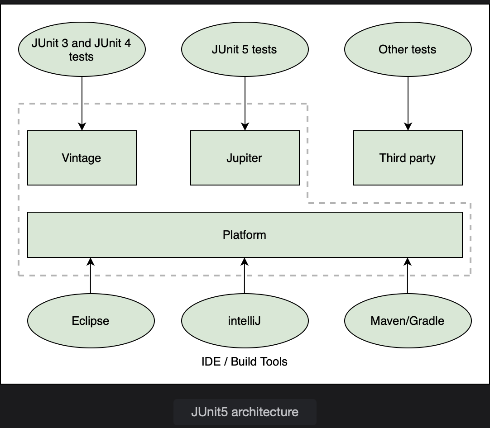

# JUnit

Learn about the unit testing and JUnit5 framework.

> We'll cover the following:
>
> - JUnit architecture
> - JUnit dependency

Testing ensures that the application is working as expected. As applications increase in size, it can become difficult to test big chunks of code.  
Testing is done at different levels and in different ways. Testing an application after deployment is called **screen testing or system testing.**  
Testing a specific method or a class is called **unit testing**.  
 It usually involves writing test for each method of a class.  
 Unit tests can also be written for a group of methods or to test the whole class.

## JUnit architecture

JUnit is a popular unit testing framework.  
It automates the testing process so that tests can run continually. If there is a change in the code such that the functionality changes, automated testing will catch it.  
 The tests compare the actual output to the expected output to check if the code is working correctly and notify the developer if it is not.

JUnit 5 is the newest release of the framework at the time of writing of this course.  
 It changed the monolithic architecture of JUnit 4 to have separate jar files for the JUnit platform (test engine), Jupiter (JUnit 5 tests), Vintage (JUnit4 tests), and 3rd party extensions while also adding support for new testing patterns.

Most IDE’s have built-in support for JUnit 5.

JUnit tests are automated, which means that the test can be kept running any number of times. The tests can be run every hour or every time there is a change in the code.  
The developer is notified whenever a test fails. These tests can be run under continuous integration.

## JUnit dependency

To enable JUnit, we need the JUnit engine and the Jupiter API to create tests. When creating a Spring Boot project, JUnit is already included as a dependency.  
 For other cases, the JUnit dependency can be added as follows:

        <dependency>
            <groupId>org.junit.jupiter</groupId>
            <artifactId>junit-jupiter-engine</artifactId>
            <scope>test</scope>
        </dependency>

scope specifies where we want the jars to be active.  
test scope means that this dependency will not be included in the final build.
