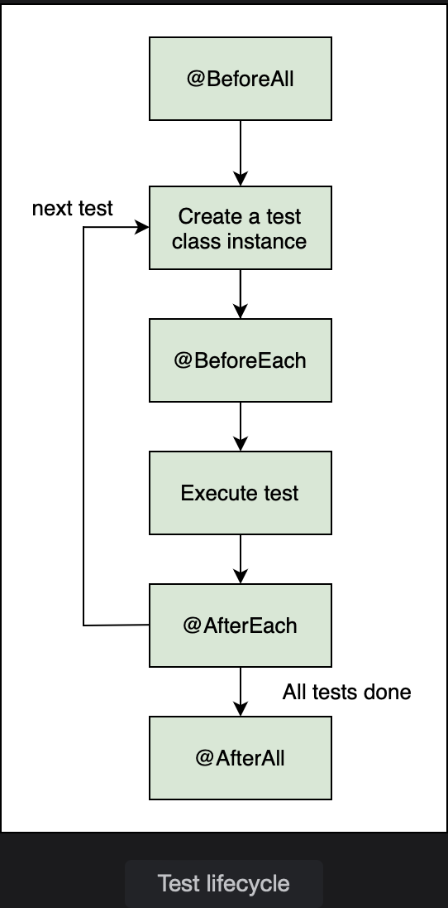

# JUnit Test Lifecycle Annotations

Learn about the annotations used at different stages of the test lifecycle.

> We'll cover the following:
>
> - @BeforeEach
> - @AfterEach
> - @BeforeAll
> - @AfterAll
> - Annotations to scale tests

JUnit provides us with some **lifecycle hooks that can be plugged in at various places in the test cycle**.  
 For example, some initialization code needs to be run before each test, and some cleanup code needs to be run after each test.  
 If we have multiple tests, there might be some code that we want to initialize before any of the tests run.  
 Similarly, there might be some teardown code that we want to run after each test has run.

JUnit provides annotations that can be used on each of these lifecycle hooks.  
 These annotations are @BeforeAll, @AfterAll, @BeforeEach, and @AfterEach.

The following image shows how these annotations are used at different stages in the lifecycle of a test.

## @BeforeEach

Before a test is run, some initialization is needed.  
 In the test cases that we wrote, we created a new instance of the class in every test.  
 A method with the @BeforeEach annotation is executed once before every test method executes.  
 We can initialize the objects or establish a database connection before each test in a method annotated with @BeforeEach.  
 With JUnit, there is no guarantee about the order in which the tests are run. But, it is guaranteed that no matter the order of tests, @BeforeEach is run before the test is run.

        @BeforeEach
        void init() {
            // Initialize the object here
            System.out.println("Initializing before test");
            arrayMethods = new ArrayMethods();
        }

We need to have the ArrayMethods object as a member variable to be able to access its methods in various tests.  
 Even if the object instance is shared by all the test cases, its state is being initialized in the init() method.

## @AfterEach

Similar to @BeforeEach, the @AfterEach annotation tells JUnit to run the method after a test has been executed.

        @AfterEach
        void afterEachTest() {
            System.out.println("Clean up after test");
        }

@AfterEach on a method ensures that it is run after the test to perform any clean up stuff.

## @BeforeAll

A method annotated with @BeforeAll is run once before all test methods of the class are executed.  
 It is a setup method and has to be static.  
 This method is executed even before the instance of the calss to be tested is created.

        @BeforeAll
        static void beforeAllTests() {
            System.out.println("Run this code before all tests");
        }

Only a static method can run without being dependent on the class in which it is written.

## @AfterAll

Just like the @BeforeAll annotation, the @AfterAll annotation on a method ensures that it is run after all the tests have been run.  
 It executes after all test methods of the class are expected.  
 This method is a class-level method and is, therefore static.

        @AfterAll
        static void afterAllTests() {
            System.out.println("Run this code after all tests");
        }

## Annotations to scale tests

The @Disabled annotation disables the test method.  
 JUnit engine skips any test methods that have the @Disabled annotation on them.

This feature is useful for tests that fail because we have yet to implement the logic for the method under test.  
 In such cases, we may want to skip the test for the time being.  
 The developer can write and test the method locally without affecting the overall build output of the application.

        @Test
        @Disabled
        public void testSortArray() {
            fail("unimplemented method");
        }

We have a fail() method in the test because we want this test to fail till all the functionality of the method under testing is complete.  
 If the tests are run, the overall build will fail because of the one test that did not succeed.  
 If we use the @Disabled annotation on this test and run tests again, the overall build will succeed because Junit skips this test.

> It can be seen that beforeAllTests() and afterAllTests() methods are run only once and the beforeEachTest() and afterEachTest() methods are run for every test.  
>  Also notice that the test for testingUnderDevelopmentMethod() was not run because of the @Disabled annotation.
