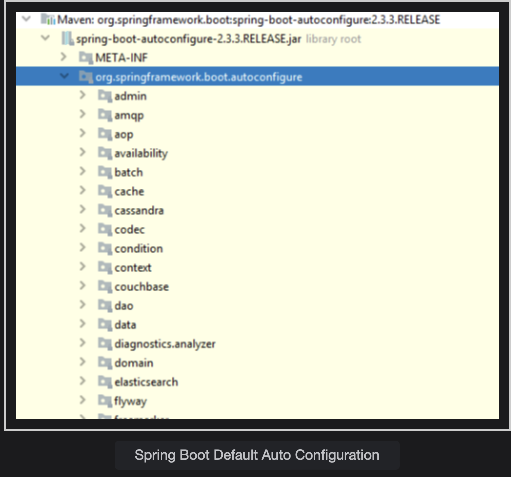

# Auto-Configuration

Learn what Spring Boot auto-configuration are and how they make the developer's life easy.

> We'll cover the following:
>
> - Configuration bloat
> - Spring boot - think differently
> - Uncover the Spring Boot Billionaire app
> - Where does auto-configuration come from?
> - Key takeaways

## Configuration bloat

As we have seen in our conventional Billionaire’s Club lesson, creating a simple web application requires configuring essential Spring beans before the start of actual development.  
 For example, when we use Spring MVC, we need to configure Component scan, Dispatcher Servlet, view resolver, etc.

When we use hibernate/JPA in our Spring application, we need to configure DataSource, a connection pool, EntityManager and Transaction Manager, among other things.

## Spring boot - think differently

Can we do this in a smarter way? Think of configuring:

- A DataSource, if the Hibernate JAR is on the classpath.
- A DispatcherServlet, if the Spring MVC JAR is on the classpath.
- An EntityManager, if JPA is on the classpath.
- Logback or log4j, if the corresponding dependency is on the classpath.

With its auto-configuration feature, this is exactly what Spring Boot does…

> Spring Boot looks at the following:
>
> 1. Dependency available on the CLASSPATH
> 2. Existing configuration for the application. Based on these, Spring Boot configures those frameworks without the need of configuring them explicitly. This is called **auto-configuration.**

## Uncover the Spring Boot Billionaire app

Notice the few key log statements from Spring Boot Billionaire startup logs.

        2020-11-13 21:26:34.648  INFO 13500 --- [           main] o.e.j.s.h.ContextHandler.application     : Initializing Spring DispatcherServlet 'dispatcherServlet'
        **2020-11-13 21:26:34.648  INFO 13500 --- [           main] o.s.web.servlet.DispatcherServlet        : Initializing Servlet 'dispatcherServlet'**
        2020-11-13 21:26:34.656  INFO 13500 --- [           main] o.s.web.servlet.DispatcherServlet        : Completed initialization in 8 ms
        2020-11-13 21:26:34.672  INFO 13500 --- [           main] o.e.jetty.server.AbstractConnector       : Started ServerConnector@2650f79{HTTP/1.1, (http/1.1)}{0.0.0.0:8080}
        2020-11-13 21:26:34.680  INFO 13500 --- [           main] o.s.b.web.embedded.jetty.JettyWebServer  : Jetty started on port(s) 8080 (http/1.1) with context path '/'
        2020-11-13 21:26:34.680  INFO 13500 --- [           main] DeferredRepositoryInitializationListener : Triggering deferred initialization of Spring Data repositories…
        2020-11-13 21:26:35.824  INFO 13500 --- [         task-1] o.h.e.t.j.p.i.JtaPlatformInitiator       : HHH000490: Using JtaPlatform implementation: [org.hibernate.engine.transaction.jta.platform.internal.NoJtaPlatform]
        2020-11-13 21:26:35.832  INFO 13500 --- [         task-1] j.LocalContainerEntityManagerFactoryBean : Initialized JPA EntityManagerFactory for persistence unit 'default'**
        2020-11-13 21:26:35.944  INFO 13500 --- [           main] DeferredRepositoryInitializationListener : Spring Data repositories initialized!
        2020-11-13 21:26:35.952  INFO 13500 --- [           main] c.c.billionaire.BillionaireApplication   : Started BillionaireApplication in 3.422 seconds (JVM running for 4.302)

- It’s clear from the log that Spring Boot automatically configures the dispatcher servlet when it sees SpringMVC on the classpath.
- Spring Boot automatically configures Data Source and an Entity Manager when it sees JPA is on the classpath.

We don’t need to configure any of the above by ourselves, because it’s taken care of by the auto-configuration capability.

## Where does auto-configuration come from?

All auto-configuration come from spring-boot-autoconfigure.jar

Another important class inside the JAR is META-INF/spring.factories. This file lists all the auto-configuration classes that should be enabled under the framework.

A few of the important auto-configurations are listed below:

        org.springframework.boot.autoconfigure.EnableAutoConfiguration=\
        org.springframework.boot.autoconfigure.admin.SpringApplicationAdminJmxAutoConfiguration,\
        org.springframework.boot.autoconfigure.aop.AopAutoConfiguration,\
        org.springframework.boot.autoconfigure.amqp.RabbitAutoConfiguration,\
        org.springframework.boot.autoconfigure.batch.BatchAutoConfiguration,\
        org.springframework.boot.autoconfigure.cache.CacheAutoConfiguration,\
        org.springframework.boot.autoconfigure.cassandra.CassandraAutoConfiguration,\
        org.springframework.boot.autoconfigure.context.ConfigurationPropertiesAutoConfiguration,\
        org.springframework.boot.autoconfigure.context.LifecycleAutoConfiguration,\
        org.springframework.boot.autoconfigure.context.MessageSourceAutoConfiguration,\
        org.springframework.boot.autoconfigure.context.PropertyPlaceholderAutoConfiguration,\
        org.springframework.boot.autoconfigure.couchbase.CouchbaseAutoConfiguration,\
        org.springframework.boot.autoconfigure.dao.PersistenceExceptionTranslationAutoConfiguration,\
        org.springframework.boot.autoconfigure.data.cassandra.CassandraDataAutoConfiguration,\
        org.springframework.boot.autoconfigure.data.cassandra.CassandraReactiveDataAutoConfiguration,\
        org.springframework.boot.autoconfigure.data.cassandra.CassandraReactiveRepositoriesAutoConfiguration,\
        org.springframework.boot.autoconfigure.data.cassandra.CassandraRepositoriesAutoConfiguration,\
        org.springframework.boot.autoconfigure.data.couchbase.CouchbaseDataAutoConfiguration,\
        org.springframework.boot.autoconfigure.data.couchbase.CouchbaseReactiveDataAutoConfiguration,\

## Key takeaways

- Auto-configuration enables spring boot to configure the required beans based on the JAR on the classpath.
- Developers don’t need to spend time working on the initial setups in every application.
