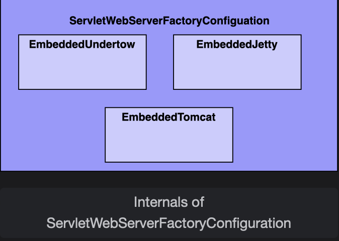
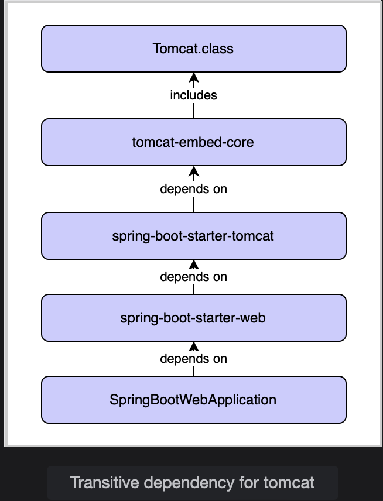

# Spring Boot Auto-configuration: Magic under the Hood

Learn the internals of Spring Boot auto-configuration, and uncover the secrets behind it.

> We'll cover the following
>
> - Try adding another web server
> - Check auto-configuration report
> - Actuator report findings
>   - Embedded tomcat configuration
>   - Understand @ConditionalOnClass
>   - Understand @ConditionalOnMissingBean
> - Additional @Conditional annotation
> - Order of configuration processing
> - Key takeaways

## Try adding another web server

Unlike other lessons, we will start this lesson with the code-first approach. We will add Jetty along with Tomcat in our application, and notice what happens.

## Check auto-configuration report

Run the below application after enabling all actuator endpoints and check the auto-configuration report, or check directly from URL /actuator/conditions.

We are looking for the ServletWebServerFactoryConfiguration class in the report.

## Actuator report findings

You should find three occurrences of the ServletWebServerFactoryConfiguration class.

1.  Tomcat: Positive match

            ServletWebServerFactoryConfiguration.EmbeddedTomcat": [
                {
                "condition": "OnClassCondition",
                "message": "@ConditionalOnClass found required classes 'javax.servlet.Servlet', 'org.apache.catalina.startup.Tomcat', 'org.apache.coyote.UpgradeProtocol'"
                },
                {
                "condition": "OnBeanCondition",
                "message": "@ConditionalOnMissingBean (types: org.springframework.boot.web.servlet.server.ServletWebServerFactory; SearchStrategy: current) did not find any beans"
                }

    As we are using the Tomcat web server, the match is positive.

2.  Jetty: Negative Match

                ServletWebServerFactoryConfiguration.EmbeddedJetty": {
                    "notMatched": [
                    {
                    "condition": "OnClassCondition",
                    "message": "@ConditionalOnClass did not find required classes 'org.eclipse.jetty.server.Server', 'org.eclipse.jetty.util.Loader', 'org.eclipse.jetty.webapp.WebAppContext'"
                    }
                    ],
                    "matched": []

    The match is negative as we don’t have any dependency added for the Jetty server.

3.  Undertow: Negative Match

                ServletWebServerFactoryConfiguration.EmbeddedUndertow": {
                    "notMatched": [
                    {
                    "condition": "OnClassCondition",
                    "message": "@ConditionalOnClass did not find required classes 'io.undertow.Undertow', 'org.xnio.SslClientAuthMode'"
                    }
                    ],
                    "matched": []
                    }

    The match is negative as we don’t have any dependency added for the Undertow server.

This clears our understanding that Spring Boot configures beans based on the JAR on the classpath. We can understand it from this simple conditional expression:

        if (jarincluded) {
            if (entryExistInSpringFactories && configurationClassExist) {
                //process corresponding autoconfiguration and register required beans.
            } else {
                //Manual configuration and registration of bean is required. It's just are regular configuration.
            }
        }

In fact, the entire auto-configuration feature is just this condition. Let’s understand more going into the internals of the class ServletWebServerFactoryConfiguration.

#### Auto-cofiguration conditional processing

The ServletWebServerFactoryConfiguration contains three inner classes — one for each web server.

1. **EmbeddedUndertow:** Configures Undertow if the corresponding JAR is on the classpath
2. **EmbeddedJetty:** Configures Jetty if the corresponding JAR is on the classpath
3. **EmbeddedTomcat:** Configures Tomcat if the corresponding JAR is on the classpath

### Embedded tomcat configuration

Let’s see the code of the inner class, EmbeddedTomcat. This will give us a full perspective on how Spring Boot configures Tomcat.

          @Configuration(
            proxyBeanMethods = false
            )
            @ConditionalOnClass({Servlet.class, Tomcat.class, UpgradeProtocol.class})
            @ConditionalOnMissingBean(
                value = {ServletWebServerFactory.class},
                search = SearchStrategy.CURRENT
            )
            static class EmbeddedTomcat {
                EmbeddedTomcat() {
                }

                @Bean
                TomcatServletWebServerFactory tomcatServletWebServerFactory(ObjectProvider<TomcatConnectorCustomizer> connectorCustomizers, ObjectProvider<TomcatContextCustomizer> contextCustomizers, ObjectProvider<TomcatProtocolHandlerCustomizer<?>> protocolHandlerCustomizers) {
                    TomcatServletWebServerFactory factory = new TomcatServletWebServerFactory();
                    factory.getTomcatConnectorCustomizers().addAll((Collection)connectorCustomizers.orderedStream().collect(Collectors.toList()));
                    factory.getTomcatContextCustomizers().addAll((Collection)contextCustomizers.orderedStream().collect(Collectors.toList()));
                    factory.getTomcatProtocolHandlerCustomizers().addAll((Collection)protocolHandlerCustomizers.orderedStream().collect(Collectors.toList()));
                    return factory;
                }
            }

The class has extremely important annotations:

- @ConditionalOnMissingBean
- @ConditionalOnClass

### Understand @ConditionalOnClass

This is the magic Spring Boot annotation we were looking for.

This annotation tells the Spring Boot **to process the underlying configuration if the class supplied in the annotation parameter is present in the classpath.**

In our example:

        @ConditionalOnClass({ Servlet.class, Tomcat.class, UpgradeProtocol.class })

This annotation **instructs spring boot to process EmbeddedTomcat configuration if Tomcat.class and other required classes are on the classpath.**  
 Where does Tomcat.class come from?  
 It **came from transitive dependency when the starter web was included**.

    

This is how Spring Boot discovers Tomcat auto-configuration and runs with it.

A similar conditional configuration exists for EmbeddedJetty and EmbeddedUndertow.  
 We can verify it from the full source either by decompiling the class inside IDE, or from the GitHub source.

### Understand @ConditionalOnMissingBean

The annotation @ConditionalOnMissingBean tells Spring Boot to configure the bean only if the supplied bean in the parameter is not configured and registered in the application context already.

In our example:

        @ConditionalOnMissingBean(value = ServletWebServerFactory.class, search = SearchStrategy.CURRENT)

The annotation instructs Spring Boot to configure EmbeddedTomcat only when ServletWebServerFactory is not configured already. In other words, no other web container is already configured.

> That is why, Spring Boot did not give any conflicting or startup errors despite having multiple containers included in the POM. Once it configures Tomcat, it ignores the other two configurations due to the presence of this annotation.

## Additional @Conditional annotation

Spring Boot supplies a lot more conditional annotations. Let’s see a few more:

- **@ConditionalOnProperty:** Processes configuration only when the supplied property is available
- **@ConditionalOnBean:** Processes and creates the bean only when some bean is present in the classpath (the opposite of the @ConditionalOnMissingBean annotation)
- **@ConditionalOnMissingClass:** Processes configuration is some class is not available on the classpath (the opposite of the @ConditionalOfClass annotation)

## Order of configuration processing

Auto-configuration is non-invasive. Spring Boot processes auto-configuration separately from regular configuration.

The Processing of auto-configuration starts only when regular configurations are processed fully.  
 This means if you add your own DataSource bean, the auto-configuration bean support will back away.

This is because once this bean is created with regular configuration, the presence of annotation @ConditionalOnMissingBean will return false.  
 Therefore, none of the auto-configuration will be processed.

---

Question: We have seen that if we remove @SpringBootApplication it disables auto-configuration fully. Is it possible to disable certain auto-configuration?

Answer: Yes, only specific auto-configuration can be disabled or excluded by supplying an exclude parameter in @SpringBootAppliation annotation.

Let’s try ourselves: Disable automatic web server discovery by supplying below configuration in the application above on the page @SpringBootApplication(exclude = {ServletWebServerFactoryAutoConfiguration.class})

It should stop the application from running and now we need to configure the full web server with Spring Boot by ourselves.

The excluded configuration will be present in the “Exclusion” section of the auto-configuration report.

---

## Key takeaways

- Spring Boot uses @Conditional... annotation to create auto-configuration.
- Configuration should be present in spring.factories to qualify that for an auto-configuration candidate.
- Auto-configuration gets processed only when the regular configurations are processed fully.
- Is it possible to disable only certain auto-configuration by supplying exclude parameters in the @SpringBootApplication annotation.
